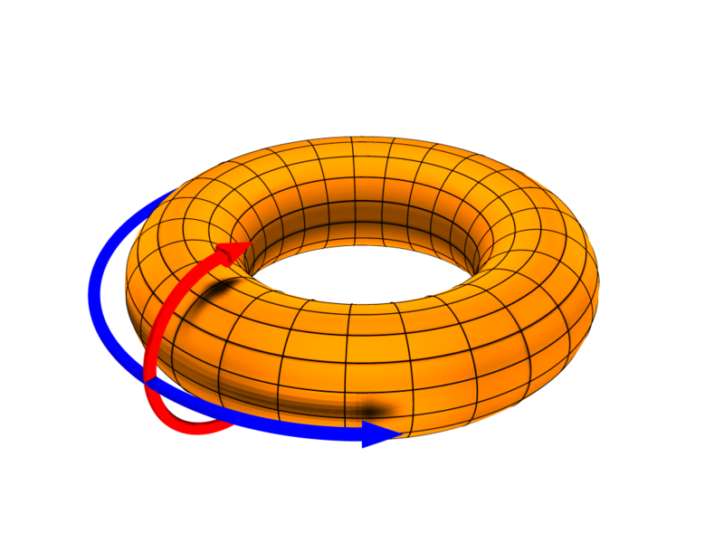
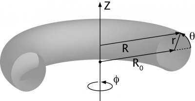

.. _itm_conventions:

=============
 Conventions
=============

.. _machine_names:

Standard Machine Names
======================

The following machine names are suggested:

-  aug
-  ftu
-  iter
-  jet
-  mast
-  tcv
-  tore_supra
-  west

.. _physics_conventions:

Physics Conventions
===================

The EU-IM-TF has agreed on a variety of conventions to facilitate the
integration of the code modules across EFDA. In the following the most
important conventions are explained in detail to remove confusion and
avoid ambiguity. For more physical detail than that represented here see
F Hinton and R Hazeltine, Rev Mod Phys 48 (1976) 239-308, or R Hazeltine
and J Meiss, Plasma Confinement (Addison-Wesley, 1992).

.. _itm_coordinate_system:

Coordinate System
-----------------

There are generally two choices for defining a right-handed coordinate
system in a toroidal geometry with the following coordinates:

-  major radius R
-  vertical heights Z
-  toroidal angle :math:`\phi`

Remaining consistent with ITER, the EU-IM-TF has chosen to adopt the
right-handed system

.. math::
   (R, \phi, Z)

i.e. R is to the right, Z is upwards, and :math:`\phi` points into the plane
on the right-hand side of the torus (i.e. mathematically positive). Looking
from above, the toroidal angle is counter-clockwise, i.e. mathematically
positive.

The following figures demonstrate the orientation of the toroidal angle
:math:`\phi` and the poloidal angle :math:`\theta`:

           

source:

http://www-fusion.ciemat.es/fusionwiki/index.php/Toroidal_coordinates\

http://en.wikipedia.org/wiki/Toroidal_and_poloidal

.. _itm_conventions_representation_of_the_magnetic_field_and_current:

Representation of the Magnetic Field and Current
------------------------------------------------

Generally, the magnetic field is described in terms of two scalar fields as
it is divergence free. If the field is also axisymmetric then MHD
equilibrium demands these are functions of each other. In the EU-IM-TF the
relevant quantities are :math:`F_{{\rm dia}}` and :math:`\Psi` and the
representation is

.. math::
   {\bf B} = F_{{\rm dia}} \nabla \phi +(2\pi)^{-1} \nabla \Psi \times \nabla \phi

where the factor of :math:`2 \pi` is to have :math:`\Psi` one and the same with
the poloidal flux in Webers (see below).

The current given by Ampere's law is

.. math::
   \mu_0 {\bf J} = \nabla F_{{\rm dia}} \times \nabla \phi - (2\pi)^{-1}(R^2 \nabla \cdot R^{-2} \nabla \Psi) \nabla \phi

The respective covariant toroidal components are useful forms:

.. math::
   B_\phi =F_{{\rm dia}} \qquad \qquad \mu_0 J_\phi = - (2\pi)^{-1}(R^2 \nabla\cdot R^{-2} \nabla \Psi)

where the latter is often expressed in terms of the "delta-star" operator,
:math:`\Delta^* = R^2 \nabla \cdot R^{-2} \nabla`. These are not the
toroidal field and current but the toroidal field and current multiplied by
:math:`R` respectively. The total plasma current :math:`I_p` is the integral 
of :math:`J_{\phi} / R` over the poloidal cross section (usually, but 
not always, over the closed flux surface region only).

.. _itm_conventions_poloidal_and_toroidal_fluxes:

Poloidal and Toroidal Fluxes
----------------------------

The toroidal flux :math:`\Phi` is the integral of :math:`B_{\phi} / R` over
the region enclosed by the flux surface. Due to axisymmetry it is also a
volume integral

.. math::
   \Phi = \oint d^3V (2 \pi R^2)^{-1} F_{{\rm dia}}

All volume integrals are understood as integration over the region enclosed
by the flux surface. They are therefore flux quantities (pure functions of
:math:`\Psi`). The units of :math:`\Phi` are volt-seconds, or Webers (Wb).

The poloidal flux is :math:`\Psi` due to the construction of :math:`\bf B`.
The factor of :math:`2 \pi` ensures this is not Wb per radian (the
more usual quantity :math:`\psi` used as a covariant toroidal component
of the magnetic potential is in Wb/radian; the factor of :math:`2 \pi`
results from integration over one angular circuit). Note that the
poloidal flux :math:`\Psi` and its equivalent per radian :math:`\psi`
are often used equivalently in the literature.

.. _itm_conventions_safety_factor:

Safety Factor
-------------

The magnetic pitch parameter is defined in terms of the flux components:

.. math::
   
 q\equiv d \Phi d \Psi

which is a flux quantity. This definition is the same as saying the
magnetic pitch is given as the number of toroidal cycle a magnetic field
line traverses per unit poloidal cycle. It is also called the local safety
factor for MHD stability reasons (here, "local" means local to a given flux
surface). Equivalent relations often seen depend on the definition of
coordinates. These are given for straight field line coordinates, below.

.. _itm_conventions_signs:

Signs
-----

With the above definition of the toroidal coordinate system and the
magnetic field, the following sign relationships ensue (where increasing
and decreasing refer to going from the magnetic axis to the separatrix
on the outboard midplane):

.. table:: Sign Relations

   +----------------+-------------+--------------+--------------+-------------+
   |:math:`B_{tor}` |:math:`I_{p}`| :math:`\Psi` | :math:`\Phi` | safety      |
   |                |             |              |              | factor      |
   |                |             |              |              | :math:`q`   |
   +================+=============+==============+==============+=============+
   | positive       | positive    | decreasing   | increasing   | negative    |
   +----------------+-------------+--------------+--------------+-------------+
   | positive       | negative    | increasing   | increasing   | positive    |
   +----------------+-------------+--------------+--------------+-------------+
   | negative       | positive    | decreasing   | decreasing   | positive    |
   +----------------+-------------+--------------+--------------+-------------+
   | negative       | negative    | increasing   | decreasing   | negative    |
   +----------------+-------------+--------------+--------------+-------------+

.. _itm_conventions_cocos:

COCOS - toroidal coordinate conventions
---------------------------------------

16 different fundamental coordinate conventions (COCOS) has been identified
for toroidal systems. These are described by `O. Sauter and S. Yu. Medvedev, Computer Phys. Commun. 184 (2013) 293
<http://www.sciencedirect.com/science/article/pii/S0010465512002962>`__.

The current EU-IM convention (described
above) is number 13, while the ITER convention is 11.

.. _itm_conventions_cocos_determine:

.. _itm_conventions_cocos_conversions:

Equilibrium COCOS transformation library and actor
~~~~~~~~~~~~~~~~~~~~~~~~~~~~~~~~~~~~~~~~~~~~~~~~~~

A Fortran library has been developed for transforming the equilibrium
cpo between different COCOS. The source is found in

.. code-block:: console

           https://gforge-next.eufus.eu/svn/numerical_tools/tags/COCOStransform_v1_1 
         

and the actor is

.. code-block:: console

           https://gforge-next.eufus.eu/svn/kepleractors/tags/4.09a/imp12/COCOStransformequil.tar 
         

(also available from: ~sauter/public/ACTORS/4.09a)

Inputs:

-  Equilibrium_in : input cpo
-  COCOS_in : COCOS of the input equilibrium (if the COCOS is not stored in
   Equilibrium_in)
-  COCOS_out : Requested COCOS for the Equilibrium_out
-  Ipsign_out : Requested sign for output Ip; -9 if just wants IP_in
   transformed to new equilibrium, +1 or -1 if a specific sign in output is
   desired
-  B0sign_out : Requested sign for output B0

Output:

-  Equilibrium_out : Output cpo

.. _itm_conventions_flux_surface_average:

The Flux Surface Average
------------------------

In general, the flux surface average is the operation which annihilates the
magnetic derivative :math:`{\bf B} \cdot \nabla` and acts as an identity
operator on any flux quantity. It can be proved that this results in a
volume derivative of a volume integral (alternatively one starts with the
latter property and then proves the former, as the above Ciemat reference
does). The flux surface average of a scalar and divergence of a vector are
given by

.. math::
   \langle G \rangle = \frac {\partial} {\partial V} \oint d^3V G \qquad \qquad \langle \nabla \cdot {\bf G} \rangle = \frac {\partial} {\partial V} \langle {\bf G}\cdot\nabla V \rangle

where :math:`{\bf G} \cdot \nabla V` is the contravariant volume
component of the vector :math:`{\bf G}`. It follows that the flux surface
average is an angle average weighted by the volume element :math:`\sqrt{g}`

.. math::
   \langle G \rangle = \oint d \phi \oint d \theta \sqrt{g} G \left / \oint d \phi \oint d \theta \sqrt{g} \right.

for any choice of toroidal and poloidal angle as well as radial
coordinates, where :math:`g` is the determinant of the covariant metric
tensor components in those coordinates. Note in general :math:`G` is not an
axisymmetric quantity so the integration is actually over both angles.

For more detail see the above references.

.. _itm_conventions_toroidal_flux_radius_as_the_radial_coordinate:

The Toroidal Flux Radius as the Radial Coordinate
-------------------------------------------------

The EU-IM-TF has decided to use the toroidal flux radius :math:`\rho_{{ \rm tor}}` defined by

.. math::
   \Phi = \pi B_0 \rho_{{ \rm tor}}^2

where :math:`B_0` is the reference (vacuum) magnetic field value. Note that
:math:`\rho_{{ \rm tor}}` is a positive quantity which has units of
meters. For several applications the volume radius :math:`\rho_{{ \rm vol}}` is also used. It is a normalised radius going from 0 to 1 and is
defined as

.. math::
   V = V_{{\rm LCFS}} \rho_{{ \rm vol}}^2 

where LCFS refers to the last closed flux surface. Both should be defined
in the equilibrium CPO (as well as :math:`{ \tt volume} \equiv V` itself).

.. _itm_conventions_toroidal_and_parallel_current:

Toroidal and Parallel Current
-----------------------------

These are not equivalent, despite the often-seen experimental practice of
considering them so. The toroidal current given in Amperes depends on some
convention applied to :math:`J_{\phi}` given above, which is not a flux
quantity. The EU-IM-TF has decided on this definition of the toroidal
current as a flux quantity:

.. math::
   {\tt jphi} \equiv \langle J^ \phi \rangle / \langle 1/R \rangle

This uses the contravariant toroidal component of :math:`\bf J` which is a
pure divergence

.. math::
   J^\phi = {\bf J} \cdot \nabla \phi = J_ \phi / R^2 = - \nabla \cdot (2 \pi \mu_0 R^2)^{-1} \nabla \Psi

Hence the flux surface average invokes the often-used quantity :math:`\langle
g^{\rho \rho}/R^2 \rangle` in the form

.. math::
   \langle J^\phi \rangle = - (2 \pi \mu_0)^{-1} \frac{1}{V'_\rho} \frac{ \partial}{ \partial \rho} V'_\rho \langle g^{ \rho \rho} / R^2 \rangle \frac{ \partial\Psi}{ \partial \rho}

Here,  :math:`V'_\rho \equiv \partial V / \partial \rho_{{\rm tor}}`
explicitly using the toroidal flux radius as the radial coordinate.

The parallel current is different from this due to the finiteness of the
poloidal current and magnetic field. Generally the correction is :math:`O( \epsilon^2 / q^2)` which is usually a few percent (but not in a 
spherical tokamak). Using the representations for :math:`\bf B` and :math:`\bf J` given above we find

.. math::
   {\bf J} \cdot{ \bf B} =-(2 \pi \mu_0)^{-1}\,F_{{ \rm dia}}^2 \nabla \cdot \frac{1}{F_{{\rm dia}} R^2} \nabla \Psi

Since :math:`F_{{\rm dia}}` is a flux quantity the flux surface average
behaves as for :math:`{\tt jphi}` and we use a factor of :math:`B_0` to
provide the correct units, yielding

.. math::
   {\tt jparallel} \equiv -(2 \pi \mu_0 B_0)^{-1} \frac{F_{{ \rm dia}}^2}{V'_\rho} \frac{ \partial}{ \partial \rho} \frac{V'_\rho}{F_{{\rm dia}}} \langle g^{\rho\rho}/R^2 \rangle \frac{\partial\Psi}{\partial\rho}

This form has been chosen due to the natural use of the flux surface
average :math:`\langle{\bf J} \cdot{ \bf B} \rangle` in neoclassical theory
and the magnetic flux diffusion equation (see the Hinton and Hazeltine
reference above).

.. _itm_conventions_straight_field_line:

Straight Field Line Coordinates
-------------------------------

A variety of modules in the EU-IM-TF use straight field line coordinate
systems to represent the closed flux surface region. To guarantee
consistency with the definition of the poloidal flux and the magnetic field
representation given above, a standard definition of the coordinate volume
element follows. This is the same sense as the usage of the term "Jacobian"
in the CPOs (note many papers use the inverse volume element as the
"Jacobian" by contrast). Here, "straight field line coordinates" refers to
the use of the right-handed coordinate system :math:`(\Psi, \theta, \zeta)`
with the poloidal flux :math:`\Psi`, the straight field line angle 
:math:`\theta`, and the toroidal angle :math:`\zeta = - \phi`. Therefore,
:math:`\theta` has the same orientation as the poloidal angle :math:`\theta`
in toroidal coordinates, while the toroidal angle :math:`\zeta` is in
the opposite direction of :math:`\phi`. This is standard usage generally
in terms of "flux coordinates" (see Hazeltine and Meiss, above).

Note here that while the toroidal angle is the geometric one in the
orientation sense of flux coordinates, the poloidal angle is not
geometric. This results from the demand that the field lines be straight
in the coordinate plane :math:`(\theta, \zeta)`. The definition of this
property is given by the specification of the ratio of contravariant
components of the magnetic field as a flux quantity, which is one and
the same with the pitch parameter ("local safety factor"):

.. math::
   q = q(\Psi) = - B^ \zeta / B^\theta = B^\phi / B^\theta

where the minus sign appears by consistency with the primary definition in
terms of the flux components as given above. This represents a magnetic
differential equation for the poloidal angle:

.. math::
   B^ \theta = B^ \phi / q  = F_{{\rm dia}}/qR^2 

Due to the choice of "natural" coordinates (with :math:`\Psi`, not :math:`\rho_{{\rm tor}}`) this relation is close to the definition of the volume element :math:`\sqrt{g}` and, equivalently, the Jacobian :math:`J`

.. math::
   J \equiv \sqrt{g} \qquad \qquad J^{-1} = {\bf \nabla} \Psi \cdot {\bf \nabla} \theta \times {\bf \nabla} \zeta = {\bf \nabla} \Psi \times {\bf \nabla} \phi \cdot {\bf \nabla}\theta 

Note the ordering of :math:`{\bf \nabla} \Psi` and :math:`{\bf \nabla} \phi`.

The components of the magnetic field are then

.. math::
   B^{\theta} &= {\bf B} \cdot {\bf \nabla} \theta = (2\pi)^{-1} {\bf \nabla} \Psi \times {\bf \nabla} \phi \cdot {\bf \nabla} \theta = (2\pi J)^{-1} \\
   B^{\zeta} &= {\bf B} \cdot {\bf \nabla} \zeta = - B_\phi/R^{2} = - F_{{\rm dia}}/R^{2}\\
   B^{\Psi} &= {\bf B} \cdot {\bf \nabla} \Psi = 0

With these relations the following relationship between the Jacobian and pitch parameter ("local safety factor") holds

.. math::
   J = (2\pi)^{-1}q R^{2}/F_{{\rm dia}}

This is the quantity labelled :math:`{\tt jacobian}` in the equilibrium
CPO.

.. _itm_conventions_plasma_betas:

Plasma Betas
------------

Out of the many definitions of plasma betas, the EU-IM has agreed to
adhere to the following definitions: Following Wesson (p. 116), the
poloidal beta is defined as an integral over the poloidal cross section

.. math::
   \beta_{\rm p} = \frac{2 \mu_{0}} {B_{ \rm a}^{2}} \frac{ \int_{A} p \rm{d}S}{ \int_{A} \rm{d}S}

where :math:`A = A (\Psi)` is the poloidal cross section enclosed by the
flux surface :math:`\Psi`, :math:`B_{\rm a} = \frac{ \mu_{0} I}{l}` is
the flux surface averaged poloidal magnetic field, :math:`I = I( \Psi )` the toroidal plasma current inside the flux surface :math:`\Psi` and :math:`l = \oint \rm{d} l` the length of the poloidal perimeter of flux surface :math:`\Psi`. This definition yields a one-dimensional profile :math:`\beta_{\rm p} = \beta_{\rm p} ( \Psi )` stored in profiles_1d%beta_pol in the equilibrium CPO. The overall poloidal beta :math:`\beta_{\rm p} (\Psi = \Psi_{\rm bd})` is stored in global_param%beta_pol.

The toroidal beta is defined as

.. math::
   \beta_{\rm tor} = \frac{2 \mu_{0}}{B_{0}^{2}} \frac {\int_{\Omega} p \rm{d}V}{\int_{\Omega} \rm{d}V}

with :math:`B_{0}` the vacuum magnetic field as stored in global_param%toroid_field%b0. The integral is carried out over the entire plasma volume and the result stored in global_param%beta_tor.

The normalized plasma beta is defined as

.. math::
   \beta_{\rm N} = 100 \frac{a B_{0}}{10^{-6}I_{\rm p}} \beta_{\rm tor}

with :math:`I_{\rm p}` the total plasma current (following Y.-S. Na et al.,
PPCF 44 (2002), 1285) and a is the minor radius. It is stored in
global_param%beta_normal.

.. _itm_conventions_internal_inductance:

Internal Inductance
-------------------

The definition of the internal inductance follows J.A. Romero et al., NF 50
(2010), 115002. The magnetic energy contained inside the flux surface 
:math:`\Psi` is

.. math::
   W_{\rm mag} = \frac{1}{2 \mu_{0}} \int_{\Omega} B_{\rm p}^{2} \rm{d}V

where :math:`B_{\rm p}` is the poloidal component of the magnetic field. The (unnormalized) internal inductance is then defined as

.. math::
   L_{\rm i} = \frac{2 W_{\rm mag}}{I^{2}}

where :math:`I = I(\Psi)` is the toroidal plasma current enclosed by the
flux surface :math:`\Psi`. The normalized internal inductance, as
stored in profiles_1d%li is defined as

.. math::
   l_{\rm i} = \frac{2 L_{\rm i}}{\mu_{0} \bar{R}}

with the surface averaged major radius

.. math::
   bar{R} = \frac{\int_{A} R \rm{d} S}{\int_{A} \rm{d}S} = \frac{V(\Psi)}{2 \pi A(\Psi)}
   
The overall internal inductance :math:`l_{\rm i} (\Psi = \Psi_{\rm bd})` is stored in global_param%li.

.. _itm_conventions_poloidal_angle_dimension_in_equilibrium_cpo:

Poloidal Angle Dimension in Equilibrium CPO
-------------------------------------------

The following entries in the equilibrium CPO are defined along the
poloidal dimension (as dim2 in the case of a flux surface equilibrium,
i.e. radial coordinate psi in dim1 and poloidal angle in dim2):

.. code-block:: console

   coord_sys%jacobian(:,:)
   coord_sys%g_11(:,:)
   coord_sys%g_12(:,:)
   coord_sys%g_13(:,:)
   coord_sys%g_22(:,:)
   coord_sys%g_23(:,:)
   coord_sys%g_33(:,:)
   profiles_2d%position
   profiles_2d%grid
   profiles_2d%psi_grid(:,:)
   profiles_2d%jphi_grid(:,:)
   profiles_2d%jpar_grid(:,:)
   profiles_2d%br(:,:)
   profiles_2d%bz(:,:)
   profiles_2d%bphi(:,:)
       

The EU-IM-TF has decided not to repeat the first poloidal point (with
poloidal angle :math:`\theta = 0`, which is identical to 
:math:`\theta = 2 \pi`. This option was chosen to facilitate Fourier transforms along the
poloidal direction. To that purpose it is required that the dimension dim2
be equidistant in the poloidal angle :math:`\theta` (going from :math:`\theta =
0` to :math:`\theta = (ndim2-1)/ndim2*2 \pi` where ndim2 is the number of
poloidal grid points), whatever the choice of this angle is.

.. _numerical_and_computational_conventions:

Numerical and computational conventions
=======================================

.. _itm_conventions_standardized_variable_types:

Standardized Variable Types
---------------------------

To ensure that physics modules produce identical results on various
computer architectures and to avoid issues with double precision versus
single precision interfaces, the EU-IM-TF has agreed on a set of
standardized variable types.
It is recommended that these types be used throughout all EU-IM modules,
but at least for the interface definitions.
The Fortran90 module defining the type standards
itm_types.f90
is hosted by the project
itmshared
.
To check out the relevant files please do

.. code-block:: console

   svn checkout https://gforge-next.eufus.eu/svn/itmshared/trunk/src/itm_types target_dir
         

For Fortran90, the following standard types have been defined

.. code-block:: console

   INTEGER,  PARAMETER :: EU-IM_I1 = SELECTED_INT_KIND (2)        ! Integer*1
   INTEGER,  PARAMETER :: EU-IM_I2 = SELECTED_INT_KIND (4)        ! Integer*2
   INTEGER,  PARAMETER :: EU-IM_I4 = SELECTED_INT_KIND (9)        ! Integer*4
   INTEGER,  PARAMETER :: EU-IM_I8 = SELECTED_INT_KIND (18)       ! Integer*8
   INTEGER,  PARAMETER :: R4 = SELECTED_REAL_KIND (6, 37)   ! Real*4
   INTEGER,  PARAMETER :: R8 = SELECTED_REAL_KIND (15, 300) ! Real*8
         

To implement these types in your code, please add the following line to
your modules

.. code-block:: console

     use itm_types
         

(More information about the EU-IM libraries.)

.. _itm_conventions_standardized_physical_constants:

Standardized Physical Constants
-------------------------------

To avoid discrepancies in simulations from using different definitions of
the physical constants, the EU-IM-TF has agreed upon a set of standardized
physical constants (all in SI units except for temperatures) based on the
NIST recommendations . It is recommended that these constant be used
throughout all EU-IM modules. The Fortran90 module defining the
standardized physical constants itm_constants.f90 is hosted by the project
itmshared . To check out the relevant files please do

.. code-block:: console

   svn checkout https://gforge-next.eufus.eu/svn/itmshared/trunk/src/itm_constants target_dir
         
.. _itm_conventions_invalid_data_base_entries:

Invalid Data Base Entries
-------------------------

The EU-IM data base does not allow for setting data base entries directly
to invalid in case they should not be set. Since the Universal Access Layer
(UAL) always pulls out complete CPOs, i.e. complete data structures, of
which not all fields may be filled, the problem arose of how to identify
those fields which have not been filled. In the case of arrays, this is
simply done by not associating the corresponding pointer. In the case of
scalars, however, unique values for floats and integers had to be defined
to identify empty fields. These values identify invalid data base entries
and can be tested through comparison. The values for invalid data base
entries in Fortran90 are defined below:

.. code-block:: console

   INTEGER,  PARAMETER :: itm_int_invalid = -999999999
   REAL(R8), PARAMETER :: itm_r8_invalid = -9.0D40
         

They have been found to be safely out of any physical range for the
affected fields such that no accidental confusion with real values may
occur. The Fortran90 module defining these values itm_types.f90 is hosted
by the project itmshared . To check out the relevant files please do

.. code-block:: console

       svn checkout https://gforge-next.eufus.eu/svn/itmshared/trunk/src/itm_types target_dir
         

The module also includes three functions of type boolean itm_is_valid_int4
, itm_is_valid_int8 , and itm_is_valid_real8 which are overloaded under the
interface itm_is_valid to check whether a data base entry has been filled.
Example:

.. code-block:: console

   if (itm_is_valid(equilibrium%global_param%i_plasma)) then
     write(*, *) 'Plasma current Ip = ', equilibrium%global_param%i_plasma
   end if
         

.. _itm_conventions_enumerated_datatypes:

Enumerated datatypes/Identifiers
--------------------------------

This section concerns how to specify the origin of data in certain types of
CPOs. The specification is performed using the datatype identifier. The
following specifies the conventions of the allowed enumerated datatypes.

-  cocos_identifier.xml
-  coordinate_identifier.xml
-  coredelta_identifier.xml
-  coreneutral_identifier.xml
-  coresource_identifier.xml
-  coretransp_identifier.xml
-  distsource_identifier.xml
-  fast_particle_origin_identifier.xml
-  fast_thermal_filter_identifier.xml
-  fokker_planck_source_identifier.xml
-  pellet_shape_identifier.xml
-  species_reference_identifier.xml
-  wall_identifier.xml
-  wave_identifier.xml

Example: How to fill coresource/values/sourceid
~~~~~~~~~~~~~~~~~~~~~~~~~~~~~~~~~~~~~~~~~~~~~~~

When filling in an enumerated datatype, like coresource/values/sourceid, it
is recomended to use the parameters and functions built into the fortran
modules associated with each such datatype. These modules are available as
part of the UAL package. As an examples we may include the
coresource_identifier:

.. code-block:: console

     use coresource_identifier, only: fusion, get_type_name, get_type_description__ind
       

Here the value of the integer-parameter fusion is the Flag for fusion
reactions in the `coresource_identifier
<#itm_enum_types__coresource_identifier>`__ structure (i.e. fusion=5). Once
we know the Flag we may get the Id using the function
Id=get_type_name(Flag) and the Description using the function
Description=get_type_description__ind(Flag). These function are available
for every datatype.

Below you have an example of how to use these functions:

.. code-block:: console

   program coresource_example use euitm_schemas, only: type_coresource use
     coresource_identifier, only: fusion, get_type_name,
     get_type_description__ind use write_structures, only: open_write_file,
     write_cpo, close_write_file use deallocate_structures, only:
     deallocate_cpo implicit none

     type (type_coresource) :: coresource
     integer :: idx, i

     character*128 :: filename
     integer :: shot, run

     data filename / &
          & 'coresource.cpo' &
          & /

     allocate(coresource%values(1))
     allocate(coresource%values(1)%sourceid%id(1))
     allocate(coresource%values(1)%sourceid%description(1))
     coresource%values(1)%sourceid%flag = fusion
     coresource%values(1)%sourceid%id = get_type_name(fusion)
     coresource%values(1)%sourceid%description =
     get_type_description__ind(fusion)

     call open_write_file(1, filename)
     call write_cpo(coresource, 'coresource')
     call close_write_file

     call deallocate_cpo(coresource)

   end program coresource_example
       

This example program, and similar examples for other enumerated
datatypes, are available in:

.. code-block:: console

      https://gforge-next.eufus.eu/svn/itmshared/trunk/src/itm_constants/examples
       

.. _itm_conventions_grid_types_in_equilibrium_cpo:

Grid Types in Equilibrium CPO
-----------------------------

Equilibria may be represented in a variety of different ways depending on
which EU-IM module has calculated them and which module shall use them. To
avoid ambiguity and to allow modules to check which type of equilibrium is
stored in the equilibrium CPO, a unique grid identifier is stored in
profiles_2d%grid_type. The grid identified currently consists of 4 strings
(at 132 chars) with the following structure (array indices in Fortran
notation):

+---------------------------+------------------------------------------+
| Position                  | Content                                  |
+===========================+==========================================+
| grid_type(1)              | integer identifier for grid type         |
+---------------------------+------------------------------------------+
| grid_type(2)              | string identifier for grid type          |
+---------------------------+------------------------------------------+
| grid_type(3)              | integer identifier for poloidal angle    |
+---------------------------+------------------------------------------+
| grid_type(4)              | string identifier for poloidal angle     |
+---------------------------+------------------------------------------+

.. _itm_conventions_grid_type_identifier:

Grid Type Identifier
~~~~~~~~~~~~~~~~~~~~

The currently allowed values (integer and string) for the identifier of
the grid type are listed below:

+-------------+--------------------+-------------------------------------+
| Integer     | String Value       | Description                         |
| Values      |                    |                                     |
+=============+====================+=====================================+
| 1           | rectangular        | Regular grid in :math:`(R,Z)`.      |
|             |                    | 'EFIT-like grid'                    |
+-------------+--------------------+-------------------------------------+
| 2           | inverse            | Regular grid in :math:`\Psi,\theta`.|
|             |                    | 'flux surface grid'.                |
+-------------+--------------------+-------------------------------------+
| 3           | irregular          | | Irregular grid. All fields in     |
|             |                    |   profiles_2d are given as (ndim1,  |
|             |                    |   1)                                |
|             |                    | | degenerate 2D matrices, i.e.      |
|             |                    |   as lists of vertices (for         |
|             |                    | | triangles or quadrilaterals).     |
+-------------+--------------------+-------------------------------------+

.. _itm_conventions_poloidal_angle_identifier:

Poloidal Angle Identifier
+++++++++++++++++++++++++

The currently allowed values (integer and string) for the identifier of
the poloidal angle are listed below:

+-------------+--------------------+-------------------------------------+
| Integer     | String Value       | Description                         |
| Values      |                    |                                     |
+=============+====================+=====================================+
| 1           | straight field     |   straight field line angle         |
|             | line               |   :math:`\theta` as defined in      |
|             |                    |   Straight Field Line Coordinates   |
+-------------+--------------------+-------------------------------------+
| 2           | equal arc          |   Poloidal angle :math:`\theta`     |
|             |                    |   defined by equal arc lengths      |
|             |                    |   along flux surfaces               |
+-------------+--------------------+-------------------------------------+
| 3           | polar              |   Poloidal angle :math:`\theta` in  |
|             |                    |   toroidal coordinates as defined   |
|             |                    |   in  Coordinate                    |
|             |                    |   System                            |
+-------------+--------------------+-------------------------------------+

.. _itm_conventions_plasma_bundle:

Standardized EU-EU-IM Plasma Bundle
-----------------------------------

The EU-IM has agreed on a standardized way to bundle CPOs and control
parameters inside KEPLER.

+---------------------------------+----------+-----------------------------------------+
| *Field names*                   | *Type*   | *Description*                           |
+=================================+==========+=========================================+
| time                            | real     | | The synthetic time of the simulation, |
|                                 |          | | or for time-dependent workflows; the  |
|                                 |          | | end of the present time step. For     |
|                                 |          | | example, consider a time dependent    |
|                                 |          | | workflows, where physics quantities   |
|                                 |          | | are update one after the other. Thus, |
|                                 |          | | while the physics quantities are      |
|                                 |          | | updated the various fields below      |
|                                 |          | | (e.g. the CPOs) may be describe at    |
|                                 |          | | different time points. In such        |
|                                 |          | | workflows the this "time"-field       |
|                                 |          | | describe the time at the end of the   |
|                                 |          | | present time step. Units: (s)         |
+---------+-----------------------+----------+-----------------------------------------+
| CONTROL | tau                   | real     | time-step (s)                           |
|         +-----------------------+----------+-----------------------------------------+
|         | tau_out               | real     | time interval for saving output (s)     |
|         +--------+--------------+----------+-----------------------------------------+
|         | ETS    | amix         | real     | mixing factor                           |
|         |        +--------------+----------+-----------------------------------------+
|         |        | amix_tr      | real     | mixing factor for profiles              |
|         |        +--------------+----------+-----------------------------------------+
|         |        | sigma_source | integer  | | option for origin of plasma electrical|
|         |        |              |          | | conductivity: 0: plasma collisions;   |
|         |        |              |          | | 1: transport module; 2: source module |
|         |        +--------------+----------+-----------------------------------------+
|         |        | solver_type  | integer  | choice of numerical solver              |
|         |        +--------------+----------+-----------------------------------------+
|         |        | conv_rec     | real     | required fractional convergence         |
+---------+--------+--------------+----------+-----------------------------------------+
| CPOS    | MHD    | equilibrium  | cpo      | see type and fortran descriptions       |
|         |        +--------------+----------+-----------------------------------------+
|         |        | toroidfield  | cpo      | see type and fortran descriptions       |
|         |        +--------------+----------+-----------------------------------------+
|         |        | mhd          | cpo      | see type and fortran descriptions       |
|         |        +--------------+----------+-----------------------------------------+
|         |        | sawteeth     | cpo      | see type and fortran descriptions       |
|         +--------+--------------+----------+-----------------------------------------+
|         | CORE   | coreprof     | cpo      | see type and fortran descriptions       |
|         |        +--------------+----------+-----------------------------------------+
|         |        | coretransp   | cpo      | see type and fortran descriptions       |
|         |        +--------------+----------+-----------------------------------------+
|         |        | coresource   | cpo      | see type and fortran descriptions       |
|         |        +--------------+----------+-----------------------------------------+
|         |        | coreimpur    | cpo      | see type and fortran descriptions       |
|         |        +--------------+----------+-----------------------------------------+
|         |        | coreneutral  | cpo      | see type and fortran descriptions       |
|         |        +--------------+----------+-----------------------------------------+
|         |        | corefast     | cpo      | see type and fortran descriptions       |
|         |        +--------------+----------+-----------------------------------------+
|         |        | coredelta    | cpo      | see type and fortran descriptions       |
|         |        +--------------+----------+-----------------------------------------+
|         |        | compositionc | cpo      | see type and fortran descriptions       |
|         |        +--------------+----------+-----------------------------------------+
|         |        | neoclassic   | cpo      | see type and fortran descriptions       |
|         +--------+--------------+----------+-----------------------------------------+
|         | EDGE   | edge         | cpo      | see type and fortran descriptions       |
|         +--------+--------------+----------+-----------------------------------------+
|         | HCD    | waves        | cpo      | see type and fortran descriptions       |
|         |        +--------------+----------+-----------------------------------------+
|         |        | distsource   | cpo      | see type and fortran descriptions       |
|         |        +--------------+----------+-----------------------------------------+
|         |        | distribution | cpo      | see type and fortran descriptions       |
|         +--------+--------------+----------+-----------------------------------------+
|         | MACH   | vessel       | cpo      | see type and fortran descriptions       |
|         |        +--------------+----------+-----------------------------------------+
|         |        | wall         | cpo      | see type and fortran descriptions       |
|         |        +--------------+----------+-----------------------------------------+
|         |        | nbi          | cpo      | see type and fortran descriptions       |
|         |        +--------------+----------+-----------------------------------------+
|         |        | antennas     | cpo      | see type and fortran descriptions       |
|         |        +--------------+----------+-----------------------------------------+
|         |        | ironmodel    | cpo      | see type and fortran descriptions       |
|         |        +--------------+----------+-----------------------------------------+
|         |        | pfsystems    | cpo      | see type and fortran descriptions       |
|         +--------+--------------+----------+-----------------------------------------+
|         | DIAG   | fusiondiag   | cpo      | see type and fortran descriptions       |
|         |        +--------------+----------+-----------------------------------------+
|         |        | scenario     | cpo      | see type and fortran descriptions       |
|         +--------+--------------+----------+-----------------------------------------+
|         | EVENTS | pellets      | cpo      | see type and fortran descriptions       |
+---------+--------+--------------+----------+-----------------------------------------+

