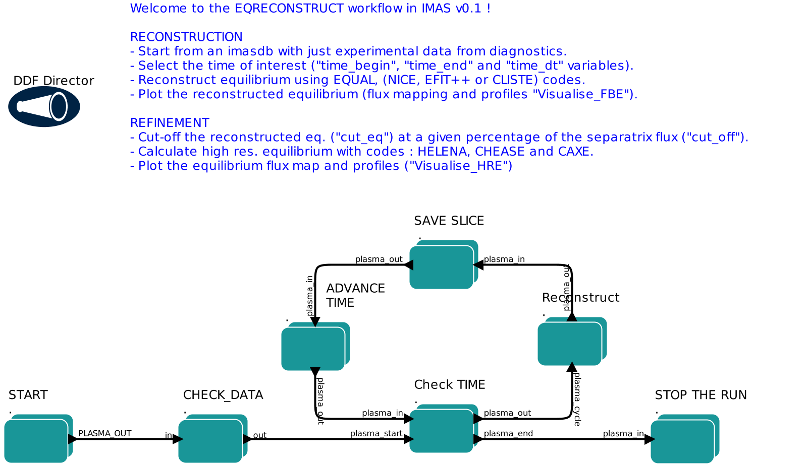
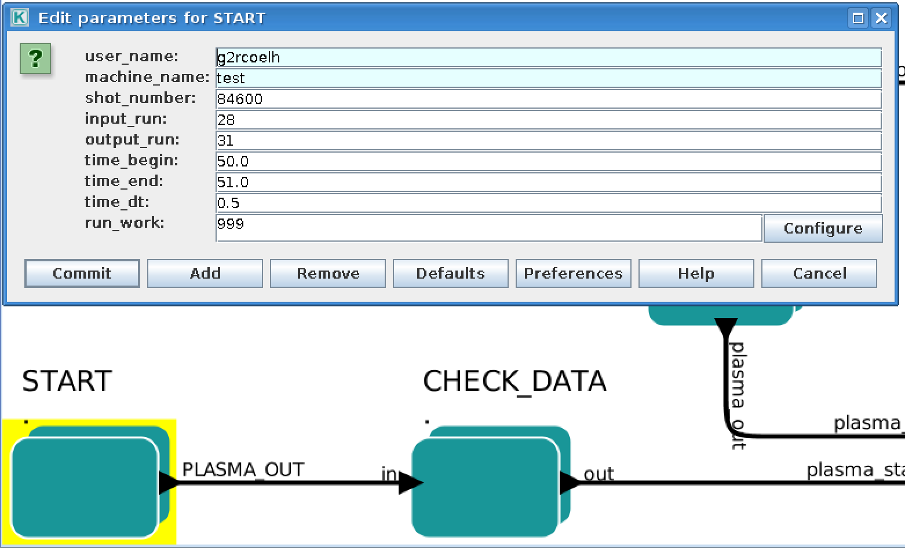
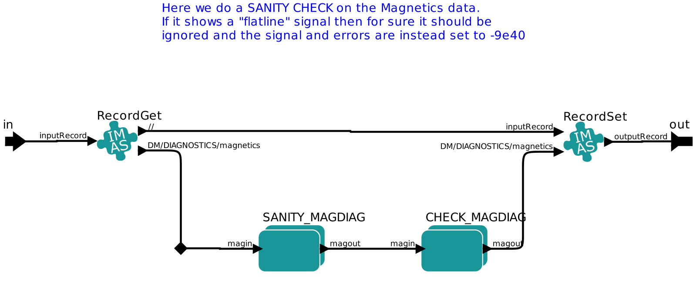
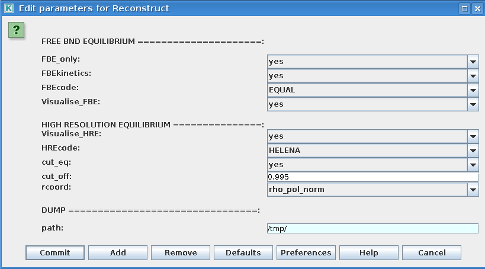
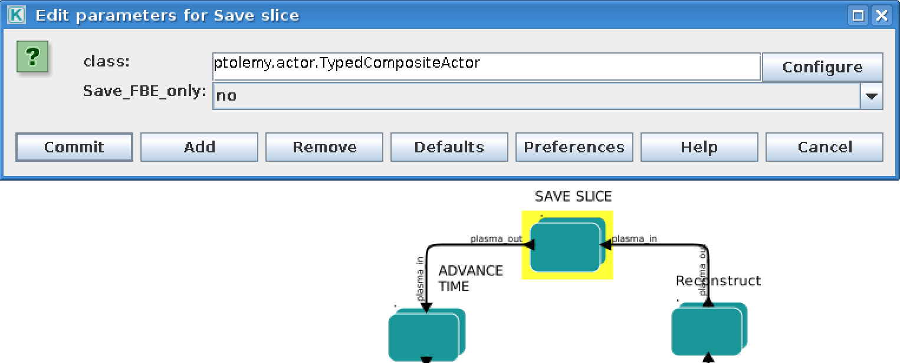

.. _eqreconstruct:

==========================
The EQRECONSTRUCT workflow
==========================

.. _rationale:

1. Workflow rationale
=====================

The EQRECONSTRUCT workflow is a Kepler workflow aimed at performing the
reconstruction of the plasma equilibrium from diagnostic data. The
workflow can perform both a single time reconstruction and over a
defined time range with a user defined sampling rate. The workflow
design facilitates the integration of a variety of plasma reconstruction
equilibrium codes, all using the same input data from a user defined
IMAS database. In addition, during all workflow stages (including
initialization and finalization), the experimental and modeling data are
cast under the same conceptual data bundling as used by the `ETS <https://portal.eufus.eu/twiki/bin/view/Main/ETS>`_,
`HCD <https://portal.eufus.eu//documentation/ITM/html/imp5_workflow__imp5hcd.html>`_
and `EQSTABIL <KeplerWorkflow_EQSTABIL>`_ workflow. This deliberate
choice greatly facilitates the interfacing to any of such workflows. In
fact, elements of the EQSTABIL workflow can and were seamlessly
integrated in the workflow namely the stage for high resolution
equilibrium actors for axisymmetric toroidal static plasmas with
isotropic pressure.

The workflow includes built-in visualization plugin options to visualize
the equilibrium reconstruction (and high resolution calculation) during
the run execution. This allow for an immediate inspection of the
results. Some fundamental data verification is performed on the input
and processed data to ensure a “safe landing” of the workflow in case
any problems are identified.

The workflow is presently targeting primarily straightforward magnetics
only plasma reconstruction calculations in any plasma scenario.
Interferometry, polarimetry and Motional Stark Effect assisted
reconstructions are also possible since no workflow changes are
necessary. Future versions of the workflow will incorporate kinetic data
(thermal/fast pressure).

The workflow is not meant for running use cases that require strong user
intervention during the run execution e.g. setting different code
parameters at different time steps (though possible by pausing the
workflow, changing the code parameters and resuming) for deselecting
given diagnostic channels or changing regularization coefficients.

.. _organization:

2. Workflow organization & design
=================================

The top level layout of the workflow is shown below.

As shown in the workflow layout, the workflow execution typically
follows the following steps (further detailed below):

-  START (set up input imasdb database and simulation time range)
-  CHECK_DATA (verify data consistency)
-  Check TIME (continue simulation if time < time_end)
-  Reconstruct (calculate reconstructued equilibrium and high resolution
   equilibrium)
-  SAVE SLICE (save time slice on database)
-  ADVANCE TIME (advance time to next time step)
-  STOP THE RUN (end the simulation and stop)

**I - START**
-------------

Composite actor used to initialize the workflow. It reads experimental
data from an ITM database and assembles the plasma bundle. The database
details e.g. \_user, device, shot, run\ *in* are configurable in the
actor when double clicking on the actor (see Figure below).

           
            
**II - CHECK_DATA**
-------------------

In this composite actor a basic sanity check is performed on the input data
and appropriate action is taken e.g. if there is no magnetics sensor data
it is pointless for the workflow to proceed and execution is immediately
stopped. Additional checking and action includes for instance flagging as
invalid any sensor data with flatline signal (see Figure below for the
sequence of 2 steps)

**III - Reconstruct**
---------------------

In this composite actor the actual calculation of the reconstructed
equilibrium and if requested of the equivalent high resolution equilibrium
(with cut-off plasma boundary with X-point removed) takes place. The user
can easily gain access to several options for workflow execution by double
clicking on the actor (see Figure below).

Among the several options the user can choose :

-  To perform plasma equilibrium reconstruction only (FBE_only = yes/no)
-  Which code to use to perform the equilibrium reconstruction (FBEcode)

   -  `EQUAL <https://portal.eufus.eu/twiki/bin/view/Main/EquilibriumCode_EQUAL>`__
   -  `NICE <https://portal.eufus.eu/twiki/bin/view/Main/EquilibriumCodeNICE>`__
   -  `EFIT++ <https://portal.eufus.eu/twiki/bin/edit/Main/EquilibriumCode_EFITpp?topicparent=Main.KeplerWorkflow_EQRECONSTRUCT;nowysiwyg=0>`__
   -  `CLISTE <https://portal.eufus.eu/twiki/bin/view/Main/EquilibriumCode_CLISTE>`__
-  Which code to use for high resolution equilibrium (HREcode)

   -  `HELENA <https://portal.eufus.eu/twiki/bin/view/Main/EquilibriumCode_HELENA>`__
   -  `CHEASE <https://portal.eufus.eu/twiki/bin/view/Main/EquilibriumCode_CHEASE>`__
   -  `CAXE <https://portal.eufus.eu/twiki/bin/view/Main/EquilibriumCode_CAXE>`__

- If cutting the equilibrium to be piped to the high resultuion calculation
   is necessary (cut_eq = yes/no) and if so at what percentage of the
   normalised separatrix flux (0<cut_off<1)
- To visualise the reconstruction and high resolution results during
   workflow execution (Visualise_FBE, Visualise_HRE=yes/no)

When the user chooses to cut the boundary to perform the high resolution
equilibrium calculations:

-  A new plasma boundary is determined from the calculated 2D flux map
-  The plasma profiles are also cut accordingly (the plasma is not
   artifically "shrank")
-  The total toroidal plasma current is *not* recalculated (equilibrium
   code should be set to use the boundary poloidal magnetic flux as
   boundary confition)
-  A plot of the original + cut_off equilibrium summary is shown if
   \_Visualise\ *HRE=yes*.

When the user chooses to visualise any of the calculated equilibria (
\_Visualise\ *FBE=yes or* \_Visualise\ *HRE=yes*):

-  A window showing the 2D poloidal flux map and radial profiles of
   Pressure, Toroidal averaged current density and q-profile is
   displayed for 4 seconds.
-  Corresponding image files are saved at the filesystem path indicated
   by the user selected *path* variable ( **START** actor setup).

**IV - SAVE SLICE**
-------------------

In this composite actor the calculated equilibria are saved at each time
step. Depending on whether the user choses to calculate also the high
resolution equilibrium and if the Save_FBE_only parameter is set to
"yes" or "no", a different number of occurrences of the equilibrium IDS
can be stored (see Figure below).

The purpose of saving at each time slice several versions of the
equilibrium is to grant extra flexibility. If the user decides to
calculate the high resolution equilibrium associated to the
reconstructed plasma equilibrium, it might be worth store all 3 stages
of the calculated equilibrium. This is managed by using multiple
*occurrences* of the equilibrium IDS.

High resolution equilibrium is stored as occurrence=0, the cut boundary
"precursor equilibrium" as occurrence=1 and the equilibrium
reconstruction as occurrence=2. To control the imasdb saving option
please refer to the SAVE SLICE parameter details.

.. _installing:

3. Installing and running the workflow
======================================

Establish the IMAS environment by typing

.. code-block:: console

   module purge
   module load cineca
   module load imasenv

   export KEPLER_DIR=$ITMWORK/imas_kepler

if it is the first time you go through this process you will need to create the imas_kepler directory

.. code-block:: console

   mkdir $ITMWORK/imas_kepler

(the one below is the latest version of the dressed kepler containing all the actors for EQRECONSTRUCT, EQSTABIL and ETS-6)

.. code-block:: console

   module switch kepler/2.5p4-3.0.6_dressed_3.25
   kepler_install my_2.5p4-3.0.6_dressed_3.25
   kepler_load my_2.5p4-3.0.6_dressed_3.25

Once you have installed kepler you do not need to repeat this operation and it will be enough to 
execute the kepler_load instruction.

Now you need to check out the workflow by typing (only for first time users)

.. code-block:: console

   svn co --username g2mroma https://gforge6.eufus.eu/svn/eqstabil/tags/imas_3.25.0_4.4.0/workflows eqstabil_workflow

Create the database folder with the name of the device you wish to run the equilibrium for

.. code-block:: console

   imasdb JET

Retrieve the data for magnetic-only equilibrium by launching IMASviz or TCV2IDS

Import the following IDSs  

magnetics, pf_active, (pf_passive), (iron_core), wall, tf

Note that iron_core is only needed for JET and WEST and pf_passive is only desirable (not supported by all equilibrium reconstruction actors)

You are now ready to launch Kepler by typing

.. code-block:: console

   kepler

load the EQRECONSTRUCT workflow from your eqstabil_workflow directory

4. Setting up the Workflow and Actor parameters
===============================================

**I - Setting the workflow parameters**
---------------------------------------

The workflow parameters in the **START** actor are as follows:

-  **shot** : the shot number on the user database (or from another user) where to read the reference equilibrium from (shot/run_in pair)
- **run_in** : the run number where the reference equilibrium is (shot/run_in pair)
- **run_work**: placeholder run for the temporary Kepler CPOs
- **run_out**: run number where the final results of the run will be stored (user running the workflow/shot/run_out). Since the input equilibrium can be a reconstruction that goes beyond the separatrix, 3 occurrences of the equilibrium are saved (original eq., cut equilibrium inside separatrix and corresponding high resolution equilibrium).
- **user**: username. Reading from someone else database is possible but the run_out will naturally be written to personal database only.
- **device** : device database where the input reference data is. MUST BE the same as the device set once running "*imasdb*" command otherwise the run_out data will end on the wrong database path.
- **time_begin**: starting time for the run (in *seconds*).
- **time_end**: ending time for the run (in *seconds*).
- **time_dt** : time step (constant value) while moving from \_time\*begin* to \_time\ *end*.

The workflow parameters in the **Reconstruct** actor are as follows:

- **FBE_only**: Set to "*yes*" if addressing only the plasma equilibrium reconstruction. If set to "*no*" the high resolution equilibrium is also calculated.
- **FBEcode**: Choice for equilibrium reconstruction code to be used.
- **Visualise_FBE**: Set to "*yes*" to get a plot of the reconstructed equilibrium at every step.
- **Visualise_HRE**: Set to *yes* to get a plot of the high resolution equilibrium derived from the reconstructed equilibrium at every step.
- **HREcode**: Choice for high resolution equilibrium code to be used.
- **cut_eq**:

   - yes: cut the input equilibrium (necessary if high resolution equilibrium code cannot handle separatrix plasma equilibria)
   - no: input equilibrium is used "as is".

- **cut_off**: float ]0,1], specifies the percentage of the separatrix flux that will define the poloidal flux of the new plasma boundary.
- **path**: temporary folder where to dump the plots generated. Also used to store output files (used by HELENA).

The workflow parameters in the **SAVE SLICE** actor are as follows:

-  **Save_FBE_only**:

   -  yes : only occurrence=0 is saved. If the user set \_FBE\ *only=yes* then the equilibrium reconstruction is saved, otherwise the high resolution equilibrium is stored.
   -  no : occurrences = 0,1,2 are saved. Only meaningful if the user set \_FBE\ *only=no*. High resolution equilibrium is stored as occurrence=0, the cut boundary "precursor equilibrium" as occurrence=1 and the equilibrium reconstruction as occurrence=2

*The user can always stop the workflow by Pressing the STOP button in
Kepler canvas.*

**II - Setting actor parameters**
---------------------------------

Actor parameters are set on the actors themselves (not passed by the
workflow). To access the actors codeparam the easiest route is to :

 1. Click on "Outline" Tab (below the "Pause" button in the KEPLER canvas)
 2. Type the name of the actor and press "Search" (or Enter)
 3. On the final item in the chain of the actor composite, right click and press"Configure". A pop-up panel appears
 4. Click on "Edit Code Parameters" and a new window appears
 5. Edit the code parameters and Press "Save & Exit"
 6. Press "Commit" and setting is completed

.. _activity:

6. News and Recent activity
===========================

*8th March 2019: JET version of the workflow tested successfully on
test/84600/28 database. Only EQUAL + HELENA codes included. Successful
run from t=49s to 53s with both EQUAL and HELENA being executed and the
corresponding data stored on the IMAS database (run=33).*
