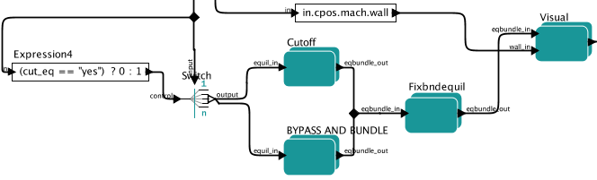

.. _eqstabil:

=================================================
Equilibrium and MHD Stability workflow (EQSTABIL)
=================================================

Workflow rationale
==================

The EQSTABIL workflow is a Kepler workflow aimed at performing linear
MHD stability analysis of tokamak plasma equilibria for a single or
multiple toroidal mode numbers when executed. The high resolution
equilibrium actors consider axisymmetric toroidal static plasmas with
isotropic pressure and the linear MHD stability models stem from single
fluid ideal/resistive MHD with compressibility.

The workflow is meant for straightforward stability calculations of any
plasma scenario, reading from a pre-existent WPCD database shot/run/time
entry. Therefore,

-  Equilibrium data need to be read from experimental databases and stored locally 
   on the platform where EQSTABIL is run. 
   Alternatively the equilibrium IDS could be the output of another workflow (e.g. 
   EQRECONSTRUCT or ETS)
-  It is not meant for parametric studies in a single workflow execution
   e.g. process several time slices or scan over resistive wall position
   or number of poloidal harmonics. Dedicated runs for such cases are
   necessary, storing each run on a dedicated output shot/run_out
   database entry. The workflow may be subject to upgrades/revisions to
   accomodate new features that facilitate/enhance user experience so
   stay tuned for News and Recent activity.

Workflow organization & design
===============================

The top level layout of the workflow is shown below.

.. figure:: images/equstabil_1.png
   :align: center

The workflow is organised in four sequential steps :

Initialization
--------------

Composite actor used to initialize the workflow. It reads from the IMAS 
database that is specified by local variables (user, device, shot,
run_in) and for the closest time sample to local variable *time* .
If the user reads the input data from some other user database, the
output data will however be written on his/her own database with shot/run_out id.

-> The workflow local variable *device* **must** be the same as the
environment variable TOKAMAKNAME. In case the two do not match the
workflow stops execution. The user must close the workflow, set imasdb with
the correct device name and run the workflow.

-> Validity checks (void/not void) are made on the input equilibrium and
core_profile IDSs (MARSGW actor can use core_profile for density profile). If
the equilibrium IDS is not considered valid the workflow stops. If the
core_profile IDS is not considered valid, the workflow continues to run but
the user can still have the option to stop it before executing the
chosen MHD code.

At the exit of the Composite actor, a Plasma_reference bundle (list of
Kepler variables, mimicking the ETS bundle is returned. This
facilitates the future coupling of the workflow to the ETS.

FixedBndCode
------------

Composite actor that prepares/calculates the equilibrium to be passed
later to the MHD stability codes. This composite actor is composed of 3
main steps:

Redefining the plasma boundary (Cutoff)
~~~~~~~~~~~~~~~~~~~~~~~~~~~~~~~~~~~~~~~

This is deemed necessary when the input equilibrium
(reconstructed/predictive equilibrium) as a separatrix as plasma boundary
since at this moment none of the flux coordinates based equilibrium codes
handles/returns plasmas with a separatrix.

If the input equilibrium does not contain a Psi(R,Z) equilibrium mapping
the cut-off is not possible and thus the workflow execution will be
stopped.

Redefining the plasma boundary is done by setting cut_eq: yes and places
the new plasma boundary at a flux surface corresponding to cut_off (in
percentage) of the input boundary flux.

The plasma profiles are also cut-off accordingly. An equilibrium bundle
exits the actor containing occurrence=1 for the cut-off input equilibrium
and occurrence=2 for the original equilibrium. If cut_off:no then both
occurrences contain the original equilibrium.

A plot of the original + cut_off equilibrium summary is shown. Closing the
plot window leads to the second stage.

Calculation of Equilibrium (Fixbndequil)
~~~~~~~~~~~~~~~~~~~~~~~~~~~~~~~~~~~~~~~~

Calculation of the high resolution equilibrium with 3 possible codes
(CAXE, CHEASE, HELENA). The cut-off equilibrium (or original one) is
passed to the equilibrium codes. The output HR equilibrium is added to
the equilibrium bundle such that in the end one has occurrence=0 for the
HR, occurrence=1 for the cut-off input equilibrium (or the original if
not cut_off is requested) and occurrence=2 for the original
equilibrium.

Visualization (Visual)
~~~~~~~~~~~~~~~~~~~~~~

Visualization part. This part plots the (R,Z) flux map of the HR
equilibrium and the most relevant profiles. The figures are saved
automatically on closing the windows at the *path* indicated in the top
level accordingly Kepler variable.

StabCode
--------

.. figure:: images/equstabil_3.png
   :align: center
           
Composite actor for the MHD stability calculation using 4 possible linear
MHD stability codes (ILSA, KINX, MARS, MARS-F). After execution of the
stability code is completed, plotting of the radial component of the
displacement vector eigenfunction in the plasma domain is shown (real and
imaginary parts). In case multiple toroidal mode numbers are set (ILSA or
KINX), one plot window per each toroidal eigenmode is returned. A Copy in
EPS format of each window is stored on the path defined by Kepler variable
*path*

The Multiple Tab display window will also display the output flag of the
code execution i.e. if the output is valid and the result can be used or
not. The plasma bundle, on exit, is updated with the MHD cpo from the
stability code.

Finalize
--------

Composite actor to wrap up the final plasma bundle, with the equilibrium
IDS containing 3 occurrences and one occurrence of the MHD IDS.

N.B. Only a single time slice of equilibrium and MHD IDSs is written, the
remaining plasma bundle IDSs are written "as is" (whatever time slices).

Actors involved
===============

+-----------------------+-----------------------+-------------------------+
|     **Name**          |     **Location**      |     **Description**     |
|                       |                       |                         |
+-----------------------+-----------------------+-------------------------+
| Check_Device          | INITIALIZATION        | | Checks if the         |
|                       |                       |   *device* Kepler       |
|                       |                       | | variable coincides    |
|                       |                       |   with the environment  |
|                       |                       | | variable TOKAMAKNAME. |
|                       |                       |   If not the run stops. |
+-----------------------+-----------------------+-------------------------+
| SELECT_TIME_CORE/EQ   | INITIALIZATION        | | Selects time slice of |
|                       |                       |   IDSs matching/closest |
|                       |                       | | to the requested time |
|                       |                       |   in *time* Kepler      |
|                       |                       |   variable              |
+-----------------------+-----------------------+-------------------------+
| Check Coreprof/Equil  | INITIALIZATION        | | Checks the            |
| Time and Flag         |                       |   output_flag of the    |
|                       |                       | | input IDSs to know if |
|                       |                       |   they are valid and    |
|                       |                       | | prints the actual     |
|                       |                       |   time stamp retrived   |
|                       |                       | | from both IDSs (if    |
|                       |                       |   time = -1 and         |
|                       |                       | | output_flag is        |
|                       |                       |   negative then the IDS |
|                       |                       | | is not valid). If the |
|                       |                       |   equilibrium is        |
|                       |                       | | considered invalid a  |
|                       |                       |   message in displayed  |
|                       |                       | | on the Multi Tab      |
|                       |                       |   Display window and    |
|                       |                       | | workflow execution is |
|                       |                       |   stopped. If the       |
|                       |                       | | core_profile is           |
|                       |                       |   considered invalid a  |
|                       |                       | | message is displayed  |
|                       |                       |   on the Multi Tab      |
|                       |                       | | Display window but    |
|                       |                       |   the workflow will     |
|                       |                       | | continue since some   |
|                       |                       |   of the MHD codes      |
|                       |                       | | handle plasma density |
|                       |                       |   internally as code    |
|                       |                       | | parameter and their   |
|                       |                       |   execution is not      |
|                       |                       |   affected.             |
+-----------------------+-----------------------+-------------------------+
| Cutoff                | FixedBndCode          | | Performs the          |
|                       |                       |   cut-off of the input  |
|                       |                       | | equilibrium if        |
|                       |                       |   requested and         |
|                       |                       | | provided the input    |
|                       |                       |   CPO has a poloidal    |
|                       |                       | | flux (Psi) mapping    |
|                       |                       |   i.e. Psi(R,Z). If not |
|                       |                       | | present then workflow |
|                       |                       |   execution stops and a |
|                       |                       | | message is displayed  |
|                       |                       |   on the Multi Tab      |
|                       |                       | | Display window. A     |
|                       |                       |   plot with the         |
|                       |                       | | original (in blue)    |
|                       |                       |   and cut equilibrium   |
|                       |                       | | (in green) is shown   |
|                       |                       |   when cut_off: yes     |
|                       |                       | | A plot with           |
|                       |                       |   just the original (in |
|                       |                       | | blue) equilibrium is  |
|                       |                       |   shown when            |
|                       |                       |   cut_off : no          |
|                       |                       |                         |
|                       |                       | | **NOTE**: A           |
|                       |                       |   useful trick to STOP  |
|                       |                       | | the workflow          |
|                       |                       |   execution*-> when a   |
|                       |                       | | Python plot window is |
|                       |                       |   shown, Press the STOP |
|                       |                       | | button on the Kepler  |
|                       |                       |   GUI before closing    |
|                       |                       | | the plot window. This |
|                       |                       |   ensures workflow      |
|                       |                       | | execution is stopped  |
|                       |                       |   since Kepler is       |
|                       |                       | | waiting for Python    |
|                       |                       |   process to            |
|                       |                       |   proceed.              |
+-----------------------+-----------------------+-------------------------+
| Fixbndequil           | FixedBndCode          | | Selects from a pool   |
|                       |                       |   of 3 equilibrium      |
|                       |                       | | codes the one to      |
|                       |                       |   launch according to   |
|                       |                       | | the value of the      |
|                       |                       |   Kepler variable       |
|                       |                       |   *eqcode*              |
+-----------------------+-----------------------+-------------------------+
| Caxe                  | FixedBndCode          | | The CAXE code.        |
|                       |                       | | It can operate        |
|                       |                       |   jointly with KINX     |
|                       |                       |   only.                 |
+-----------------------+-----------------------+-------------------------+
| Chease                | FixedBndCode          | | The CHEASE code.      |
|                       |                       | | It can operate        |
|                       |                       |   jointly with ILSA,    |
|                       |                       |   MARS                  |
|                       |                       | | and MARS-F            |
+-----------------------+-----------------------+-------------------------+
| Helena                | FixedBndCode          | | The HELENA code.      |
|                       |                       | | It can operate        |
|                       |                       |   jointly with ILSA,    |
|                       |                       |   MARS                  |
|                       |                       | | and MARS-F            |
+-----------------------+-----------------------+-------------------------+
| Visual                | FixedBndCode          | | Visualize the         |
|                       |                       |   resulting equilibrium.|
|                       |                       | | A Copy in EPS format  |
|                       |                       |   is stored on the path |
|                       |                       | | defined by Kepler     |
|                       |                       |   variable %BLUE%path   |
+-----------------------+-----------------------+-------------------------+
| Ilsa                  | StabCode              | | The ILSA code suite.  |
|                       |                       | | At the moment only    |
|                       |                       |   the MISHKA1 kernel    |
|                       |                       | | (ideal incompressible |
|                       |                       |   MHD) is active        |
+-----------------------+-----------------------+-------------------------+
| Kinx                  | StabCode              | The KINX code.          |
+-----------------------+-----------------------+-------------------------+
| Marsgw                | StabCode              | The MARS code           |
+-----------------------+-----------------------+-------------------------+
| Marsf                 | StabCode              | The MARS-F code         |
+-----------------------+-----------------------+-------------------------+
| PLOT_EIGENFUNCTION    | StabCode              | | Visualize the real    |
|                       |                       |   and imaginary         |
|                       |                       | | eigenfunction         |
|                       |                       |   components. In case   |
|                       |                       | | multiple toroidal     |
|                       |                       |   mode numbers are set  |
|                       |                       | | (ILSA or KINX), one   |
|                       |                       |   plot window per each  |
|                       |                       | | toroidal eigenmode is |
|                       |                       |   returned. A Copy in   |
|                       |                       | | EPS format of each    |
|                       |                       |   window is stored on   |
|                       |                       | | the path defined by   |
|                       |                       |   Kepler variable *path*|
+-----------------------+-----------------------+-------------------------+

Setting up Workflow and Actor parameters
========================================

Setting workflow parameters
----------------------------

The workflow has basic settings in order to work.

-  **shot** : the shot number on the user database (or from another user)
   where to read the reference equilibrium from (shot/run_in pair)
-  **run_in** : the run number where the reference equilibrium is
   (shot/run_in pair)
-   **run_work** : placeholder run for the temporary Kepler IDSs
-  **run_out** : run number where the final results of the run will be
   stored (user running the workflow/shot/run_out). Since the input
   equilibrium can be a reconstruction that goes beyond the separatrix, 3
   occurrences of the equilibrium are saved (original eq., cut equilibrium
   inside separatrix and corresponding high resolution equilibrium).
-  **user** : username. Reading from someone else database is possible but
   the run_out will naturally be written to personal database only.
-  **device** : device database where the input reference data is. MUST BE
   the same as env variable TOKAMAKNAME
-  **time** : time slice (in equilibrium IDS) to be analysed in case the
   input shot/run_in contains many time slices.
-  **path** : temporary folder where to dump the plots generated. Also used
   to store output files (used by HELENA/ILSA only)
-  **cut_eq** :

   -  yes : cut the input equilibrium (necessary if high resolution
      equilibrium code cannot handle separatrix plasma equilibria)
   -  no : input equilibrium is used "as is".

-  **cut_off** : float ]0,1], specifies the percentage of the separatrix
   flux that will define the poloidal flux of the new plasma boundary.
-  **eqcode** : chease/caxe/helena. The equilibrium code to be used
-  **stabcode** : ilsa/kinx/marsgw/marsf. The MHD stability code to be used

The user can always prevent the workflow from proceeding to the
calculation of the high resolution equilibrium after the cut-off stage
by Pressing the STOP button in Kepler GUI before closing the plot window
with the summary of the equilibrium.

Setting actor parameters
------------------------

Actor parameters are set on the actors themselves (not passed by the
workflow). To access the actors codeparam the easiest route is to :

1. Click on "Outline" Tab (below the "Pause" button)
2. Type the name of the actor and press "Search" (or Enter)
3. On the final item in the chain of the actor composite, right click and press "Configure". A pop-up panel appears
4. Click on "Edit Code Parameters" and a new window appears
5. Edit the code parameters and Press "Save & Exit"
6. Press "Commit" and setting is completed

EQSTABIL Tutorial
=================

Tutorial on using EQSTABIL workflow is available in :download:`PDF
<static/EQSTABIL_tutorial_20151214.pdf>`.
