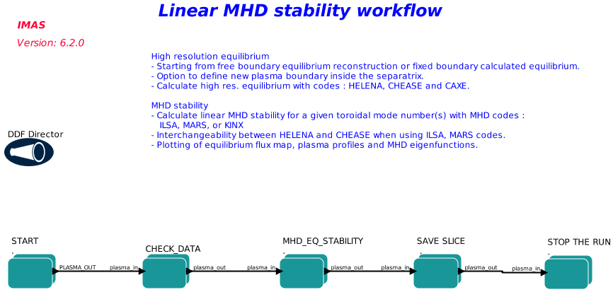
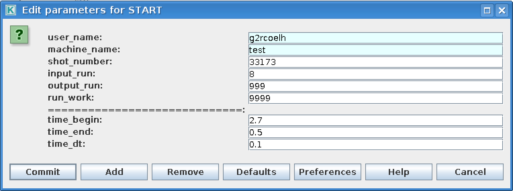
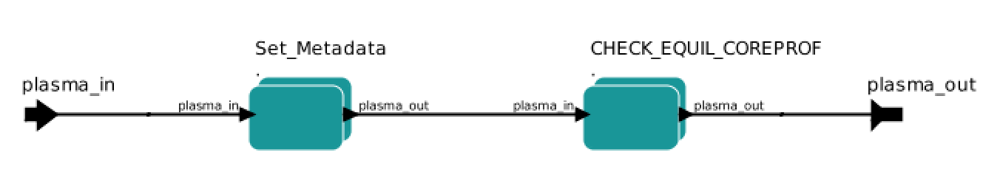
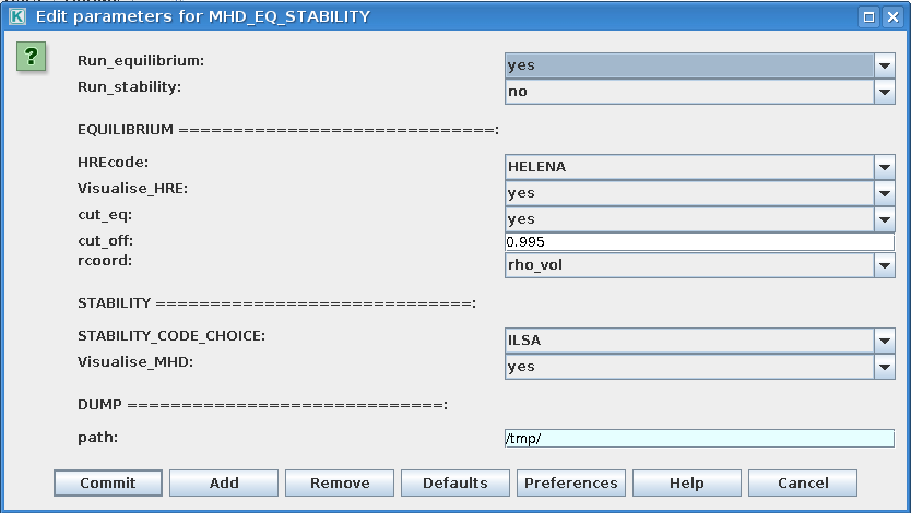
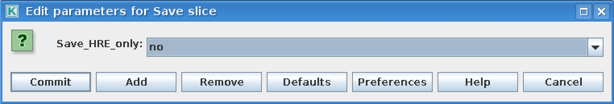

.. _eqstabil:

=================================================
Equilibrium and MHD Stability workflow (EQSTABIL)
=================================================

Workflow rationale
==================

The EQSTABIL workflow is a Kepler workflow aimed at performing linear
MHD stability analysis of tokamak plasma equilibria for a single or
multiple toroidal mode numbers when executed. The high resolution
equilibrium actors consider axisymmetric toroidal static plasmas with
isotropic pressure and the linear MHD stability models stem from single
fluid ideal/resistive MHD with compressibility.

The workflow is meant for straightforward stability calculations of any
plasma scenario, reading from a pre-existent WPCD database shot/run/time
entry. Therefore,

-  It does not read from experimental databases storing locally processed plasma
   equilibrium e.g. PPFs (JET) or shotfiles (AUG). These can be fetched using the
   several methods developed under the `EWE1 thrust of WPCD <https://users.euro-fusion.org/iterphysicswiki/index.php/EWE-1_Data_access,_interfaces_and_data_preparation_routines_for_the_initialization_of_WPCD_workflows_to_enable_MST/JET/WPs_exploitation>`__.
-  Alternatively the equilibrium IDS could be the output of another workflow e.g. 
   EQRECONSTRUCT or ETS.
-  It is not meant for parametric studies in a single workflow execution
   e.g. process several time slices or scan over resistive wall position
   or number of poloidal harmonics. Dedicated runs for such cases are
   necessary, storing each run on a dedicated output shot/run_out
   database entry. The workflow may be subject to upgrades/revisions to
   accomodate new features that facilitate/enhance user experience so
   stay tuned for News and Recent activity.
-  The workflow design facilitates the integration of a variety of plasma 
   equilibrium and stability codes, all using the same input data from a user
   defined IMAS database. In addition, during all workflow stages (including 
   initialization and finalization), the modeling data are cast under the same
   conceptual data bundling as used by the `ETS <https://portal.eufus.eu/twiki/bin/view/Main/ETS>`_,
   `HCD <https://portal.eufus.eu//documentation/ITM/html/imp5_workflow__imp5hcd.html>`_
   and `EQRECONSTRUCT <https://wpcd-workflows.github.io/eqreconstr.html>`_ workflow.
   This deliberate choice greatly facilitates the interfacing to any of such workflows.

The workflow includes built-in visualization plugin options to visualize the equilibrium during the run execution. This allow for an immediate inspection of the results. Some fundamental data verification is performed on the input and processed data to ensure a “safe landing” of the workflow in case any problems are identified.

Workflow organization & design
===============================

The top level layout of the workflow is shown below.

As shown in the workflow layout, the workflow execution typically follows the following steps (further detailed below):

-  **START** (set up input imasdb database and requested simulation time instant)
-  **CHECK_DATA** (verify data consistency)
-  **MHD_EQ_STABILITY** (high resolution equilibrium and MHD stability calculation for a given time step)
-  **SAVE SLICE** (save time slice on database)
-  **STOP THE RUN** (end the simulation and stop)

START
------------
Composite actor used to initialize the workflow. It reads experimental data from an ITM database and assembles the plasma bundle. The database details e.g. user, device, shot, run_in are configurable in the actor when double clicking on the actor (see Figure below). For the moment the "time_begin", "time_end" and "time_dt" parameters are not in use as time cycle parameters. Only "time_begin" is in use as the selected time to perform the simulation.

CHECK_DATA
------------
In this composite actor a basic sanity check is performed on the input data and appropriate action is taken e.g. if there is no equilibrium data it is pointless for the workflow to proceed and execution is immediately stopped. If core_profiles IDS is not present then the workflow continues but flags a warning since some of the MHD codes might not work e.g. mass density will have to be set in some sort using the code parameters.

MHD_EQ_STABILITY
------------
In this composite actor the actual calculation of the high resolution equilibrium and and MHD stability is performed. There are several options aviable for the user to set e.g. enable visualization during execution, perform only equilibrium or stability calculation. The user can easily gain access to several options for workflow execution by double clicking on the actor (see Figure below).

Among the several options the user can choose :

-  To run plasma equilibrium code (Run_equilibrium = yes/no)
-  To run plasma stability code (Run_stability = yes/no)
-  Which code to use to perform the equilibrium calculation (HREcode)
 
   -  HELENA (tested)
   -  CHEASE (tested)
   -  CAXE (tested)

-  Which code to use for MHD stability (STABILITY_CODE_CHOICE)

   -  ILSA
   -  MARS
   -  KINX

-  To visualise the high resolution results and MHD stability during workflow execution (Visualise_HRE, Visualise_MHD=yes/no)
-  If cutting the equilibrium to be piped to the high resultuion calculation is necessary (cut_eq = yes/no) and if so at what percentage of the normalised separatrix flux (0<cut_off<1). When the user chooses to cut the boundary to perform the high resolution equilibrium calculations:

   -  A new plasma boundary is determined from the calculated 2D flux map
   -  The plasma profiles are also cut accordingly (the plasma is not artifically "scaled down" in volume)
   -  The total toroidal plasma current is not recalculated (equilibrium code should be set to use the boundary poloidal magnetic flux as boundary condition)
   -  A plot of the original + cut_off equilibrium summary is shown if Visualise_HRE=yes .

When the user chooses to visualise any of the calculated equilibria or MHD eigenfunctions ( Visualise_HRE=yes or Visualise_MHD=yes):

-  Three windows showing

   -  The 2D poloidal flux map and radial profiles of Pressure, Toroidal averaged current density and q-profile on the rcoord grid.
   -  The profiles of P, P', F and FF' on the rcoord grid.
   -  The rho_pol_norm "radial" grid in terms of grid index.

-  The 1D profile of the eigenfunctions for the mode(s) selected in the code parameters of the MHD code.
-  Corresponding image files are saved at the filesystem path indicated by the user selected path variable.

SAVE SLICE
------------
In this composite actor the calculated equilibria and MHD data objects are saved for the requested time step. Depending on whether the Save_HRE_only parameter is set to "yes" or "no", a different number of occurrences of the equilibrium IDS can be stored (see Figure below).

The purpose of saving several versions of the equilibrium is to grant extra flexibility. If the user decides to calculate the high resolution equilibrium associated to a reconstructed plasma equilibrium, it might be worth storing all 3 stages of the calculated equilibrium. This is managed by using multiple occurrences of the equilibrium IDS.

High resolution equilibrium is stored as occurrence=0, the cut boundary "precursor equilibrium" as occurrence=1 and the original equilibrium (likely from a reconstruction of experimental equilibrium) as occurrence=2.

Installing the workflow
========================================
To obtain the workflow and included actors a dressed release of KEPLER is recommended. To get such dressed releases please proceed as follows:

-  Get the dressed KEPLER
-  Get the Workflow

**WARNING: Don't forget to set your imasdb device environment before running the workflow (run the "imasdb MACHINE_NAME" command !)**

Setting up Workflow and Actor parameters
========================================

Setting workflow parameters
----------------------------

The workflow parameters in the **START** actor are as follows:

-  **shot** : the shot number on the user database (or from another user) where to read the reference equilibrium from (shot/run_in pair)
-  **run_in** : the run number where the reference equilibrium is (shot/run_in pair)
-  **run_work** : placeholder run for to store (temporarily) the IDS exchanged by the actors in the Kepler workflow
-  **run_out** : run number where the final results of the run will be stored (user running the workflow/shot/run_out). Since the input equilibrium can be a reconstruction that goes beyond the separatrix, 3 occurrences of the equilibrium are saved (original eq., cut equilibrium inside separatrix and corresponding high resolution equilibrium).
-  **user** : username. Reading from someone else database is possible but the run_out will naturally be written to personal database only.
-  **device** : device database where the input reference data is. MUST BE the same as the device set once running "imasdb" command otherwise the run_out data will end on the wrong database path.
-  **time_begin** : selected time instant on input equilibrium to perform the run (in seconds ).
-  **time_end** : not in use.
-  **time_dt** : not in use.

The workflow parameters in the **MHD_EQ_STABILITY** actor are as follows:

-  **Run_equilibrium** : Set to "yes"/"no" to perform plasma equilibrium calculation.
-  **Run_stability** : Set to "yes"/"no" to perform plasma stability calculation.
-  **HREcode** : Choice for equilibrium code to be used.
-  **Visualise_HRE** : Set to "yes" to get a plot of the high resolution equilibrium.
-  **cut_eq** :

   -  **yes** : cut the input equilibrium (necessary if high resolution equilibrium code cannot handle separatrix plasma equilibria)
   -  **no** : input equilibrium is used "as is".

-  **cut_off** : float ]0,1], specifies the percentage of the separatrix flux that will define the poloidal flux of the new plasma boundary.
-  **rcoord** : choose either "rho_pol_norm" or "rho_vol" as radial coordinate for the plots to be displayed.
-  **STABILITY_CODE_CHOICE**: Choice for MHD stability code to be used.
-  **Visualise_MHD** : Set to "yes" to get plots of the linear MHD eigenfunctions.
-  **path** : temporary folder where to dump the plots generated. Also used to store output files (used by HELENA)

The workflow parameters in the **SAVE SLICE** actor are as follows:

-  **Save_HRE_only**:

   -  **yes** : only occurrence=0 of equilibrium i.e. the output of the high resolution code is saved.
   -  **no** : occurrences = 0,1,2 are saved. High resolution equilibrium is stored as occurrence=0, the cut boundary "precursor equilibrium" as occurrence=1 and the equilibrium input (e.g. from equilibrium reconstruction) as occurrence=2. If "cut_eq"=""no" then occurrence=1 and occurrence=2 are copies of the input equilibrium.

**The user can always stop the workflow by Pressing the STOP button in Kepler canvas.**

Setting actor parameters
------------------------

Actor parameters are set on the actors themselves (not passed by the
workflow). To access the actors codeparam the easiest route is to :

1. Click on "Outline" Tab (below the "Pause" button)
2. Type the name of the actor and press "Search" (or Enter)
3. On the final item in the chain of the actor composite, right click and press "Configure". A pop-up panel appears
4. Click on "Edit Code Parameters" and a new window appears
5. Edit the code parameters and Press "Save & Exit"
6. Press "Commit" and setting is completed

EQSTABIL Tutorial
=================

Tutorial on using EQSTABIL workflow is available in :download:`PDF
<static/EQSTABIL_tutorial_20151214.pdf>`.
