################################
 Core Transport Simulator (ETS)
################################

*************************
Documentation for the ETS
*************************

-  `Description of the ETS <https://portal.eufus.eu/documentation/ITM/imports/imp3/public/ETS_Documentation/ETS_TRANSPORT_EQUATIONS.pdf>`__ 
-  `Form of the standardize equations <https://portal.eufus.eu/documentation/ITM/imports/imp3/public/ETS_Documentation/STANDARDISED_EQUATION.pdf>`__
-  `ETS User Guide <https://portal.eufus.eu/documentation/ITM/imports/imp3/public/ETS_Documentation/ETS_User_Guide.pdf>`__
-  `ETS Status <https://portal.eufus.eu/documentation/ITM/imports/imp3/public/ETS_Documentation/ETS_Status.pdf>`__

.. _ETS_in_KEPLER:

***********************
ETS workflows in KEPLER
***********************

The ETS workflow is used for 1-D transport simulation of a tokamak core
plasma.

**ETS workflows in KEPLER**:

-  use actors and composite actors from other IMPs, thus for the most
   recent versions of them please check with relevant project
-  complex, but clearly structured workflow, which offers user friendly
   interface for configuring the simulation
-  allow for easy modifications (connecting new modules, or reconnecting
   parts of the workflow) through an easy graphical interface
-  provide users with all updates through the version control system
-  still in active development tool

The default ETS release is the tag4.10b10.3

**Before installation make sure that:**

-  you have your private data base for the version of the
   UAL
   required by the workflow
-  you have the version of
   KEPLER
   required by the workflow installed. Quick start on kepler required
   for the ETS can be found
   here
-  inside the window, where you will be downloading the ETS the source
   command:

.. code-block:: console

   >source $EU-IMSCRIPTDIR/EU-IMv1 Kepler_Version Data_Base_Name UAL_Version
            
is executed.

**To install your local copy of the ETS workflow please do:**

.. code-block:: console

   >svn co https://gforge6.eufus.eu/svn/keplerworkflows/tags/ets_4.10b10.3/ETS
   >cd ETS
   >make import_ets

Press the play button on the workflow.

**The workflow shall run!** If it
does not, please use the contact from above.

**Starting the workflow:**
If you have the workflow already installed, there are there are several
ways tio execute it:

-  For execution via kepler GUI:
   
.. code-block:: console
                
      >kepler.sh workflow_path/workflow_name.xml
          

-  For execution in none GUI mode:

.. code-block:: console

      >kepler.sh -runwf -nogui -redirectgui $EU-IMHOME/some_dir_name workflow_path/workflow_name.xml
          

-  For execution in batch mode:
   it is essential to keep the workflow inside your $EU-IMWORK area

   it is essential to switch to scripts/R2.2 module

.. code-block:: console

      >module switch scripts/R2.2
      >submit_batch_kepler.sh run_dircetory 1 $EU-IMWORK/workflow_path/workflow_name.xml $EU-IMSCRIPTDIR/batch_submission/ParallelKepler.bsub
          

.. _ETS_A_4.10b_run_config:

Configuring the ETS run
=======================

.. _ETS_A_4.10b_workflow_parameters:

Workflow parameters
-------------------

General Parameters
~~~~~~~~~~~~~~~~~~

-  USER
   - your userid
-  MACHINE
   - machine name (database name) for which comutations are done
-  SHOT_IN
   - input shot number
-  RUN_IN
   - input run number
-  SHOT_OUT
   - output shot number
-  RUN_OUT
   - output run number
-  NUMERICAL_SOLVER
   - choice of the numerics solving transport equations (RECOMENDED
   SELECTION: 3 or 4)

Space resolution
~~~~~~~~~~~~~~~~

-  NRHO
   - number of radial points for transport equations
-  NPSI
   - number of points for equilibrium 1-D arrays
-  NEQ_DIM1
   - number of points for equilibrium 2-D arrays, first index
-  NEQ_DIM2
   - number of points for equilibrium 2-D arrays, second index
-  NEQ_MAX_NPOINTS
   - maximum number of points for equilibrium boundary

Time resolution
~~~~~~~~~~~~~~~

**Start and End time:**

-  TBEGIN
   - Computations start time
-  TEND
   - Computattions end time

.. figure:: images/ets_config1.png
   :align: center

   
**Time step:**

-  right click on the box
   BEFORE THE TIME EVOLUTION
-  select
   Configure actor
-  TAU
   :specify value of the time step in [s]
-  TAU_OUT
   : specify value of the output time interval in [s]
-  Commit

.. figure:: images/ets_settings1.png
   :align: center

.. _ETS_A_4.10b_composition:

Ion, Impurity and Neutral Composition
-------------------------------------

Before starting the run you need to define types of main ions, impurity
(optional) and neutrals (optional) to be included in simulations.

To define plasma composition:

-  right click on the box
   BEFORE THE TIME EVOLUTION
-  select **Configure actor**
-  choose one of modes for setting
   Run_compositions

   -  from_input_CPO
      - will pick up the COMPOSITIONS structure of the COREPROF CPO
      saved to the input shot;
   -  configure_manually
      - will force the composition from the values specified below

-  specify values of atomic mass (AMN_ion), nuclear charge ( ZN_ion ) and
   charge ( Z_ion , from the first ion to the last [1:NION] , separated by
   commas
-  (optional) specify values of atomic mass ( AMN_imp ), nuclear charge (
   ZN_imp ) and maximal ionization state ( max_Z_imp ) for impurity ions,
   from the first to the last [1:NIMP] , separated by commas
-  (optional)for neutrals activate, by switchen them to **ON**, the types which
   shall be followed by neutral solver
-  press **Commit**

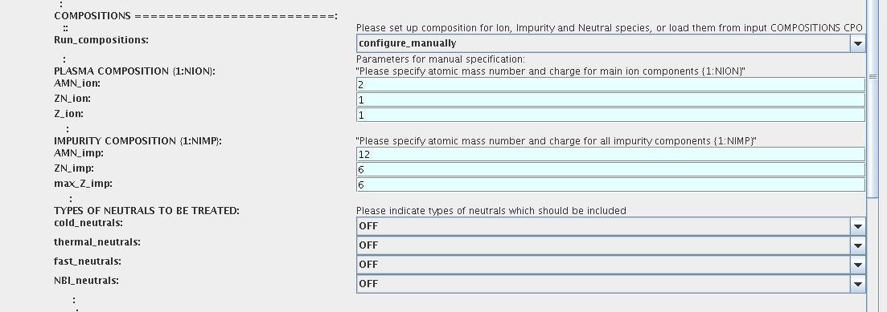
           
.. _ETS_A_4.10b_equations:

Equations to be solved and boundary conditions
----------------------------------------------

Main Plasma
~~~~~~~~~~~

Before starting the run you need to select the type and value of the
boundary conditions for all equations. Please note that the value should
correspond to the type. All equations allow for following types of
boundary conditions:

-  OFF
   - equation is not solved, initial profiles will be kept for whole run
-  value
   - edge value should be specified
-  gradient
   - edge gradient should be specified
-  scale_length
   - edge scale length should be specified
-  generic
   - generic form:
   a1*y´ + a2*y = a3
   of the boundary condition is assumed, 3 coefficients (a1, a2, a3) should be provided
-  value_from_input_CPO
   - equation is solved, edge value evolution will be red from input
   shot
-  profile_from_input_CPO
   - equation is not solved, profile evolution will be red from input
   shot

The particular equation will be activated if the boundary condition type
for it is other than *OFF*

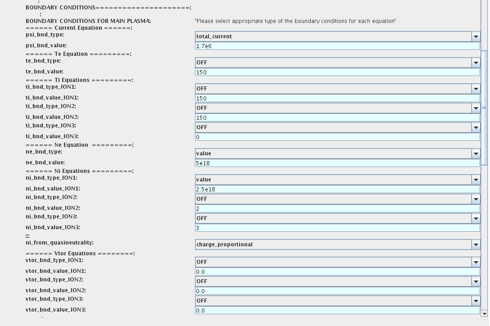
           

To set up boundary conditions:

-  right click on the box BEFORE THE TIME EVOLUTION
-  select **Configure actor**
-  select appropriate boundary condition for each equation
-  specify values for boundary conditions corresponding to the type and
   to the ion component
-  **Commit**

The workflow will not allow the user all particle components
(ions[1:NION]+electrons) to be run predictively. At least one of them shall
be set to OFF (this component will be computed from quasi-neutrality
condition).

!!! If electron density is solved, all ions with ni_bnd_type=OFF will be
computed from the quasineutrality condition and scaled proportional to
specified *ni_bnd_value* or inversely proportional to their charge,
*charge_proportional*. This is defined by option:
*ni_from_quasineutrality*.

Impurity
~~~~~~~~

You can set up the boundary conditions for impurity ions in a similar
way as for main ions. !!! Note, that at the moment only types: *OFF*;
*value* and *value_from_input_CPO* are accepter by impurity solver.

To set up boundary conditions:

-  right click on the box BEFORE THE TIME EVOLUTION
-  select **Configure actor**
-  select appropriate boundary condition for each impurity species (
   OFF-equation is not solved)
-  specify values for boundary density of each impurity component
   [1:MAX_Z_IMP], separated by commas
-  **Commit**

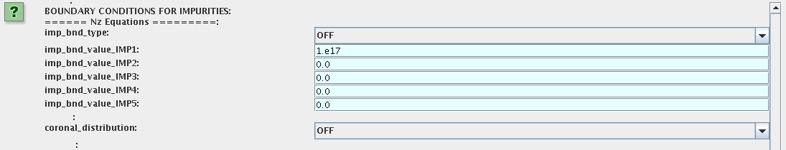

Interface for impurity boundary condition has additional option,
*coronal_distribution*, that allow to preset the edge values or entire
profiles of individual ionization states from coronal distribution. In tis
case only single value is required to be specified for each impurity
boundary value. The options are:

-  OFF
   - the boundary values for impurity densities will be as they are
   specified above;
-  boundary_conditions
   - the boundary densities will be renormalized with corona, using the
   first element from above as a total density
-  boundary_conditions_and_profiles
   - the boundary densities and starting profiles will be renormalized
   with corona, using the first element from above as a total density

Neutrals
~~~~~~~~

!!! AT THE MOMENT BOUNDARY CONDITIONS FOR NEUTRAL VELOCITIES ARE DISABLED,
MIGHT BE ADDED ON REQUEST

Note, that ALL values should be specified in the order: {*1, 2, 3 ...NION, 1, 2, 3, ...NIMP*}

To set up boundary conditions:

-  right click on the box BEFORE THE TIME EVOLUTION
-  select **Configure actor**
-  select appropriate boundary condition for each neutral species (OFF-equation is not solved)
-  specify values for boundary density and temperature of each neutral component
   [1, 2, 3 ...NION, 1, 2, 3, ...NIMP], separated by commas
- **Commit**

.. figure:: images/ets_run_settings5.png
   :align: center

Input profiles interpolation
~~~~~~~~~~~~~~~~~~~~~~~~~~~~

You are going to start the ETS run from some input shot, which might
contain some conflicting rho grids saved to different CPOs. Thus there is a
choice for the user to decide on the grid on which the starting profiles
should be load by the worflow,

*Interpolation_of_input_profiles*.

To define the interpolation grid select:

-  on_RHO_TOR_grid
   - interpolate input profiles based on the grid specyfied in [m];
-  on_RHO_TOR_NORM_grid
   - interpolate input profiles based on normalised rho grid [0:1]

           
.. _ETS_A_4.10b_convergence:

Convergence loop
----------------

ETS updates input from different physics actors in a sequence, which is
finished by solving the transport equations. Ther are possible
none-linear couplings between different parts of the system. These
nonelinearities are trited by the ETS using iterations. The decision to
step in time is made by the ETS based on the criteria that the maximum
relative deviation of main plasma profiles is lower than some predefined
tolerance. There is a number of settings and sitches in the ETS that are
used by the iterative scheme. To edit them do:

-  right click on the box CONVERGENCE LOOP
-  select **Configure actor** to edit settings
-  choose your settings
-  **Commit**

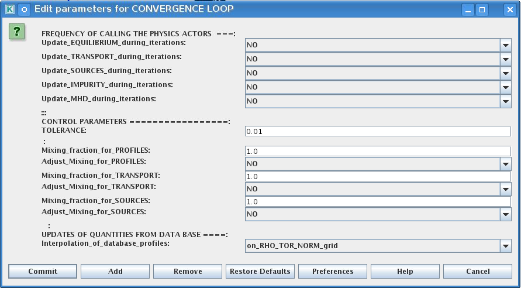

Switches in the field *FREQUENCY OF CALLING THE PHYSICS ACTORS* define
how many times the the actors of a certain cathegory (equilibrium,
transport, etc.) should be called in a single time step.
By selecting *YES* all actors of this cathegory will be called every iteration
By selecting *NO* all actors of this cathegory will be called only ones in
a time step

Switches and parameters in the field *CONTROL PARAMETERS* define how
iterations are done

-  Tolerance - defines the maximum relative error of profiles change compared to
   previous iteration. If it is achieved the time steping is done.

For highly none-linear case the required precision can be achieved
faster by the iterative scheme if only fraction of the new solution is
mixed to the previous state.
The following scheme is adopted by the ets to reduce none-linearities in profiles, transport coefficients and
sources:

.. code-block:: console

   Y = (Amix * Y+) + ((1-Amix)*Y-)

where Amix is the mixing fraction You can activate the mixing of
profiles, transport coefficient and sources by selecting the
corresponding *Mixing_fraction_...* to be between [0:1]
You also can activate the authomatic ajustment of this fraction by selecting:
*Ajust_Mixing_for_...* to *YES*

.. _ETS_A_4.10b_equilibrium:

Equilibrium
-----------

Initialization Settings
~~~~~~~~~~~~~~~~~~~~~~~

Before starting the run you need to set up your initial equlibrium.
There are several options to do it: if your input shot contains the
consistent equilibrium with all necessary parameters - you can start
immediately from it; if your input shot contains the equilibrium but it
is not consistent or some parameters are missing you can check it
automatically; if your input equilibrium is corrupt or not present - you
can define the starting equlinbrium by tree moment description. To
select your starting equilibrium please do:

-  right click on the box BEFORE THE TIME EVOLUTION
-  select **Configure actor** to edit settings
-  Select your settings or specify values
-  **Commit**

.. figure:: images/ets_before_time.png
   :align: center

SETTINGS:

-  Equilibrium_configuration
   - select
   configure_manually
   if you like to specify configuration below; select
   from_input_CPO
   if all quantities should be picked up from the input CPO
-  R0_Machine_characteristic_radius
   - Characteristic radius of the machine, here B0 is measured [m]
-  B0_Magnetic_field_at_R0
   - Magnetic field measured at the position R0 [T]
-  RGEO_Major_Radius_of_LCMS_centre
   - R coordinate of the geometrical centre of the LCMS [m]
-  ZGEO_Altitude_of_LCMS_centre
   - Z coordinate of the geometrical centre of the LCMS [m]
-  Total_plasma_current_IP
   - plasma current within the LCMS [A]
-  Minor_radius
   - minor radius of the LCMS [m]
-  Elongation
   - elongation of the LCMS [-]
-  Triangularity_upper
   - upper triangularity of the LCMS [-]
-  Triangularity_lower
   - lower triangularity of the LCMS [-]
-  Equilibrium code
   - select one of available equilibrium solvers to check the
   consistency between starting equilibrium and current profile; use
   INTERPRETATIVE
   if you trust your input data (in this case the check will be
   ignorred).

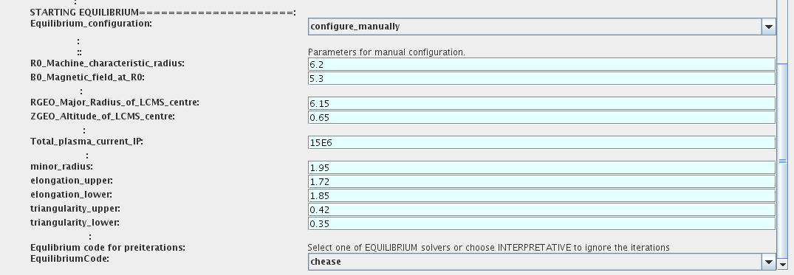
   
Please note, that different equilibrium solvers might require slightly
different input. Thus it is a user responsibility to check that the
information inside input shot/run is enough to run selected equilibrium
solver.

Run Settings
~~~~~~~~~~~~

There are several equilibrium solvers connected to the ETS. You can
select the one of them.Therefore please do:

-  right click on the box CONVERGENCE LOOP
-  select **Open actor**
-  right click on the box EQUILIBRIUM
-  select **Configure actor** to edit settings
-  choose your equilibrium solver
-  **Commit**

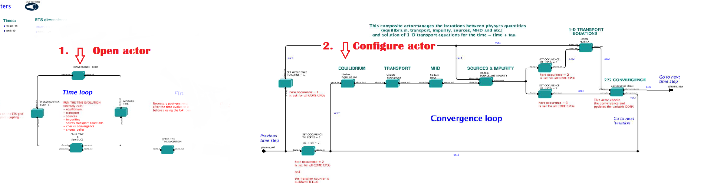

*INTERPRETATIVE* means that the ETS will not update the equilibrium,
instead it will be using the initial equilibrium.

Please note, that it is better to select the same code as you used for
pre-iterrations. Because outputs of different equilibrium solver are not
necessary done with the same resolution. Therefore the routine saving
the information to the data base might brake due to uncompatible sizes
of some signals.

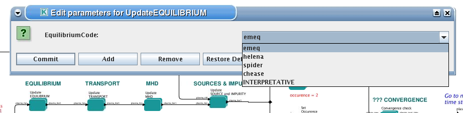

.. _ETS_A_4.10b_transport:

Transport
---------

The settings for TRANSPORT can be done inside the CONVERGENCE LOOP
composite actor. Therefore please do:

-  right click on the box CONVERGENCE LOOP
-  select **Open actor**
-  right click on the box TRANSPORT
-  select **Configure actor** to edit settings
-  choose your settings
-  press **Commit**

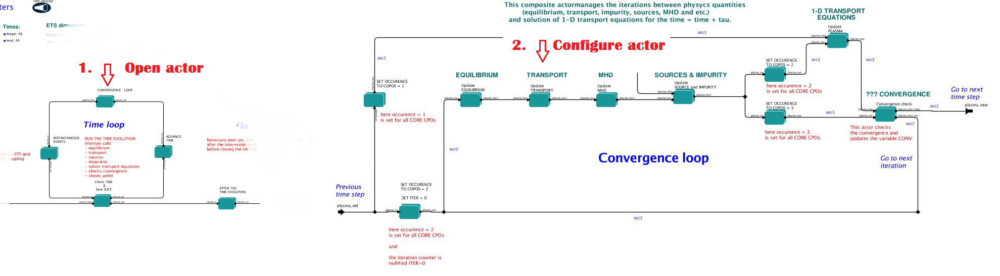
   
Transport models
~~~~~~~~~~~~~~~~

ETS constructs the total transport coefficients from the combination of
Anomalous transport (model choice), Neoclassical transport (model
choice), Database transport (transport coefficients be saved to the
input shot) and Background transport (Transport coefficients defined
through the GUI interface)

D_tot = D_DB*M_DB + D_AN*M_AN + D_NC*M_NC + D_BG*M_BG

You should choose from the list of evailable models in each cathegory or
switch it **OFF**

Individual multipliers for all channels shall be specified on the lower
level through the code parameters of Transport Combiner

The list of available transport models can be found
`here <https://www.eufus.eu/documentation/EU-IM/html/ets_status.html>`__.

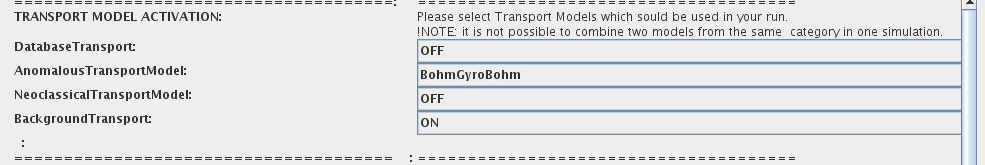
           
Background transport
~~~~~~~~~~~~~~~~~~~~

You can add the constant background level for each coefficient (ion and
impurity coefficients are expected to be the strings of [1:NION] and
[1:NIMP] elements respectively, separated by commas)

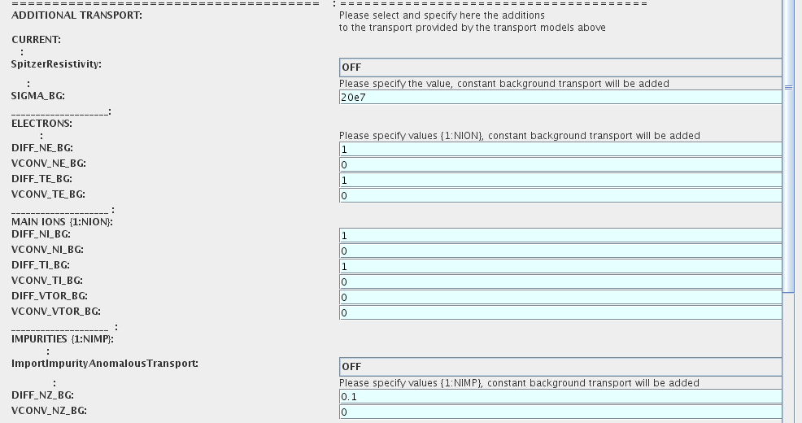

Edge transport barrier
~~~~~~~~~~~~~~~~~~~~~~

In this section you can artificially supress the transport outside of
specified *RHO_TOR_NORM_ETB*. Total transport coefficients for all
transport channels (ne, ni, nz, Te, Ti,...) will be reduced to constant
values specified below (ion and impurity coefficients are expected to be
the strings [1:NION] and [1:NIMP] respectively)

.. figure:: images/ets_transport4.png
   :align: center

Total transport coefficients
~~~~~~~~~~~~~~~~~~~~~~~~~~~~

The fine tuning of of transport coefficients can be done through editing
the XML code parameters of the **transport combiner** actor:

-  In Outline browse for transportcombiner
-  select **Configure actor**
-  click **Edit Code Parameters**
-  

   -  If you select **OFF** contributions from all transport models to this channel will be
      nullified;
   -  If you select **Multipliers_for_contributions_from** the transport channel
      will be activated, and the total transport coefficient will be
      combined from active tranport models. You gust need to specify
      multiplier against each channel;
   -  For convective velocity there is an additional option
      **V_over_D_ratio_for_contributions_from**.
      With this option selected the combiner will ignore the
      convective components provided by transport models. The convective
      velocity will be determined from the diffusion coefficient by
      applying fixed V/D ratio (
      for inward pinch the values should be negative!
      ).

-  **Save and exit**
-  **Commit**

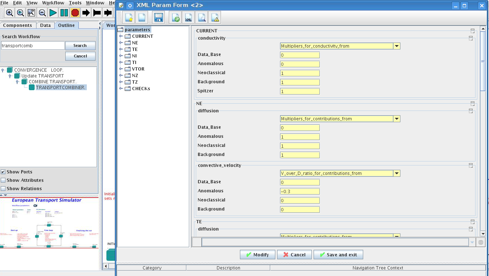
   
.. _ETS_A_4.10b_mhd:

MHD
---

The settings for MHD type of events can be done inside the CONVERGENCE
LOOP composite actor. Therefore please do:

-  right click on the box CONVERGENCE LOOP
-  select **Open actor**
-  right click on the box MHD
-  select **Configure actor** to edit settings
-  choose your settings
-  **Commit**

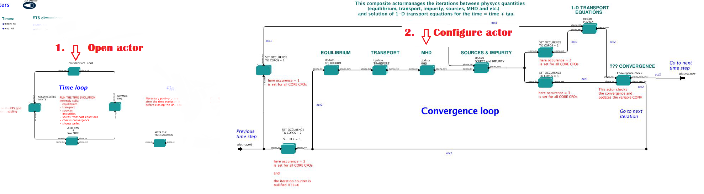

At the moment ETS allows only for NTM to be activated. The sawtooth
module is expected to be deployed before EU-IM Code Camp in Slovenia.

User can ajust the following NTM settings:

-  NTM – **ON** means that ETS will add the NTM driven transport to the total
   transport coefficient; **OFF** -ignored
-  NTMTransportMultiplier – the transport contrinution from NTM will be multiplied with this
   value
-  Onset_NTM_time - activation time for the NTM mode
-  Onset_NTM_width - starting width of the mode
-  m_NTM_poloidal_number
-  n_NTM_toroidal_number
-  NTM_phase
-  NTM_frequency

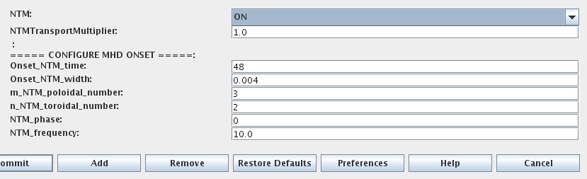
           
.. _ETS_A_4.10b_sources:

Sources and impurity
--------------------

The settings for SOURCES AND IMPURITY can be done inside the CONVERGENCE
LOOP composite actor. Therefore please do:

-  right click on the box CONVERGENCE LOOP
-  select **Open actor**
-  right click on the box SOURCES AND IMPURITY
-  select **Configure actor** to edit settings
-  choose your settings
-  **Commit**

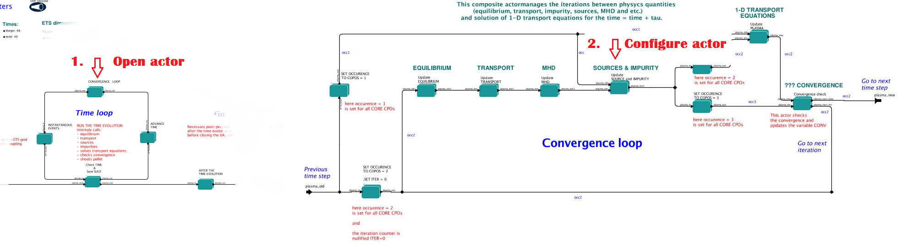

Analytical & Impurity sources
~~~~~~~~~~~~~~~~~~~~~~~~~~~~~

There is a number of sources developed by IMP3 project, which are actors
or internal routines of the transport solver. You can activate them by
selecting **ON / OFF** in front of corresponding source:

-  Database Sources – **ON** - ETS will pick up the evolution of source profiles saved to your
   input shot/run; **OFF** -ignored
-  Ohmic Heating – **ON** - ETS will compute Ohmic heating internaly; **OFF** -ignored
-  Gaussian Sources – **ON** - ETS will add sources from the Gaussian source actor (you can
   configure heat and particle deposition profiles by editing the code
   parameters of the actor); **OFF** -ignored
-  Neutral Sources – **ON** - Fluid neutrals will be solved according to the boundary conditions
   specified on ¨Before_time_evolution¨ composite actor interface; **OFF** -ignored
-  Switch_IMPURITY – **ON** - Impurity density and radiative sources will be computed;
   **OFF** -ignored; **INTERPRETATIVE** – profiles of impurity density will be read from input shot/run

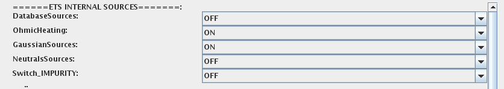

HCD sources
~~~~~~~~~~~

There is a number of sources developed by HCD project, that are
incorporated by the ETS workflow.

For the HCD sources please activate the type of heating source, by
ticking the box in front of it, and select the code to simulate it.

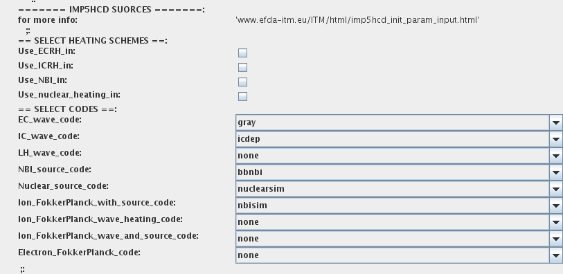

You also need to configure initial IMP5HCD settings. Therefore please:

-  right click on the box BEFORE THE TIME EVOLUTION
-  select **Open Actor**
-  right click on the box SETTINGS FOR HEATING AND CURRENT DRIVE
-  select **Configure actor**
-  edit the stettings
-  **Commit**

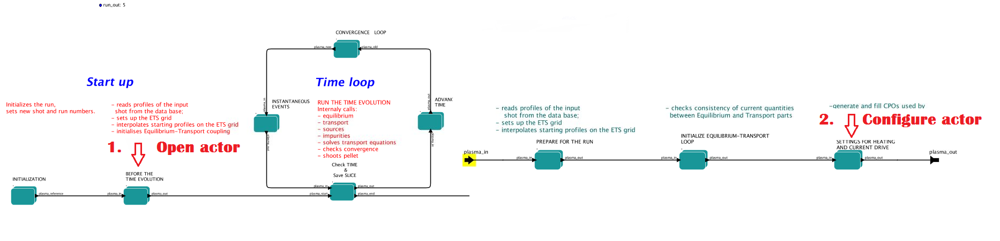

The detailed information on initial IMP5HCD settings can be found
`here <https://www.eufus.eu/documentation/EU-IM/html/imp5_imp5hcd.html>`__.
Please note that settings for NBI are done independent for each PINI.
Therefore, for NBI settings, please insert the values separated by
commas. The number of the element in the array corresponds to the number
of activated PINI. Maximum accepted number of PINIs = 16.

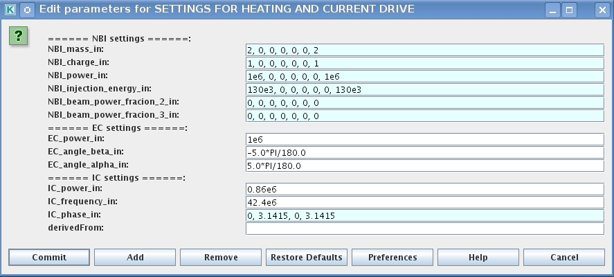

Power control
~~~~~~~~~~~~~

You also can activate the power control for the IMP5HCD sources.

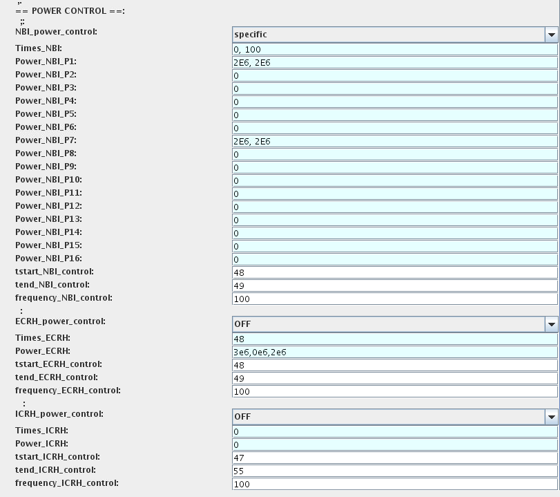

If the POWER_CONTROL is not **OFF**, there are two modes of
operation: **specific** and **frequency**

For **specific** you should specify the time sequence separated by commas
and the corresponding power sequence (where first power level
corresponds to the first time, second to second and etc.). Linear
interpolation will be done between the sequence points. For example: if
you give the power **sequence** = 2e6,4e6,1e6 and **times** = 0.0, 0.7, 1.5 (s) the delivered power would be:

.. figure:: images/ets_sources7.png
   :align: center

For **frequency** you should specify the power levels sequence separated
by commas, start and end time of the power control and the frequency of
switching between these levels. For example: if you give the power
**sequence** = 2e6,4e6,1e6 and **frequency** = 10 (Hz) **tstart** = 0.0 (s)
**tend** = 1.5 (s) the delivered power would be:

.. figure:: images/ets_sources8.png
   :align: center

Total power
~~~~~~~~~~~

Profiles of the total source for each channel are obtained from the the
individual contributions (Data Base, Gaussian, Neutrals, Impurity and
HCD) as a summ of all activated sources multiplied with coefficients
specified on the interface of the composite actor.

S_tot = S_DS*DSM + S_GS*GSM + S_Neu*NeuSM + S_IMP*IMPSM + S_HCD*HCDSM

The fine tuning of of sources can be done through editing the XML code
parameters of the source combiner actor:

-  In the Outline browse for source combiner
-  select **Configure actor**
-  click **Edit Code Parameters**
-  If you like the sources to the particular equation being activated -
   select **from_input_CPOs**, and then, put the multipliers against each
   contribution; if you select **OFF** contributions from all sources to
   this channel will be nullified.
-  save and exit
- **Commit**

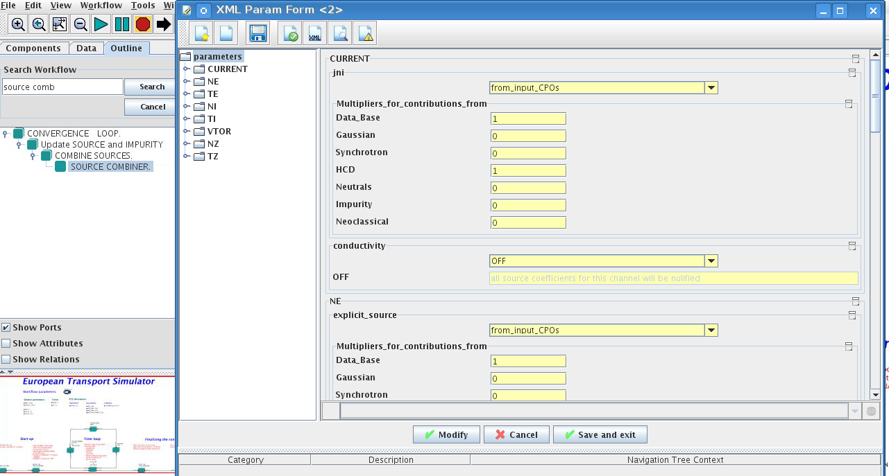

.. _ETS_A_4.10b_inst_events:

Instantaneous events & Actuators
--------------------------------

At the moment, user can swith **ON** and **OFF** two types of events: PELLET
and SAWTOOTH

Pellet
~~~~~~

At the top level of the workflow you can configure times for pellet
injection

-  right click on the box INSTANTANEOUS EVENTS & ACTUATORS
-  select **Configure actor** to edit settings
-  Select Pellet_injection equal **ON** if you like to use pellet in your
   simulation
-  Select mode of operation:

   -  Times_for_pellets equals **specific** – pellets will be shut at exact times specified in array times_pellet
   -  Times_for_pellets equals **frequency** – pellets will be shut from
      tstart_pellet until tend_pellet with a frequency_pellet

-  **Commit**

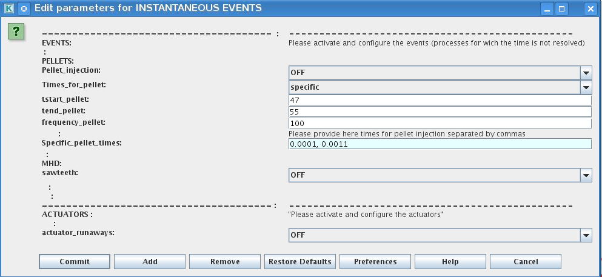

Parameters of individual pellet need to be configured through the
code_parameters of the PELLET actor. To access it go to **Outline** on the
right upper corner and open the following:

.. figure:: images/ets_instantaneous_events2.png
   :align: center

-  right click on the actor PELLET
-  select **Configure actor**
-  click **Edit Code Parameters**
-  edit parameters and click **save and exit**
-  **Commit**

.. figure:: images/ets_instantaneous_events3.png
   :align: center
   
amn – atomic mass number: array of elements separated by space
(1:nelements) [-]

zn – nuclear charge: array of elements separated by space (1:nelements)
[-]

fraction – fraction of each element in the pellet, based on the number
of atoms: array of elements separated by space (1:nelements) [-]

rpell – radius of the pellet [m]

vpell – velocity of the pellet [m/s]

rcloud – radius of the pellet cloud [m], radial extension of the cloud =
2*rp0

lcloud – length of the pellet cloud along the field line [m]

Tcloud – temperature of the pellet cloud [eV]

Pellet path is specified by two points, for which R and Z coordinated
should be specified

R – R coordinates of the pivot and second points of the pellet path,
separated by space [m]

Z – Z coordinates of the pivot and second points of the pellet path,
separated by space [m]

Control switches allow to activate:

-  drifts - YES - will activate radial displacement of deposition profile, same
   for all path points
-  cooling - YES - will activate cooling of the other side of the plasma due to
   parallel heat transport (essential for large pellets, which might
   cross the same flux surface twice)
-  JINTRAC - YES - will provide temperature reduction consistent with the model
   used in JETTO

Sawtooth
~~~~~~~~

At the top level of the workflow you can switch ON/OFF possible MHD
events

-  right click on the box INSTANTANEOUS EVENTS & ACTUATORS
-  select **Configure actor** to edit settings
-  Select SAWTOOTH **ON** if you like to use them in your simulation
-  **Commit**

Actuators
~~~~~~~~~

At the top level of the workflow you can switch ON/OFF actuator for
runaways

-  right click on the box INSTANTANEOUS EVENTS & ACTUATORS
-  select **Configure actor** to edit settings
-  Select actuator_runaways **ON** if you like to use them in your simulation
-  **Commit**
   
.. _ETS_A_4.10b_scenario:

Scenario output
---------------

You can summarize the ETS run by activating the output to SCENARIO CPO
(as post-processing of the run).

To activate the SCENARIO output:

-  right click on the box AFTER THE TIME EVOLUTION
-  select **Configure actor**
-  select Generate_SCENARIO_output_from_ETS_run equal **YES**
-  **Commit**
   
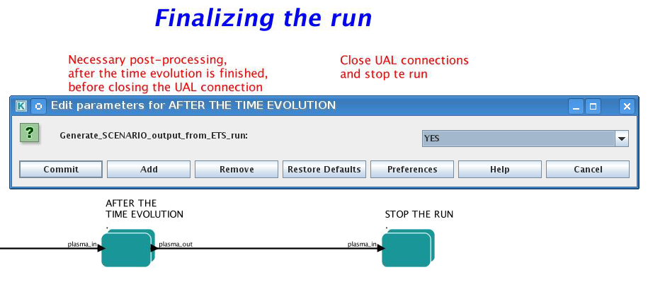

   
.. _ETS_A_4.10b_visualization:

Visualization
--------------

There is a number tools visualizing the ETS run.

Multiple Tab Display
--------------------

The display appeares automaticaly when the ETS workflow is launched. It
displays diagnostic text messages from the workflow on following topics:

-  Input data statement
-  Iterations to check the initial convergence between EQUILIBRIUM and
   CURRENT
-  Time evolution
-  Convergence of iteratinos within the time step
-  IMP5HCD settings
-  Power used by IMP5HCD actors durung the run

Also the error messages from execution of the workflow will be displayed
here.

.. figure:: images/ets_visual1.png
   :align: center

Python Visualization Display
----------------------------

Please note, if you plan to use python based vizualization **nomatlab**
argument is essential by the opening of the workflow.

.. code-block:: console

   >kepler.sh nomatlab workflow_path/workflow_name.xml

You can activate the graphical visualization of your run evolution:

-  right click on the box Check Time & Save Slice
-  select **Configure actor**
-  select visualisation **YES** or **NO**
-  **Commit**

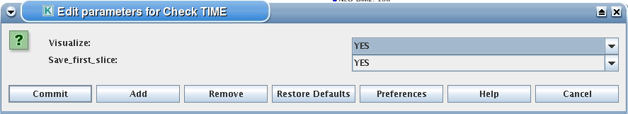
   
Then evolution of main discharge parameters will be shown in this
window:

.. figure:: images/ets_visual3.png
   :align: center

.. _ETS_A_4.10b_list_actors:

List of Actors
==============

UNDER DEVELOPMENT

.. _ETS_A_4.10b_list_actors_Equilibrium:

Equilibrium actors
------------------

+------------+-----------------+-----------------+--------------------------+
| Code name  | Code Category   | Contact persons | Short description        |
+============+=================+=================+==========================+
|  chease    | | Grad-Shafranov| Olivier Sauter  | | Chease is a fixed      |  
|            | | solver        |                 | | boundary Grad-Shafranov| 
|            |                 |                 | | solver based on cubic  | 
|            |                 |                 | | hermitian finite       | 
|            |                 |                 | | elements see           | 
|            |                 |                 | | H. Lütjens, A.         | 
|            |                 |                 | | Bondeson, O. Sauter,   | 
|            |                 |                 | | Computer Physics       | 
|            |                 |                 | | Communications 97      | 
|            |                 |                 | | (1996) 219-260         | 
+------------+-----------------+-----------------+--------------------------+
| emeq       | /               | /               |                          |
+------------+-----------------+-----------------+--------------------------+
| spider     | /               | /               |                          |
+------------+-----------------+-----------------+--------------------------+

.. _ETS_A_4.10b_list_actors_CoreTransport:

Core transport actors
---------------------

+--------------------+-------------------+-----------------+--------------------------+
| Code name          | Code Category     | Contact persons | Short description        |
+====================+===================+=================+==========================+
| ETS                | Transport solver  | Denis Kalupin   |                          |
+--------------------+-------------------+-----------------+--------------------------+
| BohmGB             | | Bohm/gyro-Bohm  | /               |                          |
|                    | | transport       |                 |                          |
|                    | | coefficients    |                 |                          |
+--------------------+-------------------+-----------------+--------------------------+
| TCI/Weiland        | | Transport       | Pär Strand      |                          |
|                    | | coefficient from|                 |                          |
|                    | | coefficients    |                 |                          |
+--------------------+-------------------+-----------------+--------------------------+
| TCI/GLF23          | | Transport       | /               |                          |
|                    | | coefficient from|                 |                          |
|                    | | drift wave      |                 |                          |
|                    | | turbulence      |                 |                          |
+--------------------+-------------------+-----------------+--------------------------+
| TCI/RITM           | | Transport       | /               |                          |
|                    | | coefficient from|                 |                          |
|                    | | drift wave      |                 |                          |
|                    | | turbulence      |                 |                          |
+--------------------+-------------------+-----------------+--------------------------+
| | TCI/MMM          | | Transport       | /               |                          |
| | (not yet         | | coefficient from|                 |                          |
| | in ETS)          | | drift wave      |                 |                          |
|                    | | turbulence      |                 |                          |
+--------------------+-------------------+-----------------+--------------------------+
| | TCI/EDWM         | | Transport       | /               |                          |
| | (not yet         | | coefficient from|                 |                          |
| | in ETS)          | | drift wave      |                 |                          |
|                    | | turbulence      |                 |                          |
+--------------------+-------------------+-----------------+--------------------------+
| | nclass           | | Neoclassical    | Pär Strand      |                          |
| | (not yet         | | transport       |                 |                          |
| | in ETS)          | | coefficients    |                 |                          |
+--------------------+-------------------+-----------------+--------------------------+
| | neos             | | Neoclassical    | Olivier Sauter  |                          |
| | (not yet         | | transport       |                 |                          |
| | in ETS)          | | coefficients    |                 |                          |
+--------------------+-------------------+-----------------+--------------------------+
| neowesz            | | Neoclassical    | Bruce Scott     | | Neoclassical transport |
|                    | | transport       |                 | | coefficients based on  |
|                    | | coefficients    |                 | | the expression in John |
|                    |                   |                 | | Wesson's book Tokamaks.|
+--------------------+-------------------+-----------------+--------------------------+
| neoartz            | | Neoclassical    | Bruce Scott     |                          |
|                    | | transport       |                 |                          |
|                    | | coefficients    |                 |                          |
+--------------------+-------------------+-----------------+--------------------------+
| spitzer            |                   |                 |                          |
+--------------------+-------------------+-----------------+--------------------------+
| ETBtransport       |                   |                 |                          |
+--------------------+-------------------+-----------------+--------------------------+
| coronal            |                   |                 |                          |
+--------------------+-------------------+-----------------+--------------------------+
| synchrotronsources |                   |                 |                          |
+--------------------+-------------------+-----------------+--------------------------+

.. _ETS_A_4.10b_list_actors_Edge:

Edge transport actors
---------------------

.. _ETS_A_4.10b_list_actors_HCD:

Heating and current drive actors
--------------------------------

.. Table

+---------------+-----------------+-----------------+----------------------------------------------+
| Code name     | Code Category   | Contact persons | Short description                            |
+===============+=================+=================+==============================================+
|  gray         | EC/waves        | Lorenzo Figini  | | GRAY is a quasi-optical ray-tracing code   |
|               |                 |                 | | for electron cyclotron heating & current   |
|               |                 |                 | | drive calculations in tokamaks.            |
|               |                 |                 | | Code-parameter documentation can be found  |
|               |                 |                 |                                              |
+---------------+-----------------+-----------------+----------------------------------------------+
| travis        | EC/waves        | | Nikolai       | | Travis is a ray-tracing code for electron  |
|               |                 | | Marushchenko  | | cyclotron heating & current drive          |
|               |                 | | and           | | calculations in tokamaks.                  |
|               |                 | | Lorenzo       |                                              |
|               |                 | | Figini        |                                              |
+---------------+-----------------+-----------------+----------------------------------------------+
| Torray-FOM    | EC/waves        | Egbert Westerhof| | Torray-FOM is a ray-tracing code for       |
|               |                 |                 | | electron cyclotron heating & current       |
|               |                 |                 | | drive calculations in tokamaks.            |
+---------------+-----------------+-----------------+----------------------------------------------+
| bbnbi         | NBI/source      | Otto Asunta     | | Calculate the deposition rates of neutrals |
|               |                 |                 | | beam particles, i.e. the input source for  |
|               |                 |                 | | Fokker-Planck solvers (not the heating and |
|               |                 |                 | | current drive). Note that the number of    |
|               |                 |                 | | markers generated by BBNBI is described by |
|               |                 |                 | | the kepler variable number_nbi_markers_in. |
|               |                 |                 |                                              |
+---------------+-----------------+-----------------+----------------------------------------------+
| nemo          | NBI/source      | | Mireille      | | Calculate the deposition rates of neutrals |
|               |                 | | Schneider     | | beam particles, i.e. the input source for  |
|               |                 |                 | | Fokker-Planck solvers (not the heating and |
|               |                 |                 | | current drive). Code-parameter             |
|               |                 |                 | | documentation can be found                 |
|               |                 |                 |                                              |
+---------------+-----------------+-----------------+----------------------------------------------+
| nuclearsim    | nuclear/source  | Thomas Johnson  | | Simple code for nuclear sources from       |
|               |                 |                 | | thermal/thermal reactions. Code-parameter  |
|               |                 |                 | | documentation can be found                 |
+---------------+-----------------+-----------------+----------------------------------------------+
| nbisim        | | NBI, alphas/  | Thomas Johnson  | | Simple Fokker-Planck code calculating the  |
|               | | Fokker-Planck |                 | | collisional ion and electron heating from  |
|               |                 |                 | | a particle source, either NBI or nuclear.  |
|               |                 |                 | | Code-parameter documentation can be found  |
+---------------+-----------------+-----------------+----------------------------------------------+
| risk          | | NBI Fokker-   | | Mireille      | | Bounce averaged steady-state Fokker-Planck |
|               | | Planck        | | Schneider     | | solver calculating the collisional ion and |
|               |                 |                 | | electron heating from a particle source    |
|               |                 |                 | | and the NBI current drive. Code-parameter  |
|               |                 |                 | | documentation can be found                 |
+---------------+-----------------+-----------------+----------------------------------------------+
| spot          | | NBI, alphas   | | Mireille      | | Monte Carlo solver for the Fokker-Planck   |
|               | | and           | | Schneider     | | equation. Traces guiding centre orbits in  |
|               | | ICRF Fokker   |                 | | a steady state magnetic equilibrium under  |
|               | | -Planck       |                 | | the influence of Coloumb collisions and    |
|               |                 |                 | | interactions with ICRF waves (through the  |
|               |                 |                 | | RFOF library). The code can also be used   |
|               |                 |                 | | for NBI and alpha particle modelling as it |
|               |                 |                 | | can handle source terms from the           |
|               |                 |                 | | distsource CPO.                            |
+---------------+-----------------+-----------------+----------------------------------------------+
| ascot4serial  | | NBI, alphas,  | | Otto          | | Monte Carlo Fokker-Planck solver           |
|               | | ICRF/         | | Asunta/       | | calculating the collisional ion and        |
|               | | Fokker-Planck | | Seppo         | | electron heating from a particle source    |
|               |                 | | Sipila        | | and the NBI current drive.                 |
+---------------+-----------------+-----------------+----------------------------------------------+
| ascot4parallel| | NBI, alphas,  | | Otto          | | Monte Carlo Fokker-Planck solver           |
|               | | ICRF/         | | Asunta/       | | calculating the collisional ion and        |
|               | | Fokker-Planck | | Seppo         | | electron heating from a particle source    |
|               |                 | | Sipila        | | and the NBI current drive.                 |
+---------------+-----------------+-----------------+----------------------------------------------+
| Lion          | IC / waves      | | Olivier Sauter| | Global ICRF wave solver. Code-parameter    |
|               |                 | | and           | | documentation can be found                 |
|               |                 | | Laurent       |                                              |
|               |                 | | Villard       |                                              |
+---------------+-----------------+-----------------+----------------------------------------------+
| Cyrano        | IC / waves      | | Ernesto Lerche| | Global ICRF wave solver. Code-parameter    |
|               |                 | | and           | | documentation can be found                 |
|               |                 | | Dirk          |                                              |
|               |                 | | Van Eester    |                                              |
+---------------+-----------------+-----------------+----------------------------------------------+
| | Eve         | IC / waves      | Remi Dumont     | | Global ICRF wave solver                    |
| | (not yet in |                 |                 |                                              |
| | ETS)        |                 |                 |                                              |
+---------------+-----------------+-----------------+----------------------------------------------+
| StixReDist    | IC / waves      | | Dirk          | | 1d Fokker-Planck solver for ICRF heating.  |
|               |                 | | Van Eester    |                                              |
|               |                 | | and           |                                              |
|               |                 | | Ernesto       |                                              |
|               |                 | | Lerche        |                                              |
+---------------+-----------------+-----------------+----------------------------------------------+
| ICdep         | IC / waves      | Thomas Johnson  | | Generates Waves-cpo with an IC wave field  |
|               |                 |                 | | with Gaussian deposition profiles          |
|               |                 |                 | | described by a combination of antenna-cpo  |
|               |                 |                 | | input and through code parameters input.   |
|               |                 |                 | | Code-parameter documentation can be found  |
+---------------+-----------------+-----------------+----------------------------------------------+
| ICcoup        | IC / coupling   | Thomas Johnson  | | Simple model for the coupling waves from   |
|               |                 |                 | | ion cyclotron antennas to the plasma.      |
|               |                 |                 | | Code-parameter documentation can be found  |
+---------------+-----------------+-----------------+----------------------------------------------+

.. _ETS_A_4.10b_list_actors_events:

Events actors
-------------

.. Table

+--------------------+-------------------+-----------------+-----------------------------------------------+
| Code name          | Code Category     | Contact persons | Short description                             |
+====================+===================+=================+===============================================+
| pelletactor        | pellet            | Denis Kalupin   |                                               |
+--------------------+-------------------+-----------------+-----------------------------------------------+
| pellettrigger      | pellet            | Denis Kalupin   |                                               |
+--------------------+-------------------+-----------------+-----------------------------------------------+
| sawcrash_slice     | sawteeth          | Olivier Sauter  |                                               |
+--------------------+-------------------+-----------------+-----------------------------------------------+
| sawcrit            | sawteeth          | Olivier Sauter  |                                               |
+--------------------+-------------------+-----------------+-----------------------------------------------+
| runaway_indicator  | runaway           | Roland Lohneroch| | Indicating the presence of runaway          |
|                    |                   | Gergo Pokol     | | electrons:                                  |
|                    |                   |                 | | 1) Indicate, whether electric field is      |
|                    |                   |                 | | below the critical level, thus runaway      |
|                    |                   |                 | | generation is impossible.                   |
|                    |                   |                 | | 2) Indicate, whether runaway electron       |
|                    |                   |                 | | growth rate exceeds a preset limit. This    |
|                    |                   |                 | | calculation takes only the Dreicer runaway  |
|                    |                   |                 | | generation method in account and assumes a  |
|                    |                   |                 | | velocity distribution close to Maxwellian,  |
|                    |                   |                 | | therefore this result should be considered  |
|                    |                   |                 | | with caution. The growth rate limit can be  |
|                    |                   |                 | | set via an input of the actor. Limit value  |
|                    |                   |                 | | is set to \\( 10^{12} \\) particle per      |
|                    |                   |                 |   second by default.                          |
|                    |                   |                 | | (This growth rate generates a runaway       |
|                    |                   |                 | | current of approximately 1kA considering a  |
|                    |                   |                 | | 10 seconds long discharge.)                 | 
+--------------------+-------------------+-----------------+-----------------------------------------------+

Non-physics actors
------------------

The ETS uses the following list of non-physics actors: addECant,
addICant, backgroundtransport, calculateRHO, changeocc, changepsi,
changeradii, checkconvergence, controlAMIX, coredelta2coreprof,
correctcurrent, deltacombiner, emptydistribution, emptydistsource,
emptywaves, eqinput, etsstart, fillcoreimpur, fillcoreneutrals,
fillcoreprof, fillcoresource, fillcoretransp, fillequilibrium,
fillneoclassic, filltoroidfield, gausiansources, geomfromcpo,
hcd2coresource, ignoredelta, ignoreimpurity, ignoreneoclassic,
ignoreneutrals, ignorepellet, ignoresources, ignoretransport, IMP4dv,
IMP4imp, importimptransport, itmimpurity, itmneutrals,
merger4distribution, merger4distsource, merger4waves, nbifiller,
neoclassic2coresource, neoclassic2coretransp, parabolicprof,
plasmacomposition, PowerFromArray, PowerModulation, profilesdatabase,
readjustprof, sawupdate_slice, scaleprof, sourcecombiner,
sourcedatabase, transportcombiner, transportdatabase, wallFiller and
waves2sources.

   
.. _ETS_A_4.10A:

=========
ETS 4.10a
=========

**ETS workflow in KEPLER**:

-  uses as actors and composite actors from other IMPs, thus for the
   most recent versions of them please check with relevant project
-  complex, but clearly structured workflow, which offers user friendly
   interface for configuring the simulation
- allows for easy modifications (connecting new modules, or reconnecting
   the parts of the workflow) through the easy graphical interface
-  provides users with all updates through the version control system
-  still actively developing tool

The list and status of available physics models for the ETS_A can be
found
`here <https://www.eufus.eu/documentation/EU-IM/html/ets_status.html>`__.

**Contact person:** Denis Kalupin 

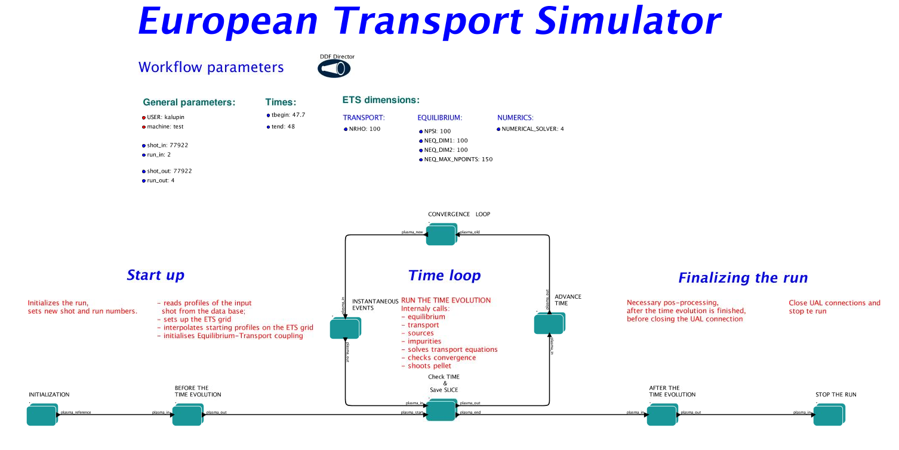

Obtaining the ETS
=================

Copy the ETS workflow to your space:

.. code-block:: console

   >svn co https://gforge6.eufus.eu/svn/keplerworkflows/trunk/4.10a/imp3/ets $EU-IMSCRATCH/ETS_WORKFLOWS

Compile ETS actors:

.. code-block:: console

   >cd $EU-IMSCRATCH/ETS_WORKFLOWS
   >make import_ets

Updating the ETS
================

If you have already a copy of the ETS you do not need to check it out
again!!!

If you like to update everything (WORKFLOW + ACTORS + VISUALIZATION +
INPUT DATA)

.. code-block:: console

   >cd $EU-IMSCRATCH/ETS_WORKFLOWS
   >svn update
   >make import_ets

To update ETS actors go inside your ETS_ACTORS:

.. code-block:: console

   >cd $EU-IMSCRATCH/ETS_WORKFLOWS
   >svn update
   >make import_actors

To update the workflow go inside your ETS_WORKFLOWS:

.. code-block:: console

   >cd $EU-IMSCRATCH/ETS_WORKFLOWS
   >svn update

To update visualization scripts go inside your $KEPLER/kplots:

.. code-block:: console

   >svn update

This is ALL you need to do for updates!

Executing the ETS
=================

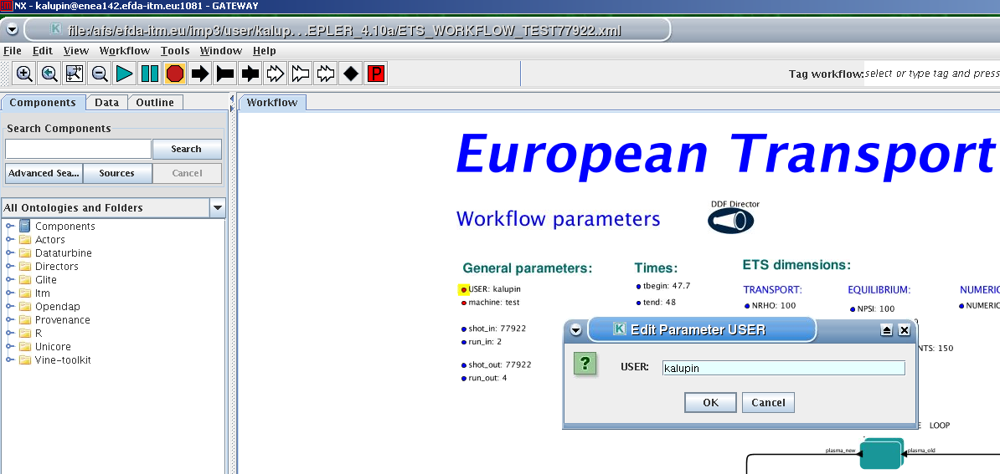

Open ETS workflow in Kepler:

.. code-block:: console

   >kepler.sh $EU-IMSCRATCH/ETS_WORKFLOWS/ETS_WORKFLOW.xml

on the top of the workflow, change the parameter "user" to your user_ID.

You can run the workflow!!!

.. _ETS_A_4.10a_configuring:

Configuring the ETS run
=======================

.. _ETS_A_4.10a_workflow_parameters:

Workflow Parameters
-------------------

General Parameters
~~~~~~~~~~~~~~~~~~

-  USER - your userid
-  MACHINE - machine name (database name) for which comutations are done
-  SHOT_IN - input shot number
-  RUN_IN - input run number
-  SHOT_OUT - output shot number
-  RUN_OUT - output run number
-  NUMERICAL_SOLVER - choice of the numerics solving transport equations
   (RECOMENDED SELECTION: 3 or 4)

Space resolution
~~~~~~~~~~~~~~~~

-  NRHO - number of radial points for transport equations
-  NPSI - number of points for equilibrium 1-D arrays
-  NEQ_DIM1 - number of points for equilibrium 2-D arrays, first index
-  NEQ_DIM2 - number of points for equilibrium 2-D arrays, second index
-  NEQ_MAX_NPOINTS - maximum number of points for equilibrium boundary

Time resolution
~~~~~~~~~~~~~~~

Start and End time

-  TBEGIN - Computations start time
-  TEND - Computattions end time

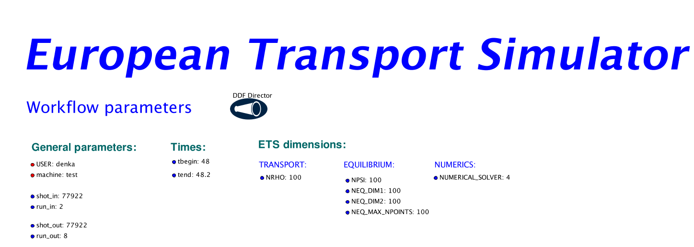

Time spep

-  right click on the box ‘BEFORE THE TIME EVOLUTION’
-  select ‘Configure actor’
-  TAU:specify value of the time step in [s]
-  TAU_OUT: specify value of the output time interval in [s]
-  Commit

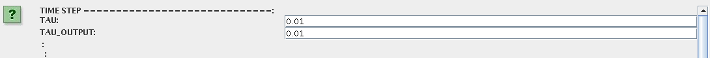
   
.. _ETS_A_4.10a_composition:

Plasma, Impurity and Neutrals Composition
-----------------------------------------

Before starting the run you need to define types of main and impurity
ions and types of neutrals to be included in simulations.

To set up the composition:

-  right click on the box ‘BEFORE THE TIME EVOLUTION’
-  select ‘Configure actor’
-  choose one of modes for setting "Run_compositions"
   "from_input_CPO" - will pick up the COMPOSITIONS structure of the
   COREPROF CPO from the input shot;
   "configure_manually" - will force the composition from the values
   specified below
-  specify values of AMN_ion, ZN_ion and Z_ion for ions, from the first
   ion to the last [1:NION], separated by commas
-  specify values of AMN_imp, ZN_imp and max_Z_imp for impurity ions,
   from the first to the last [1:NIMP], separated by commas
-  choose the neutrals types, which should be switched "ON"
-  Commit

.. figure:: images/ets_run_settings2_a.png
   :align: center

.. _ETS_A_4.10a_equations:

Equations to be solved and boundary conditions
----------------------------------------------

Main plasma
~~~~~~~~~~~

Before starting the run you need to select the type and value of the
boundary conditions for all equations. Please note that the value should
correspond to the type. All equations allow for following types of
boundary conditions:

-  OFF
   - equation is not solved, initial profiles will be kept for whole run
-  value
   - edge value should be specified
-  gradient
   - edge gradient should be specified
-  scale_length
   - edge scale length should be specified
-  generic
   - 3 coefficients (a1,a2,a3) should be provided: a1*y´ + a2*y = a3
-  value_from_input_CPO
   - equation is solved, edge value evolution will be red from input
   shot
-  profile_from_input_CPO
   - equation is not solved, profile evolution will be red from input
   shot

The particular equation will be activated if the boundary condition type
for it is other than *OFF*!

.. figure:: images/ets_run_boundary_a.png
   :align: center 

To set up boundary conditions:

-  right click on the box ‘BEFORE THE TIME EVOLUTION’
-  select ‘Configure actor’
-  select appropriate boundary condition for each equation
-  specify values for boundary conditions corresponding to the type and
   to the ion component
-  Commit

!!! If electron density is solved, all ions with ni_bnd_type=OFF will be
computed from the quasineutrality condition and scaled proportional to
specified *ni_bnd_value* or inversely proportional to their charge
*(charge_proportional)*. This is defined by option:
*ni_from_quasineutrality*.

Impurity
~~~~~~~~

You can set up the boundary conditions for impurity ions in a similar
way as for main ions. !!! Note, that at the moment only types: *OFF*;
*value* and *value_from_input_CPO* are accepter by impurity solver.

To set up boundary conditions:

-  right click on the box ‘BEFORE THE TIME EVOLUTION’
-  select ‘Configure actor’
-  select appropriate boundary condition for each impurity species
   (OFF-equation is not solved)
-  specify values for boundary density of each impurity component
   [1:MAX_Z_IMP], separated by commas
-  Commit
   
.. figure:: images/ets_run_boundary2_a.png
   :align: center 

   
Interface for impurity boundary condition has additional option ,
*coronal_distribution*, that allow to preset the edge values or entire
profiles of individual ionization states from coronal distribution. In
tis case only single value is required to be specified for each impurity
boundary value. The options are:

-  OFF
   - the boundary values for impurity densities will be as they are
   specified above;
-  boundary_conditions
   - the boundary densities will be renormalized with corona, using the
   first element from above as a total density
-  boundary_conditions_and_profiles
   - the boundary densities and starting profiles will be renormalized
   with corona, using the first element from above as a total density

Neutrals
~~~~~~~~

!!! AT THE MOMENT BOUNDARY CONDITIONS FOR NEUTRAL VELOCITIES ARE
DISABLED, MIGHT BE ADDED ON REQUEST

Note, that ALL values should be specified in the order: *{1, 2, 3
...NION, 1, 2, 3, ...NIMP}*

To set up boundary conditions:

-  right click on the box ‘BEFORE THE TIME EVOLUTION’
-  select ‘Configure actor’
-  select appropriate boundary condition for each neutral species
   (OFF-equation is not solved)
-  specify values for boundary density and temperature of each neutral
   component [1, 2, 3 ...NION, 1, 2, 3, ...NIMP], separated by commas
-  Commit

.. figure:: images/ets_run_boundary3_a.png
   :align: center 

Input Profiles Interpolation
~~~~~~~~~~~~~~~~~~~~~~~~~~~~

You are going to start the ETS run from some input shot, which might
contain some conflicting rho grids. Thus there is a choice for the user
to decide on the grid on which the starting profiles should be load by
the worflow, *Interpolation_of_input_profiles*.

To define the interpolation grid select:

-  on_RHO_TOR_grid
   - interpolate input profiles based on the grid specyfied in [m];
-  on_RHO_TOR_NORM_grid
   - interpolate input profiles based on normalised rho grid [0:1]

.. figure:: images/ets_run_boundary5_a.png
   :align: center 

.. _ETS_A_4.10a_convergence:

Convergence loop
----------------

ETS updates input from different physics actors in a sequence, which is
finished by solving the transport equations. Ther are possible none-linear
couplings between different parts of the system. These nonelinearities are
trited by the ETS using iterations. The decision to step in time is made by
the ETS based on the criteria that the maximum relative deviation of main
plasma profiles is lower than some predefined tolerance. There is a number
of settings and sitches in the ETS that are used by the iterative scheme.
To edit them do:

-  right click on the box ‘CONVERGENCE LOOP’
-  select ‘Configure actor’ to edit settings
-  choose your settings
-  Commit

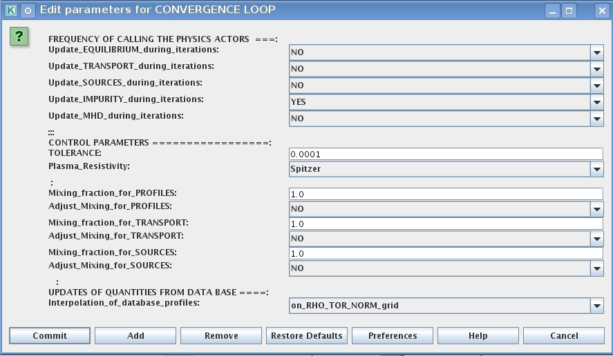
   
Switches in the field *FREQUENCY OF CALLING THE PHYSICS ACTORS* define how
many times the the actors of a certain cathegory (equilibrium, transport,
etc.) should be called in a single time step. By selecting *YES* all actors
of this cathegory will be called every iteration By selecting *NO* all
actors of this cathegory will be called only ones in a time step

Switches and parameters in the field *CONTROL PARAMETERS* define how
iterations are done

-  Tolerance
   - defines the maximum relative error of profiles change compared to
   previous iteration. If it is achieved the time steping is done.

For highly none-linear case the required precision can be achieved faster
by the iterative scheme if only fraction of the new solution is mixed to
the previous state. The following scheme is adopted by the ets to reduce
none-linearities in profiles, transport coefficients and sources:

.. code-block:: console

   Y = (Amix * Y+) + ((1-Amix)*Y-)

where Amix is the mixing fraction You can activate the mixing of profiles,
transport coefficient and sources by selecting the corresponding
*Mixing_fraction_...* to be between [0:1] You also can activate the
authomatic ajustment of this fraction by selecting: *Ajust_Mixing_for_...*
to *YES*

.. _ETS_A_4.10a_equilibrium:

Equilibrium
-----------

Starting Settings
~~~~~~~~~~~~~~~~~

Before starting the run you need to set up your initial equlibrium. There
are several options to do it: if your input shot contains the consistent
equilibrium with all necessary parameters - you can start immediately from
it; if your input shot contains the equilibrium but it is not consistent or
some parameters are missing you can check it automatically; if your input
equilibrium is corrupt or not present - you can define the starting
equlinbrium by tree moment description. To select your starting equilibrium
please do:

-  right click on the box ‘BEFORE THE TIME EVOLUTION’
-  select ‘Configure actor’ to edit settings
-  Select your settings or specify values
-  Commit
   
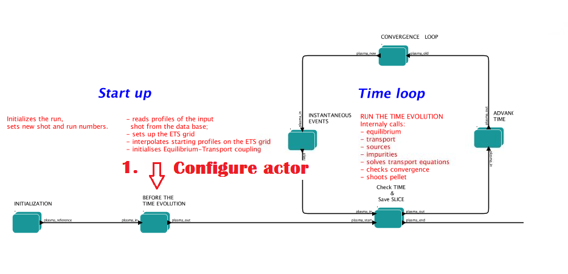
   
SETTINGS:

-  Equilibrium_configuration
   - select
   configure_manually
   if you like to specify configuration below; select
   from_input_CPO
   if all quantities should be picked up from the input CPO
-  Major_Radius_of_geom_axis_RGEO
   - radius of the geometrical centre of the vessel [m]
-  Altitude_of_geom_axis_ZGEO
   - altitude of the geometrical centre of the vessel [m]
-  Major_Radius_of_LCMS_centre_R0
   - radius of the plasma centre [m]
-  Altitude_of_LCMS_centre_Z0
   - altitude of the plasma centre [m]
-  Magn_field_on_LCMS_centre_B0
   - vacume magnetic field at R0 [T]
-  Total_plasma_current_IP
   - plasma current within the LCMS [A]
-  Minor_radius
   - minor radius of the LCMS [m]
-  Elongation
   - elongation of the LCMS [-]
-  Triangularity_upper
   - upper triangularity of the LCMS [-]
-  Triangularity_lower
   - lower triangularity of the LCMS [-]
-  Equilibrium code
   - select one of available equilibrium solvers to check the
   consistency between starting equilibrium and current profile; use
   INTERPRETATIVE
   if you trust your input data (in this case the check will be
   ignorred).

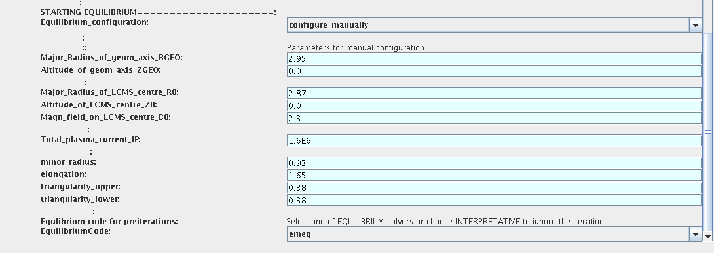

Please note, that different equilibrium solvers might require slightly
different input. Thus it is a user responsibility to check that the
information inside input shot/run is enough to run selected equilibrium
solver.

Run Settings
~~~~~~~~~~~~

There are several equilibrium solvers connected to the ETS. You can
select the one of them.Therefore please do:

-  right click on the box ‘CONVERGENCE LOOP’
-  select ‘Open actor’
-  right click on the box ‘EQUILIBRIUM’
-  select ‘Configure actor’ to edit settings
-  choose your equilibrium solver
-  Commit

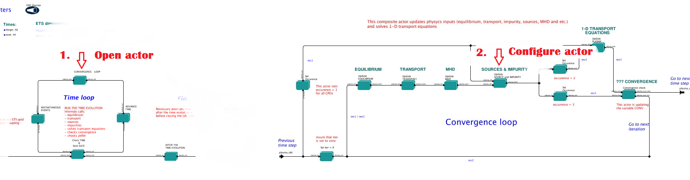
   
*INTERPRETATIVE* means that the ETS will not update the equilibrium,
instead it will be using the initial equilibrium.

Please note, that it is better to select the same code as you used for
pre-iterrations. Because outputs of different equilibrium solver are not
necessary done with the same resolution. Therefore the routine saving
the information to the data base might brake due to uncompatible sizes
of some signals.

.. figure:: images/ets_eq4_a.png
   :align: center

.. _ETS_A_4.10a_transport:

Transport
---------

The settings for TRANSPORT can be done inside the CONVERGENCE LOOP
composite actor. Therefore please do:

-  right click on the box ‘CONVERGENCE LOOP’
-  select ‘Open actor’
-  right click on the box ‘TRANSPORT’
-  select ‘Configure actor’ to edit settings
-  choose your settings
-  Commit
   
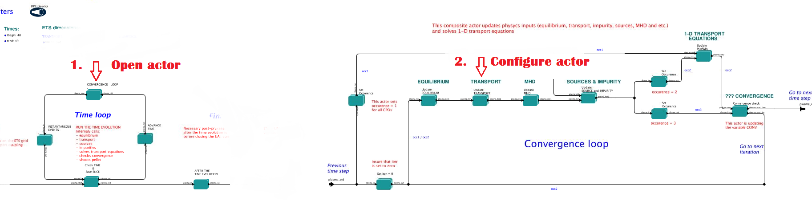

   
Choice of transport model
~~~~~~~~~~~~~~~~~~~~~~~~~

ETS constructs the total transport coefficients from the combination of
Anomalous transport (model choice), Neoclassical transport (model
choice) and Database transport (transport coefficients be saved to the
input shot)

.. code-block:: console

   D_tot = D_DB*M_DB + D_AN*M_AN + D_NC*M_NC 

You should choose from the list of evailable models in each cathegory or
switch it OFF

The list of available transport models can be found
`here <https://www.eufus.eu/documentation/EU-IM/html/ets_status.html>`__.

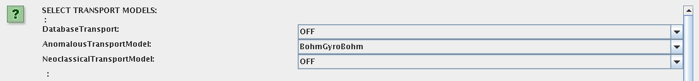

Main plasma transport
~~~~~~~~~~~~~~~~~~~~~

In this section you define how total transport coefficients for main
ions should be constructed from contributions provided by different
models. You need to provide the multipliers for Anomalous, Neoclassical
and Database contributions, which will determine their weights in total
transport coefficient.

You also can add the constant background level for each coefficient (ion
coefficients are expected to be the string {1:NION}, separated by
commas)

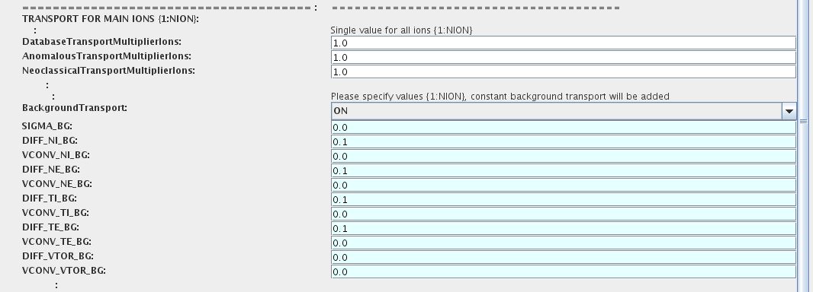

Impurity transport
~~~~~~~~~~~~~~~~~~

In this section you define how total transport coefficients for impurity
ions should be constructed from contributions provided by different
models. You need to provide the multipliers for Anomalous, Neoclassical
and Database contributions, which will determine their weights in total
transport coefficient.

You also can add the constant background level for each coefficient
(coefficients are expected to be the string {1:NIMP}, separated by
commas)

In addition, there is an option to import the Anomalous component of
transport coefficient *from_first_ion* or *from_electrons* (the same
anomalous contribution will be added to all impurity components, all
ionization states)

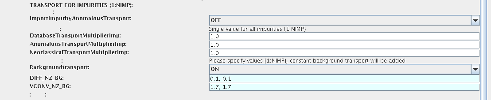

Edge transport barrier
~~~~~~~~~~~~~~~~~~~~~~

In this section you can artificially supress the transport outside of
specified *RHO_TOR_NORM_ETB*. Total transport coefficients for all
transport channels (ne, ni, nz, Te, Ti,...) will be reduced to constant
values specified below (ion and impurity coefficients are expected to be
the strings {1:NION}) and {1:NIMP} respectively)

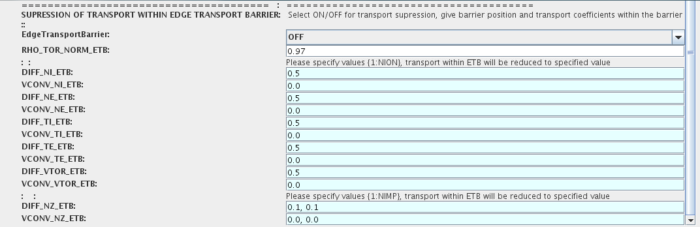

Total transport coefficients
~~~~~~~~~~~~~~~~~~~~~~~~~~~~

Profiles of the total transport coefficient for each channel are
obtained from the the individual contributions (Data Base, Anomalous,
Neoclassical and Background) as a summ of all activated transport models
multiplied with coefficients specified on the interface of the composite
actor.

.. code-block:: console

   X_tot = X_DB*DBM + X_AN*ANM + X_NC*NCM + X_BG*BGM  

!!! Note, that contributions to all transport equations will be
multiplied with the same value. For example: if
AnomalousTransportMultiplier=3.0, then contibutions from selected
anomalous transport model to each transport equation will be multiplied
with 3.0

The fine tuning of of transport coefficients can be done through editing
the XML code parameters of the transport combiner actor:

-  right click on the box ‘TRANSPORT’
-  select ‘Open actor’ to edit settings
-  right click on the box ‘Transport Combiner’
-  select ‘Open actor’ to edit settings
-  right click on the box ‘transportcombiner’
-  select ‘Configure actor’
-  click ‘Edit Code Parameters’
-  If you select *OFF* contributions from all transport models to this
   channel will be nullified; If you select *from_input_CPOs* the
   transport channel will be activated, and the total transport
   coefficient will be combined from active tranport models; For
   convective velocity there is an additional option
   *fixed_V_over_D_ratio*, by selecting this the combiner will ignore
   the convective components provided by transport nmodels. The
   convective velocity will be determined from the total diffusion
   coefficient by applying fixed V/D ratio (*for inward pinch the values
   should be negative!*). For all active channels you can adjust
   multipliers for combining contributions from different transport
   models (array of four space separated values is expected):

   -  first position - Data Base transport coefficients;
   -  second position – Anomalous transport coefficients;
   -  third position – Neoclassical transport coefficients;
   -  fourth position – Background (constant level) transport
      coefficients;

-  save and exit
-  Commit
   

   
.. _ETS_A_4.10a_mhd:

MHD
---

The settings for MHD type of events can be done inside the CONVERGENCE
LOOP composite actor. Therefore please do:

-  right click on the box ‘CONVERGENCE LOOP’
-  select ‘Open actor’
-  right click on the box ‘MHD’
-  select ‘Configure actor’ to edit settings
-  choose your settings
-  Commit

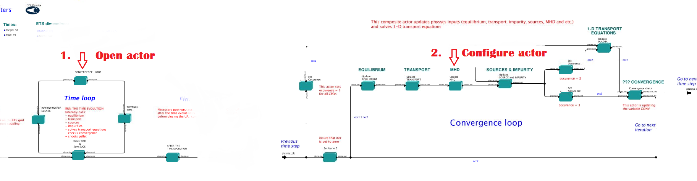

At the moment ETS allows only for NTM to be activated. 

User can ajust the following NTM settings:

-  NTM –
   ON
   means that ETS will add the NTM driven transport to the total
   transport coefficient;
   OFF-ignored
-  NTMTransportMultiplier – the transport contrinution from NTM will be
   multiplied with this value
-  Onset_NTM_time - activation time for the NTM mode
-  Onset_NTM_width - starting width of the mode
-  m_NTM_poloidal_number
-  n_NTM_toroidal_number
-  NTM_phase
-  NTM_frequency

.. figure:: images/ets_mhd2_a.png
   :align: center   

.. _ETS_A_4.10a_sources:

Sources and impurity
--------------------

The settings for SOURCES AND IMPURITY can be done inside the CONVERGENCE
LOOP composite actor. Therefore please do:

-  right click on the box ‘CONVERGENCE LOOP’
-  select ‘Open actor’
-  right click on the box ‘SOURCES AND IMPURITY’
-  select ‘Configure actor’ to edit settings
-  choose your settings
-  Commit
   
.. figure:: images/ets_sources1_a.png
   :align: center

IMP3 sources
~~~~~~~~~~~~

There is a number of sources developed by IMP3 project, which are actors
or internal routines of the transport solver. You can activate them by
selecting *ON / OFF* in front of corresponding source:

-  Database Sources –
   ON
   - ETS will pick up the evolution of source profiles saved to your
   input shot/run;
   OFF -ignored
-  Ohmic Heating –
   ON
   - ETS will compute Ohmic heating internaly;
   OFF-ignored
-  Gaussian Sources –
   ON
   - ETS will add sources from the Gaussian source actor (you can
   configure heat and particle deposition profiles by editing the code
   parameters of the actor);
   OFF-ignored
-  Neutral Sources–
   ON
   - Fluid neutrals will be solved according to the boundary conditions
   specified on ¨Before_time_evolution¨ composite actor interface;
   OFF -ignored
-  Switch_IMPURITY–
   ON
   - Impurity density and radiative sources will be computed;
   OFF
   -ignored;
   INTERPRETATIVE
   – profiles of impurity density will be read from input shot/run
   
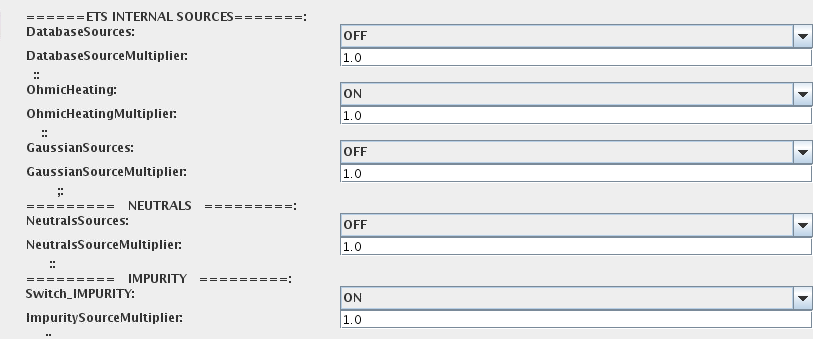
   

IMP5HCD sources
~~~~~~~~~~~~~~~

There is a number of sources developed by IMP5 project, that are
incorporated by the ETS workflow.

For the IMP5HCD sources please activate the type of heating source, by
ticking the box in front of it, and select the code to simulate it.

.. figure:: images/ets_sources3_a.png
   :align: center

You also need to configure initial IMP5HCD settings. Therefore please:

-  right click on the box ‘BEFORE THE TIME EVOLUTION’
-  select ‘Open Actor’
-  right click on the box ‘SETTINGS FOR HEATING AND CURRENT DRIVE’
-  select ‘Configure actor’
-  edit the stettings
-  Commit
   
.. figure:: images/ets_sources4_a.png
   :align: center
 
The detailed information on initial IMP5HCD settings can be found
`here <https://www.eufus.eu/documentation/EU-IM/html/imp5_imp5hcd.html>`__.
Please note that settings for NBI are done independent for each PINI.
Therefore, for NBI settings, please insert the values separated by
commas. The number of the element in the array corresponds to the number
of activated PINI. Maximum accepted number of PINIs = 16.

.. figure:: images/ets_sources5_a.png
   :align: center

Power control
~~~~~~~~~~~~~

You also can activate the power control for the IMP5HCD sources.

.. figure:: images/ets_sources6_a.png
   :align: center

If the POWER_CONTROL is not *OFF*, there are two modes of
operation:\ *specific* and *frequency*

For *specific* you should specify the time sequence separated by commas
and the corresponding power sequence (where first power level
corresponds to the first time, second to second and etc.). Linear
interpolation will be done between the sequence points. For example: if
you give the power sequence = 2e6,4e6,1e6 and times = 0.0, 0.7, 1.5 (s)
the delivered power would be:

.. figure:: images/ets_sources7_a.png
   :align: center

For *frequency* you should specify the power levels sequence separated
by commas, start and end time of the power control and the frequency of
switching between these levels. For example: if you give the power
sequence = 2e6,4e6,1e6 and frequency = 10 (Hz) tstart =0.0 (s) tend =
1.5 (s) the delivered power would be:

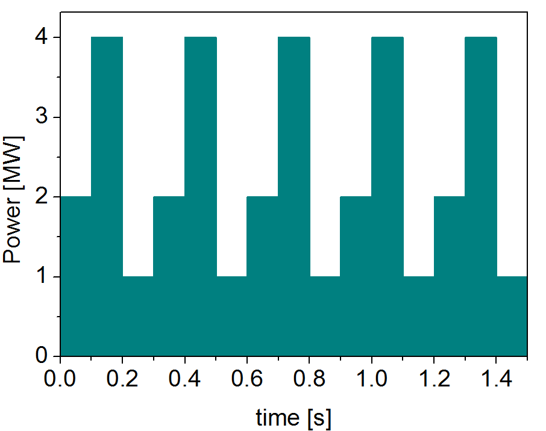

Total power
~~~~~~~~~~~

Profiles of the total source for each channel are obtained from the the
individual contributions (Data Base, Gaussian, Neutrals, Impurity and
HCD) as a summ of all activated sources multiplied with coefficients
specified on the interface of the composite actor.

::

   S_tot = S_DS*DSM + S_GS*GSM + S_Neu*NeuSM + S_IMP*IMPSM + S_HCD*HCDSM 

!!! Note, that contributions to all transport equations will be
multiplied with the same value. For example: if
ImpuritySourceMultiplier=3.0, then contibutions from impurity to Se, Sz
and Qe will be multiplied with 3.0

The fine tuning of of sources can be done through editing the XML code
parameters of the source combiner actor:

-  right click on the box ‘SOURCES and IMPURITY’
-  select ‘Open actor’ to edit settings
-  right click on the box ‘Source Combiner’
-  select ‘Open actor’ to edit settings
-  right click on the box ‘sourcecombiner’
-  select ‘Configure actor’
-  click ‘Edit Code Parameters’
-  If you like the sources to the particular equation being activated -
   select *from_input_CPOs*; if you select *OFF* contributions from all
   sources to this channel will be nullified. For active channels you
   can adjust multipliers for combining contributions from different
   source modules (array of five space separated values is expected):

   -  first position - Data Base sources;
   -  second position – Gaussian sources;
   -  third position – HCD sources;
   -  fourth position – Neutral sources;
   -  fifth position – Impurity sources.

-  save and exit
-  Commit
   
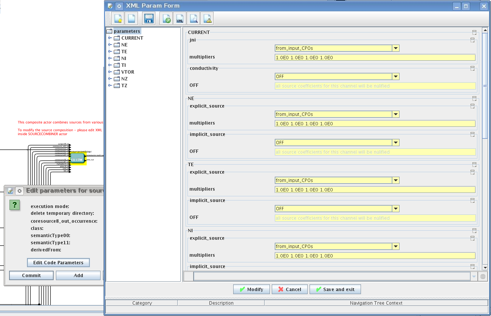

.. _ETS_A_4.10a_inst_events:

Instantaneous events
--------------------

At the moment, user can swith ON and OFF two types of events: PELLET and
SAWTOOTH

Pellet
~~~~~~

At the top level of the workflow you can configure times for pellet
injection

-  right click on the box ‘INSTANTANEOUS EVENTS’
-  select ‘Configure actor’ to edit settings
-  Select Pellet_injection ‘ON’ if you like to use pellet in your
   simulation
-  Select mode of operation: ‘specific’ - pellets will be shut at
   specific times, you also need to specify array ‘times_pellet’

   -  ‘specific’ - pellets will be shut at exact times specified in
      array ‘times_pellet’
   -  ‘frequency’ – pellets will be shut from ‘tstart_pellet’ until
      ‘tend_pellet’ with a ’frequency_pellet’

-  ‘frequency’ – pellets will be shut from ‘tstart_pellet’ until
   ‘tend_pellet’ with a ’frequency_pellet’
-  Commit

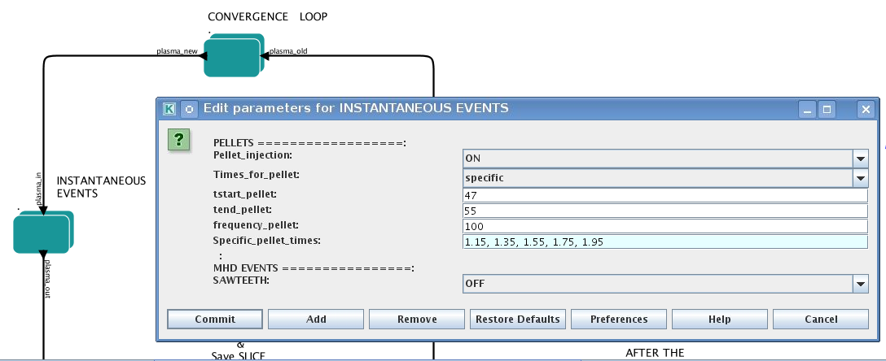

Parameters of individual pellet need to be configured through the
icode_parameters of the PELLET actor. To access it go to 'Outline' on
the right upper corner and open the following:

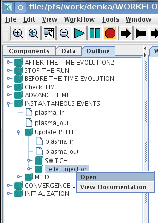

-  right click on the actor ‘PELLET’
-  select ‘Configure actor’
-  click ‘Edit Code Parameters’
-  edit parameters and click ‘save and exit’
-  Commit

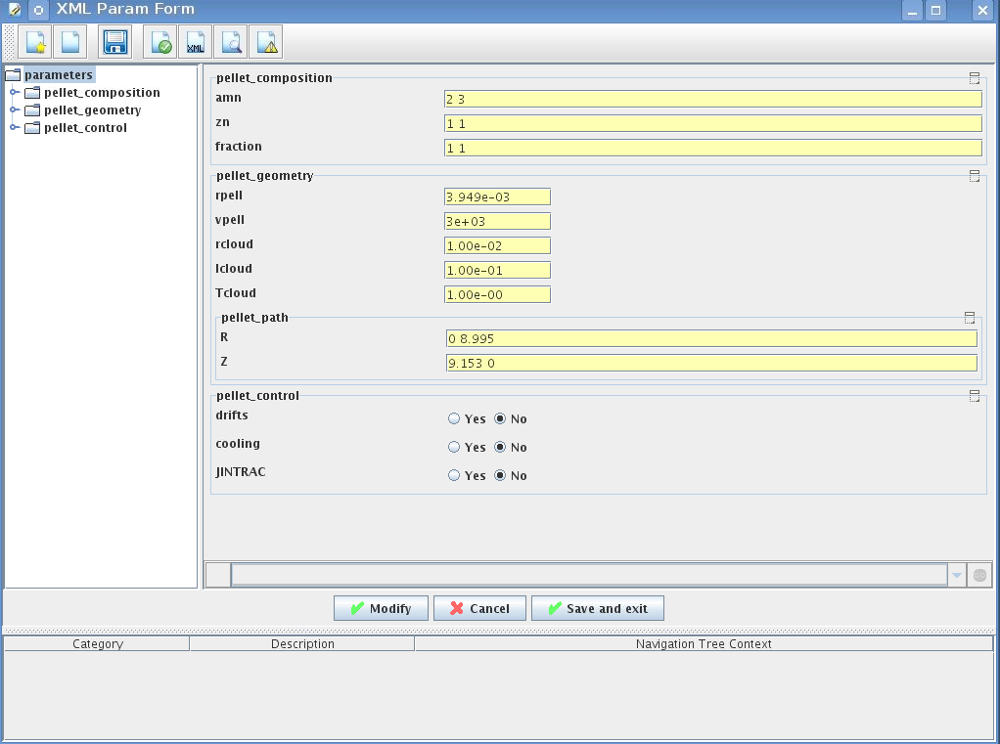

*amn* – atomic mass number: array of elements separated by space
(1:nelements) [-]

*zn* – nuclear charge: array of elements separated by space
(1:nelements) [-]

*fraction* – fraction of each element in the pellet, based on the number
of atoms: array of elements separated by space (1:nelements) [-]

*rpell* – radius of the pellet [m]

*vpell* – velocity of the pellet [m/s]

*rcloud* – radius of the pellet cloud [m], radial extension of the cloud
= 2*rp0

*lcloud* – length of the pellet cloud along the field line [m]

*Tcloud* – temperature of the pellet cloud [eV]

Pellet path is specified by two points, for which R and Z coordinated
should be specified

*R* – R coordinates of the pivot and second points of the pellet path,
separated by space [m]

*Z* – Z coordinates of the pivot and second points of the pellet path,
separated by space [m]

Control switches allow to activate:

-  drifts
   - YES - will activate radial displacement of deposition profile, same
   for all path points
-  cooling
   - YES - will activate cooling of the other side of the plasma due to
   parallel heat transport (essential for large pellets, which might
   cross the same flux surface twice)
-  JINTRAC
   - YES - will provide temperature reduction consistent with the model
   used in JETTO

MHD
~~~

At the top level of the workflow you can switch ON/OFF possible MHD
events

-  right click on the box ‘INSTANTANEOUS EVENTS’
-  select ‘Configure actor’ to edit settings
-  Select SAWTOOTH ‘ON’ if you like to use them in your simulation
-  Commit

.. _ETS_A_4.10a_visualization:

Visualization during the run
----------------------------

There is a number tools visualizing the ETS run.

Multiple Tab Display
~~~~~~~~~~~~~~~~~~~~

The display appeares automaticaly when the ETS workflow is launched. It
displays diagnostic text messages from the workflow on following topics:

-  Input data statement
-  Iterations to check the initial convergence between EQUILIBRIUM and
   CURRENT
-  Time evolution
-  Convergence of iteratinos within the time step
-  IMP5HCD settings
-  Power used by IMP5HCD actors durung the run

Also the error messages from execution of the workflow will be displayed
here.

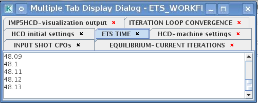

Python Visualization Display
~~~~~~~~~~~~~~~~~~~~~~~~~~~~

You can activate the graphical visualization of your run evolution:

-  right click on the box ‘Check Time & Save Slice’
-  select ‘Configure actor’
-  select visualisation ‘YES’ or ‘NO’
-  Commit

.. figure:: images/ets_visual2_a.png
   :align: center

Then evolution of main discharge parameters will be shown in this
window:

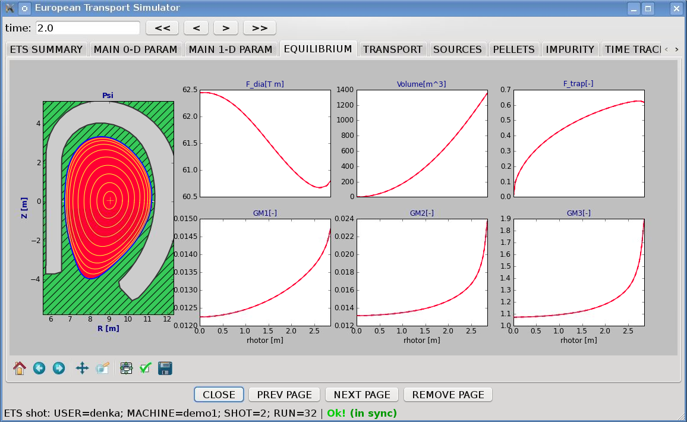

.. _ETS_C_KEPLER:

=====
ETS_C
=====

The ETS workflow (IMP3-ACT1) is used for 1-D transport simulation of a
tokamak core plasma.

**ETS workflow in KEPLER**:

-  uses as actors and composite actors from other IMPs, thus for the
   most recent versions of them please check with relevant project
-  complex, but clearly structured workflow, which offers user friendly
   interface for configuring the simulation
- allows for easy modifications (connecting new modules, or reconnecting
   the parts of the workflow) through the easy graphical interface
-  provides users with all updates through the version control system
-  still actively developing tool

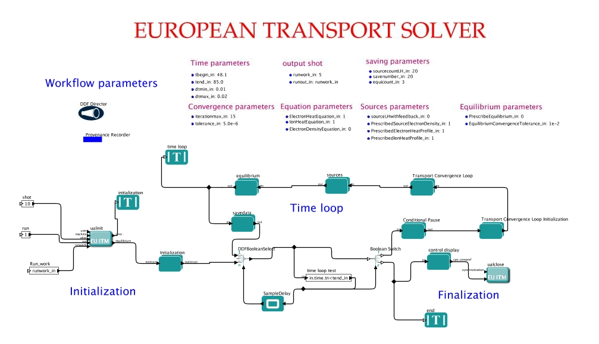

.. _ets_status:

==========
ETS Status
==========

+-----------------------+-----------------------+------------------------+
| | *Package Name* /    |       ETS-A           |       ETS-C            |
| | *Physics Module*    |                       |                        |
+=======================+=======================+========================+
| *EQUILIBRIUM*         |                       |                        |
+-----------------------+-----------------------+------------------------+
| *fixed boundary:*     |                       |                        |
+-----------------------+-----------------------+------------------------+
| BDSEQ                 | Ready for use         |                        |
+-----------------------+-----------------------+------------------------+
| EMEQ                  | Ready for use         |                        |
+-----------------------+-----------------------+------------------------+
| SPIDER                | Ready for use         |                        |
+-----------------------+-----------------------+------------------------+
| SPIDER_IMP12          | Ready for use         |                        |
+-----------------------+-----------------------+------------------------+
| CHEASE                | Ready for use         | validate               |
+-----------------------+-----------------------+------------------------+
| HELENA                | Ready for use         |                        |
+-----------------------+-----------------------+------------------------+
| HELENA21              |                       | | work in 4.09a problem|
|                       |                       | | when it doesn't find |
|                       |                       | | any equilibrium crash|
+-----------------------+-----------------------+------------------------+
|                       |                       |                        |
+-----------------------+-----------------------+------------------------+
| *free boundary:*      |                       |                        |
+-----------------------+-----------------------+------------------------+
| CEDRES++              | | In progress/tests   | | validate (static     |
|                       | | are planned for     | | mode, TBD evolution  |
|                       | | Nov.2014            | | mode)                |
+-----------------------+-----------------------+------------------------+
| CREATE-NL             |                       |                        |
+-----------------------+-----------------------+------------------------+
| FIXFREE               |                       |                        |
+-----------------------+-----------------------+------------------------+
| EQFAST                |                       | work in 4.09a          |
+-----------------------+-----------------------+------------------------+
| FREEBIE               |                       | validate               |
+-----------------------+-----------------------+------------------------+
|                       |                       |                        |
+-----------------------+-----------------------+------------------------+
| *MHD*                 |                       |                        |
+-----------------------+-----------------------+------------------------+
| NTM                   | Ready for use         | validate               |
+-----------------------+-----------------------+------------------------+
| SAWTEETH              | | Implemented/Tested/ |                        |
|                       | | release             |                        |
|                       | | date:Nov.2014       |                        |
+-----------------------+-----------------------+------------------------+
| | Linear Stability    | | Stand alone         |                        |
| | Chain               | | tests/implementation|                        |
|                       | | in ETS and          |                        |
|                       | | release:2015        |                        |
+-----------------------+-----------------------+------------------------+
|                       |                       |                        |
+-----------------------+-----------------------+------------------------+
| *TRANSPORT*           |                       |                        |
+-----------------------+-----------------------+------------------------+
| | *analytical &*      |                       |                        |
| | *interpretative:*   |                       |                        |
+-----------------------+-----------------------+------------------------+
| | From DATA BASE      | Ready for use         |                        |
| | (interpretative)    |                       |                        |
+-----------------------+-----------------------+------------------------+
| | Edge Transport      | Ready for use         |                        |
| | Barried (analytical)|                       |                        |
+-----------------------+-----------------------+------------------------+
|                       |                       |                        |
+-----------------------+-----------------------+------------------------+
| *anomalous:*          |                       |                        |
+-----------------------+-----------------------+------------------------+
| ETAIGB                | Ready for use         |                        |
+-----------------------+-----------------------+------------------------+
| BOHM-GYROBOHM         | Ready for use         | | validate, + effect of|
|                       |                       | | rotation             |
+-----------------------+-----------------------+------------------------+
| GLF23                 | | Implemented/Tested/ | | to be tested (GLF23  |
|                       | | release             | | installed in previous|
|                       | | date:Nov.2014       | | gateway not          |
|                       |                       | | validated)           |
+-----------------------+-----------------------+------------------------+
| WEILAND               | | Implemented/Tested/ |                        |
|                       | | release             |                        |
|                       | | date:Nov.2014       |                        |
+-----------------------+-----------------------+------------------------+
| REU-IM                | | Implemented/Tested/ |                        |
|                       | | release             |                        |
|                       | | date:Nov.2014       |                        |
+-----------------------+-----------------------+------------------------+
| EWDM                  | | Implemented/Tested/ |                        |
|                       | | release             |                        |
|                       | | date:Nov.2014       |                        |
+-----------------------+-----------------------+------------------------+
| TGLF                  | | In progress/Some    |                        |
|                       | | initial tests       |                        |
+-----------------------+-----------------------+------------------------+
| KIAUTO                |                       | | installed (transport |
|                       |                       | | model based on       |
|                       |                       | | scaling law)         |
+-----------------------+-----------------------+------------------------+
|                       |                       |                        |
+-----------------------+-----------------------+------------------------+
| *neoclassical:*       |                       |                        |
+-----------------------+-----------------------+------------------------+
| NEOS                  | Ready for use         |                        |
+-----------------------+-----------------------+------------------------+
| NEOWES                | Ready for use         |                        |
+-----------------------+-----------------------+------------------------+
| NEOART                | | Ready for use       |                        |
|                       | | (probably not       |                        |
|                       | | suggested as being  |                        |
|                       | | too oscilatory)     |                        |
+-----------------------+-----------------------+------------------------+
| NCLASS                | In progress           | | validate with        |
|                       |                       | | composition (to be   |
|                       |                       | | upgrade with         |
|                       |                       | | compositions         |
+-----------------------+-----------------------+------------------------+
| NCLASS/FORCEBALL      |                       | | installed (gives the |
|                       |                       | | radial electric      |
|                       |                       | | field)               |
+-----------------------+-----------------------+------------------------+
|                       |                       |                        |
+-----------------------+-----------------------+------------------------+
| | *HEAT,PARTICLE*     |                       |                        |
| | *SOURCES & CURRENT* |                       |                        |
| | *DRIVE*             |                       |                        |
+-----------------------+-----------------------+------------------------+
| | *analytical &*      |                       |                        |
| | *interpretative:*   |                       |                        |
+-----------------------+-----------------------+------------------------+
| | From DATA BASE      | Ready for use         |                        |
| | (interpretative)    |                       |                        |
+-----------------------+-----------------------+------------------------+
| Gaussian              | Ready for use         |                        |
+-----------------------+-----------------------+------------------------+
|                       |                       |                        |
+-----------------------+-----------------------+------------------------+
| | *impurity and*      |                       |                        |
| | *particles:*        |                       |                        |
+-----------------------+-----------------------+------------------------+
| IMPURITY              | Ready for use         |                        |
+-----------------------+-----------------------+------------------------+
| NEUTRALS              | Ready for use         |                        |
+-----------------------+-----------------------+------------------------+
| PELLET                | Ready for use         |                        |
+-----------------------+-----------------------+------------------------+
| ZNEUTRES              |                       | | installed (simple    |
|                       |                       | | module of CRONOS for |
|                       |                       | | neutral source terms)|
+-----------------------+-----------------------+------------------------+
| ZRECYCLE              |                       | | edge boundary for    |
|                       |                       | | electron density     |
+-----------------------+-----------------------+------------------------+
|                       |                       |                        |
+-----------------------+-----------------------+------------------------+
| *ECRH*                |                       |                        |
+-----------------------+-----------------------+------------------------+
| GRAY                  | Ready for use         | Installed              |
+-----------------------+-----------------------+------------------------+
| TORAY-FOM             |                       | In preparation         |
+-----------------------+-----------------------+------------------------+
| TRAVIS                | Tested                | In preparation         |
+-----------------------+-----------------------+------------------------+
| TORBEAM               |                       | In preparation         |
+-----------------------+-----------------------+------------------------+
|                       |                       |                        |
+-----------------------+-----------------------+------------------------+
| *ICRH*                |                       |                        |
+-----------------------+-----------------------+------------------------+
| TORIC                 | In progress           | In preparation         |
+-----------------------+-----------------------+------------------------+
| ICDEP                 |                       | Installed              |
+-----------------------+-----------------------+------------------------+
| FPSIM                 |                       | Installed              |
+-----------------------+-----------------------+------------------------+
|                       |                       |                        |
+-----------------------+-----------------------+------------------------+
| *NBI*                 |                       |                        |
+-----------------------+-----------------------+------------------------+
| NEMO                  | Ready for use         | Installed              |
+-----------------------+-----------------------+------------------------+
| BBNBI                 | Ready for use         | In preparation         |
+-----------------------+-----------------------+------------------------+
| NBISIM                | Ready for use         | Installed              |
+-----------------------+-----------------------+------------------------+
| ASCOT                 | Ready for use         |                        |
+-----------------------+-----------------------+------------------------+
| RISK                  | Ready for use         | In preparation         |
+-----------------------+-----------------------+------------------------+
|                       |                       |                        |
+-----------------------+-----------------------+------------------------+
| *LH*                  |                       |                        |
+-----------------------+-----------------------+------------------------+
|                       |                       |                        |
+-----------------------+-----------------------+------------------------+
| *nuclear sources*     |                       |                        |
+-----------------------+-----------------------+------------------------+
| nuclearsim            | Ready for use         | Installed              |
+-----------------------+-----------------------+------------------------+
|                       |                       |                        |
+-----------------------+-----------------------+------------------------+
| *CONTROLS*            |                       |                        |
+-----------------------+-----------------------+------------------------+
| NBI power control     | Ready for use         |                        |
+-----------------------+-----------------------+------------------------+
| ECRH power control    | Ready for use         |                        |
+-----------------------+-----------------------+------------------------+
| ICRH power control    | Ready for use         |                        |
+-----------------------+-----------------------+------------------------+
| | Pellet frequency    | Ready for use         |                        |
| | control             |                       |                        |
+-----------------------+-----------------------+------------------------+
|                       |                       |                        |
+-----------------------+-----------------------+------------------------+
| *COUPLING TO EDGE*    |                       |                        |
+-----------------------+-----------------------+------------------------+
| SOLPS                 | | Tested at Fortran   |                        |
|                       | | level               |                        |
+-----------------------+-----------------------+------------------------+
|                       |                       |                        |
+-----------------------+-----------------------+------------------------+
| | *DOCUMENTATION and* |                       |                        |
| | *MANUALS*           |                       |                        |
+-----------------------+-----------------------+------------------------+
| Physics Description   | | Description of the  |                        |
|                       | | ETS                 |                        |
+-----------------------+-----------------------+------------------------+
| Numerics Description  | | Form of the         |                        |
|                       | | standardize         |                        |
|                       | | equations           |                        |
+-----------------------+-----------------------+------------------------+
| Manuals               | | -  ETS workflows in |                        |
|                       | |    KEPLER           |                        |
|                       | | -  ETS source in    |                        |
|                       | |    Fortran          |                        |
+-----------------------+-----------------------+------------------------+
