.. _kepler:

======
Kepler
======

Introduction to Kepler - basics
===============================

`Kepler <https://kepler-project.org/>`__ is a workflow engine and design
platform for analyzing and modeling scientific data. Kepler provides a
graphical interface and a library of pre-defined components to enable users
to construct scientific workflows which can undertake a wide range of
functionality. It is primarily designed to access, analyse, and visualise
scientific data but can be used to construct whole programs or run
pre-existing simulation codes.

Kepler builds upon the mature Ptolemy II framework, developed at the
University of California, Berkeley. Kepler itself is developed and
maintained by the cross-project Kepler collaboration.

The main components in a Kepler workflow are actors, which are used in a
design (inherited from Ptolemy II) that separates workflow components
("actors") from workflow orchestration ("directors"), making components
more easily reusable. Workflows can work at very levels of granularity,
from low-level workflows (that explicitly move data around or start and
monitor remote jobs, for example) to high-level workflows that interlink
complex steps/actors. Actors can be reused to construct more complex
actors enabling complex functionality to be encapsulated in easy to use
packages. A wide range of actors are available for use and reuse.

Installing Kepler and tutorial workflows
----------------------------------------

You can download Kepler from the following page https://kepler-project.org/users/downloads

In order to install Kepler and tutorial related workflows you have to follow the instruction at

https://confluence.man.poznan.pl/community/display/WFMS/5.3.+Kepler+Basics#id-5.3.KeplerBasics-1InstallingKepler

Now you can start Kepler application and proceed to tutorial examples  

Kepler IMAS actors
==================

.. Picture

+------------------+--------------------------------------------+
| **Imas actor**   |      **Deacription**                       |
+==================+============================================+
|UALSliceCollector | | Store one slice from input IDS into      |
|                  |   different run. This way, it is possible  |
|                  | | to collect intermediate results during   |
|                  |   workflow execution.                      |
+------------------+--------------------------------------------+
| UALPython        | | Allows to run external Python process and|
|                  |   pass input/output data between workflow  |
|                  | | and process itself. This actor is, most  |
|                  |   commonly, used for data visualization.   |
|                  | | User can pass Python script directly to  |
|                  |   the actor.                               |
+------------------+--------------------------------------------+
| UALMuxParam      | | Provides similar behavior to             |
|                  |   ualmux/UALMux, however, this actors has  |
|                  | | two additional ports:                    |
|                  | |  - fieldDescription - contains name of   |
|                  |    the filed that will be modified         |
|                  | |  - fieldValue - contains new value of    |
|                  |    the field                               | 
|                  | | Main difference between ualmux/          |      
|                  |   ualmuxparam                              |           
|                  |   actors lays in it's ability to be used   |               
|                  |   in                                       |  
|                  | | a loop that modify different field       |
|                  |   inside IDS.                              |
|                  | | You can simply provide different field   | 
|                  |   name                                     |
|                  |   for different loop's step.               |
+------------------+--------------------------------------------+
| UALMux           | | Provides a method for putting data inside|
|                  |   IDS inputs                               |
|                  | |  - inputIds/inputCpo - cpo we are going  |
|                  |    to modify                               |  
|                  | |  - inTime - time index at which data are |
|                  |    supposed to be updated                  |
|                  | |  - name of the field is specified as port|
|                  |    name                                    |
|                  | |  - new value of the field is passed as   | 
|                  |    value sent to the port                  | 
|                  | | outputs:                                 |
|                  | |  - outputIds/outputCpo - modified IDS    |
|                  | |  - outTime - actual time index (depend   |
|                  |    on approximation mode)                  |
+------------------+--------------------------------------------+
| UALInit          | | Initializes input pulse file, creates    |
|                  |   run work and provides ID S description   |
|                  | | for other actors                         |
|                  |   inputs:                                  | 
|                  | |  - user - name of the user for input     |
|                  |    data file (e.g. g2michal)               |
|                  | |  - machine - name of the machine for     |
|                  |    input data file (e.g. test/jet)         |
|                  | |  - shot - shot number                    |
|                  | |  - run - run number                      |
|                  | |  - runwork - temporary run number        |
|                  |    (place where output will be stored)     | 
|                  | | outputs:                                 |
|                  | |  - error - description of error in case  |
|                  |    there are problems while accessing      |
|                  |    input data                              |
|                  | |  - all IDSess requested by user (each    | 
|                  |    IDS is specified as output port         |
|                  |    name)	      	                        |
+------------------+--------------------------------------------+
| UALDemux         | | Allows to read data from given IDS -     |
|                  |   name of the field is specified as        |
|                  | | output port.                             |
+------------------+--------------------------------------------+
| UALCollector	   | | Stores input IDSess inside new run.      |
|                  |   This way, it is possible to copy data    |
|                  | | into different shot/run rather than      |
|                  |   inside run work.                         |
+------------------+--------------------------------------------+
| UALClose         | | Closes run work based on description     |
|                  |   passed via input IDS.                    |  
+------------------+--------------------------------------------+               
| SetBreakpoint    | | This actor allows to enforce "debug"     |
|                  |   mode for IMAS based actors. It sets      |
|                  | | global parameter "ITM_DEBUG" to either   |
|                  |   true or false. In case true is a value   |
|                  | | of "ITM_DEBUG" all FC2K generated actors |
|                  |   will start in debug mode.                |
+------------------+--------------------------------------------+
| RecordSet        | | Sets values inside record (take a look   |
|                  |   for short tutorial: RecordGet/RecordSet) |          
+------------------+--------------------------------------------+
| RecordGet        | | Gets values from the record (take a      |
|                  |   look here for short tutorial:            |
|                  | | RecordGet/RecordSet)                     |
+------------------+--------------------------------------------+
| IDSOccurence     | | Provides a method to create duplicate    |
|                  |   of IDS with new occurrence number.       | 
|                  | | This way, it is possible to store data   |
|                  |   before they get modified by user code.   |	
+------------------+--------------------------------------------+
| IDSFlush         | | Flushes data from workflow. Data from    |
|                  |   memory cache are stored inside database  |
+------------------+--------------------------------------------+
| IDSDiscard       | | Discards data inside workflow. Data will |
|                  |   be re-read into memory cache.            |
+------------------+--------------------------------------------+    
| IDSContentStd    | | Displays IDS data on console (better     |
|                  |   for huge data sets)                      |
+------------------+--------------------------------------------+
| IDSContent	   | | Displays IDS data                        |
+------------------+--------------------------------------------+

IMAS Kepler based configuration
===============================

Running Kepler using IMAS environment
-------------------------------------

Setting up environment
~~~~~~~~~~~~~~~~~~~~~~

Please do not forget to set JAVA memory settings:

.. code-block:: console
                
        export _JAVA_OPTIONS="-Xss20m -Xms8g -Xmx8g"

Backing up old files
~~~~~~~~~~~~~~~~~~~~
Before first configuration of Kepler, make sure to backup your old data files

.. code-block:: console
                
        cd ~
        mv .kepler .kepler~
        mv KeplerData KeplerData~
        mv .ptolemyII .ptolemyII~

        
Creating place to store your personal installations of Kepler
~~~~~~~~~~~~~~~~~~~~~~~~~~~~~~~~~~~~~~~~~~~~~~~~~~~~~~~~~~~~~

IMAS based installations are stored inside **$HOME/kepler** directory.

Before proceeding further, make sure to create **kepler** directory

.. code-block:: console
                
        # create directory inside $HOME
        cd ~
        mkdir kepler
        
Running Kepler (default release)
~~~~~~~~~~~~~~~~~~~~~~~~~~~~~~~~

In order to start Kepler you have use helper scripts that will install and configure your personal copy of Kepler
   - load IMAS module

     .. code-block:: fortran
                     
             module load imas
             module load kepler
             # NOTE! It might be that you don't have Kepler copy inside your $HOME
             # in that case you need to install it kepler_install_light

   - Start Kepler
      
     .. code-block:: fortran
                     
             # run alias that will execute Kepler
             kepler

             
FC2K - Embedding user codes into Kepler
=======================================

This tutorial is designed to introduce the concept of using FC2K tool in order to build Kepler compatible actors.

.. code-block:: console
                
        This tutorial explains
        how to set up codes for FC2K
        how to build actor using FC2K
        how to incorporate actor within Kepler workflow

FC2K basics
-----------

What FC2K actually does?
~~~~~~~~~~~~~~~~~~~~~~~~

- Generates a Fortran/CPP wrapper, which intermediates between Kepler actor and user code in terms of:
  
  - reading/writing of in/out physical data (IDS)
  - passing arguments of standard types to/from the actor
    
- Creates a Kepler actor that:
  
  - calls a user code
  - provides error handling
  - calls debugger (if run in "debug" mode)
  - calls batch submission commands for MPI based actors

FC2K main window
~~~~~~~~~~~~~~~~

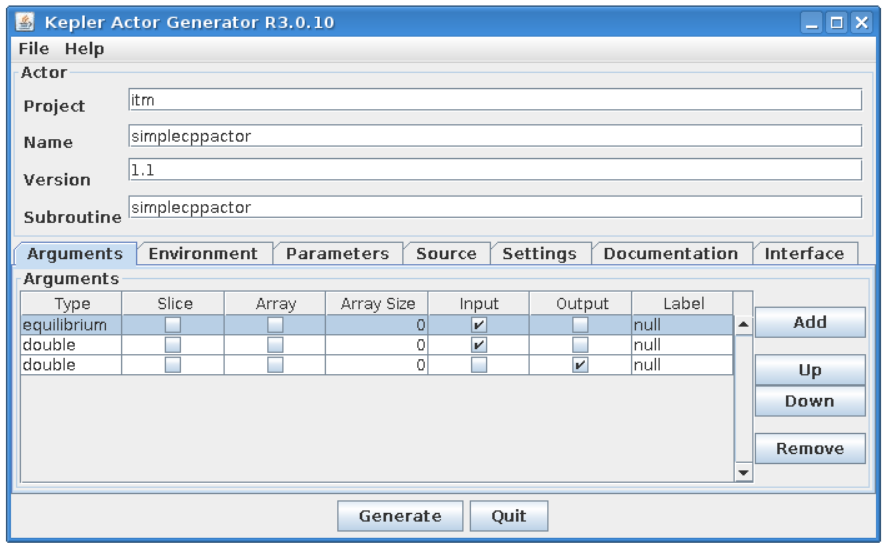

Actor description
~~~~~~~~~~~~~~~~~

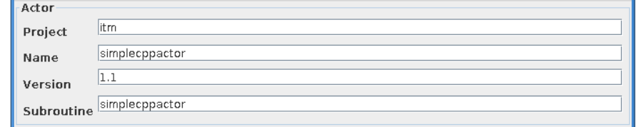

This group of graphical controls allows to set the description of the actor and its "place" in hierarchy of Kepler elements in Kepler "Component" browser

- **Project** - defines a branch in Kepler "Component" browser where an actor will be placed
- **Name** - a user defined name of the actor
- **Version** - a user defined version of user codes
- **Subroutine** - A name of user subroutine (Fortran) or function (C++)
  
Environment
~~~~~~~~~~~

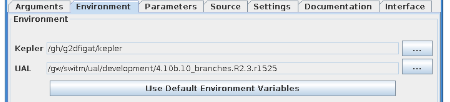

The Environment text fields shows UAL and Kepler locations.

- **Kepler** - Kepler location (usually the same as $KEPLER)
- **UAL** - IMAS UAL location (usually the same as $IMAS_PREFIX)

  
"Arguments" tab explained
~~~~~~~~~~~~~~~~~~~~~~~~~

Below you can find explanation of FC2K arguments tab.

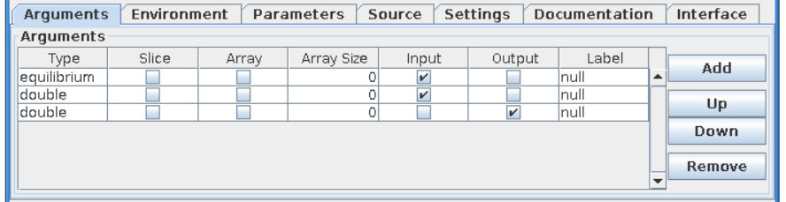

- **Type** - Defines a type of an argument. It is possible to choose either IDS based type (e.g. equilibrium, topinfo, etc.) or primitive type (e.g. int, long, double, char)
- **Single slice** - Determines if IDS is passed as single slice or an array. (This setting is valid for IDS types only )
  
  - if turned **ON** - Only one slice is passed. An actor will get an additional port to define a time.
  - if turned **OFF** - All IDSes for given shot run is passed.
    
- **Is array** - Determines if a primitive type  is passed as a scalar or an array
  
  - if turned **ON** - An argument is passed as an array. It requires definition of array size (dynamic array are not supported)
  - if turned **OFF** - An argument is passed as a scalar.
    
- **Array size** - Defines the size of an array of primitive types
- **Input** - Defines argument as an input
- **Output** - Defines argument as an output
- **Label** - User defined name of an argument (and actor port)

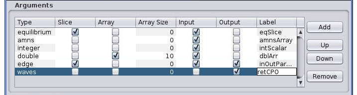
  
Please take a look on a screenshot above:

- *equilibrium* - an input parameter - one IDS (slice)
- *amns* - an input parameter - all amns IDS slices stored in given shot/run
- *integer* - an input parameter - a scalar
- *double* - an input parameter - an array of size 10
- *edge* - an in/out parameter - single slice of "edge" IDS
- *waves* - an output parameter - all slices of "waves" IDS

"Parameters" tab explained
~~~~~~~~~~~~~~~~~~~~~~~~~~

Code specific parameters are all parameters which are specific to the code (like switches, scaling parameters, and parameters for built-in analytical models) as well as parameters to explicitly overrule fields in the ITM data structures.

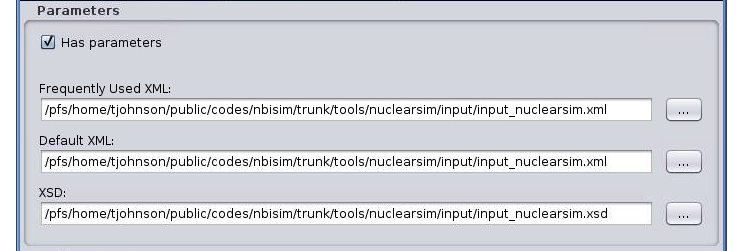

- **Frequently Used XML** - Actual value of the code parameters
- **Default XML** - Default values of the code parameters
- **Schema** - A (XSD) XML schema
 
"Source" tab explained
~~~~~~~~~~~~~~~~~~~~~~

.. image:: images/kepler_7.png
   :align: center

The purpose of this tab is to define all code related issues:

- a programming language
- utilized compiler,
- type of code execution (sequential of parallel)
- libraries being used

Libraries
*********
*"Main library"*

A "Main library" field allows to define a path to library containing user subroutine/function.

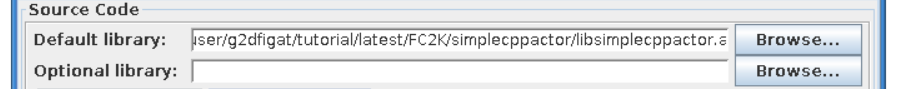

*"Optional library"*

A "Optional library" field allows to define a path to optional library containing user subroutine/function.

*"Custom libraries"*

"Custom libraries" are non-standard static libraries required for building the user code.

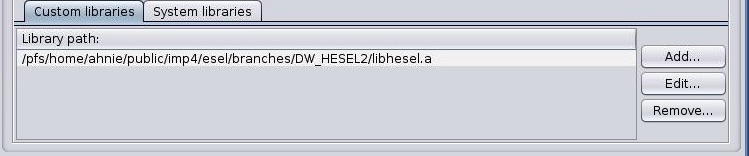

Available operations on libraries list:

- *"Add..."* - Adds a new library to the list
- *"Edit..."* - Edits library path
- *"Remove"* - Removes a new library from the list

*"System libraries"*

"System libraries" are system libraries handled by pkg-config mechanism and required for building the user code.

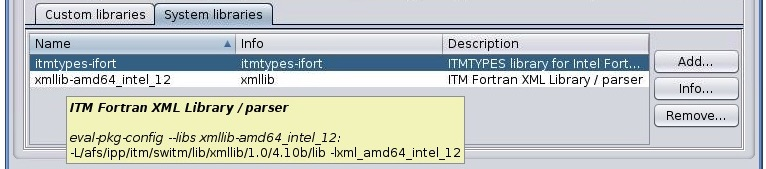

A user can:

- add library from the list,
- remove library
- display detailed info (library definition returned by pkg-config mechanism)

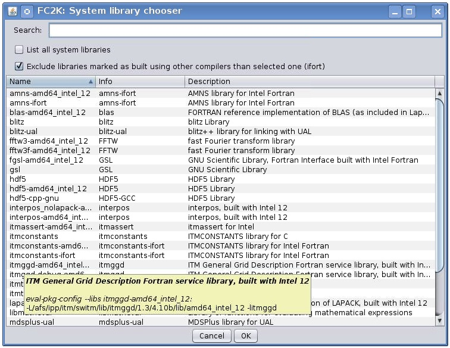
  
"Settings" tab explained
~~~~~~~~~~~~~~~~~~~~~~~~

A user, using this tab, selects programming language of codes provided, compiler used to built library and type of code execution (sequential or parallel)

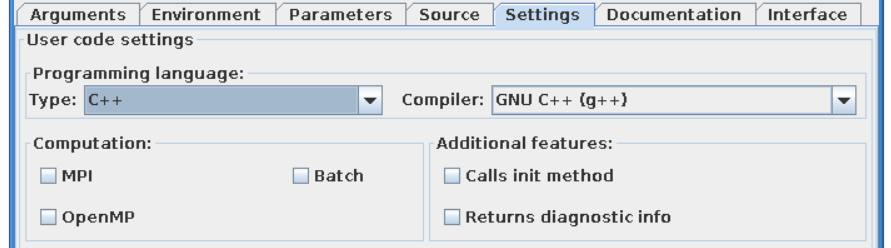

- **Programming languange:**
  
    - **Type** - Defines programming language of user codes. It could be set to:
      
        - Fortran
        - _C/C++
          
- **Compiler** - Defines compiler being used. Possible values:

    - ifort, gfortran
    - gcc, g++
    
- **Computation:**
  
    - **Parallel MPI** - If turned **ON** uses MPI compilers (mpiifort for ifort, mpif90 for gfortran, mpigxx for C)
     
    - **OPENMP** - Defined if usage of OpenMP directives is turned ON/OFF
    
    - **Batch** - If turned **ON**, submits a user code to jobs queue (combined with Parallel MPI or OPENMP switch runs user code as parallel job)
    
- **Additional features:**
  
    - **Calls init method** - If user function needs any pre-initialization, an additional function will be called.
    
    - **Returns diagnostic info** - adds output diagnostic information
    
"Documentation" tab explained
~~~~~~~~~~~~~~~~~~~~~~~~~~~~~

The "Documentation" tab specifies an user-defined Kepler actor description. It could be displayed from actor pop-up menu.

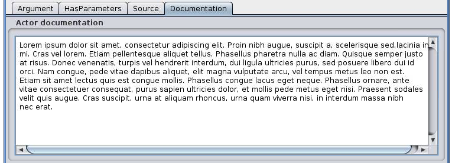

"Interface" tab explained
~~~~~~~~~~~~~~~~~~~~~~~~~

The "Interface" tab specifies interface for Kepler actor.

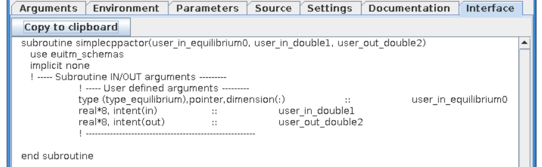

Incorporating user codes into Kepler using FC2K - exercises
-----------------------------------------------------------

In this part of the tutorial you will learn how to incorporate Fortran and C++ codes into Kepler. 

Hands-on exercises show:

- how to prepare C++ codes for FC2K
- how to prepare C++ library
- how set up Makefile
- how start and configure FC2K tool
 

Embedding Fortran codes into Kepler
~~~~~~~~~~~~~~~~~~~~~~~~~~~~~~~~~~~

**Simple Fortran code**

In this exercise you will execute simple Fortran code (multiplying input value by two) within Kepler.

Exercise no. 1

**Fortran UAL example (CPO handling)**

In this exercise you will create Kepler actor that uses UAL. 

Exercise no. 2

Embedding C++ codes
~~~~~~~~~~~~~~~~~~~

**Simple C++ code**

Simple C++ code that will be incorporated into Kepler via FC2K tool - addition of one to the value passed into input port of the actor

Exercise no. 3

**C++ code within Kepler (CPO)**

In this exercise you will create Kepler actor that uses UAL. 

Exercise no. 4

FC2K - developer guidelines
===========================

What code wrapper actually does?
--------------------------------

The code wrapper intermediates between Kepler actor and user code:

- Passes variables of language built-in types (int, char, etc) from actor to the code
- Reads CPO(s) from UAL and passes data to user code
- Passes input code parameters (XML/XSD files) to user code
- Calls user subroutine/function
- Saves output CPO(s)

Development of Fortran codes
----------------------------

Subroutine syntax
~~~~~~~~~~~~~~~~~

subroutine name (<in/out arguments list> [,code_parameters] [,diagnostic_info])

- name - subroutine name
- in/out arguments list - a list of input and output subroutine arguments
- diagnostic_info - arbitrary output diagnostic information

Arguments list
~~~~~~~~~~~~~~

- A mandatory position
- A list of input and output subroutine arguments including:
  
    - Fortran intrisic data types, eg:
      
       - integer :: input
       - character(50) :: charstring
       - integer,dimension(4) :: tabint
       
    - CPOs, eg:
      
       - type (type_equilibrium),pointer :: equilibriumin(:)
       - type (type_distsource),pointer :: distsourceout(:)

Code parameters
~~~~~~~~~~~~~~~

- user defined input parameters
- input / optional
- Argument of type: type_param

.. code-block:: console
         
        type type_param  !
            character(len=132), dimension(:), pointer ::parameters
            character(len=132), dimension(:), pointer ::default_param 
            character(len=132), dimension(:), pointer ::schema        
        endtype

- Derived type type_param describes:
  
  - parameters - Actual value of the code parameters (instance of coparam/parameters in XML format).
  - default_param - Default value of the code parameters (instance of coparam/parameters in XML format).
  - schema - Code parameters schema.

- An example:
  
  - (type_param) :: codeparam{{
    
Diagnostic info
~~~~~~~~~~~~~~~

- arbitrary output diagnostic information
  
   - output / optional

  .. code-block:: console
                
          !----  Diagnostic info  ----
          integer, intent(out)     ::     user_out_outputFlag
          character(len=:), pointer, intent(out)    ::    user_out_diagnosticInfo

- outputFlag - indicates if user subroutine was successfully executed

   - outpuflag = 0    - SUCCESS, no action is taken
   - outputFlag > 0  - WARNING, a warning message is displayed, workflow continuue execution
   - outputFlag < 0 - ERROR, actor throws an exception, workflow stops

- diagnosticInfo - an arbitrary string

Examples
~~~~~~~~

.. code-block:: fortran
                
        **Example 1 Simple in/out argument types**
        subroutine nocpo(input, output)
           integer, intent(in):: input
           integer, intent(out):: output

.. code-block:: console
                
        **Example 2 A CPO array as a subroutine argument**
        subroutine equil2dist(equilibriumin, distsourceout)
            use euITM_schemas
            implicit none
 
            !input
            type (type_equilibrium), pointer :: equilibriumin(:)
            !output
            type (type_distsource), pointer :: distsourceout(:)
 
.. code-block:: console
 
        **Example 3 Usage of code input parameters**
        subroutine teststring(coreprof,equi,tabint,tabchar,codeparam)
            use euITM_schemas

            implicit none                                            

        !input
            type(type_coreprof),pointer,dimension(:) :: coreprof
            integer, dimension(4), intent(in) :: tabint

        !output
            type(type_equilibrium),pointer,dimension(:) :: equi
            character(50), intent(out) :: tabchar

        !code parameters
            type(type_param), intent(in) :: codeparam

                    
Development of C++ codes
------------------------

Function syntax
~~~~~~~~~~~~~~~

void name ( <in/out arguments list> [,code_parameters] [,diagnostic_info] )

   - name - function name
   - code_parameters - optional - user defined input parameters
   - diagnostic_info -  arbitrary output diagnostic information

Arguments list
~~~~~~~~~~~~~~

    - in/out arguments list
    - mandatory
    - a list of input and output function arguments including:
      
        - CPP intrisic data types, eg:
          
          - int &x
          - double &y
            
        - CPOs, eg:
          
          - ItmNs::Itm::antennas & ant
          - ItmNs::Itm::equilibriumArray & eq
            
Code parameters
~~~~~~~~~~~~~~~

    - Optional
    - User defined input parameters
    - Argument of type: ItmNs:: codeparam_t &

       .. code-block:: console
                
               typedef struct {
                  char **parameters;
                  char **default_param;
                  char **schema;
               } codeparam_t;
 

    - A structure codeparam_t describes:
      
        - parameters - Actual value of the code parameters (instance of coparam/parameters in XML format).
        - default_param - Default value of the code parameters (instance of coparam/parameters in XML format).
        - schema - Code parameters schema.
          
    - An example: ItmNs::codeparam_t & codeparam

Diagnostic info
~~~~~~~~~~~~~~~

    - arbitrary output diagnostic information
    - output / optional

    .. code-block:: console
                
            void name(...., int* output_flag, char** diagnostic_info)
        

    - output_flag - indicates if user subroutine was successfully executed

        - output_flag = 0  - SUCCESS, no action is taken
        - output_flag > 0  - WARNING, a warning message is displayed, workflow continuue execution
        - output_flag < 0  - ERROR, actor throws an exception, workflow stops

    - diagnostic_info - an arbitrary string

Examples
~~~~~~~~

.. code-block:: console
                
        **Example 4. Simple in/out argument types**
        void simplecppactornocpo(double &x, double &y)

.. code-block:: console
   
        **Example 5. A CPO array as a function argument**
        void simplecppactor(ItmNs::Itm::equilibriumArray &eq, double &x, double &y)

.. code-block:: console
                
        **Example 6. Usage of init function and code input parameters**
        void mycppfunctionbis_init();
        void mycppfunction(ItmNs::Itm::summary& sum, ItmNs::Itm::equilibriumArray& eq, int& x, ItmNs::Itm::coreimpur& cor,  double&  y, ItmNs::codeparam_t& codeparam)

Delivery of the user code
-------------------------

The user code should be delivered as a static library.
Please find examples of the simple "makefiles" below:

.. code-block:: console
                
        **Example 6. Building of Fortran code**
        F90 = $(ITM_INTEL_FC)
        COPTS = -g -O0 -assume no2underscore -fPIC -shared-intel

        INCLUDES = $(shell eval-pkg-config --cflags ual-$(ITM_INTEL_OBJECTCODE))

        all: equilibrium2distsource.o libequilibrium2distsource
        
        libequilibrium2distsource: equilibrium2distsource.o
               ar -rvs libequilibrium2distsource.a equilibrium2distsource.o
        
        equilibrium2distsource.o: equilibrium2distsource.f90
               $(F90) $(COPTS) -c -o $@ $^ ${INCLUDES}
 
        clean:
              rm -f *.o *.a

.. code-block:: console             
                      
        **Example 7. Building of C++ code**
        CXX=g++
        CXXFLAGS= -g -fPIC
        CXXINCLUDES= ${shell eval-pkg-config --cflags ual-cpp-gnu}
 
        all: libsimplecppactor.a
 
        libsimplecppactor.a: simplecppactor.o
             ar -rvs $@ $^
 
        simplecppactor.o: simplecppactor.cpp
             $(CXX) $(CXXFLAGS) $(CXXINCLUDES) -c -o $@ $^
 
        clean:
             rm *.a *.o

FC2K - Example 1 - Embedding Fortran codes into Kepler (no CPOs)
================================================================

**The knowledge gained**
**After this exercise you will:**

- know how to prepare Fortran codes for FC2K
- know how to build Fortran library
- know how set up Makefile
- know how start and configure FC2K tool
  
In this exercise you will execute simple Fortran code within Kepler. In order to this follow the instructions:

Get familiar with codes that will be incorporated into Kepler
-------------------------------------------------------------

Go to Code Camp related materials within your home directory

.. code-block:: console

        shell> cd $TUTORIAL_DIR/FC2K/nocpo_example_1

You can find there various files. Pay particular attention to following ones:

- nocpo.f90 - Fortran source code that will be executed from Kepler
- Makefile - makefile that allows to build library file
- nocpo_fc2k.xml - parameters for FC2K application (NOTE! this file contains my own settings, we will modify them during tutorial)
- nocpo.xml - example workflow
  
Build the code by issuing
-------------------------

.. code-block:: console 

        shell> make clean
        shell> make

        
Codes are ready to be used within FC2K

Prepare environment for FC2K
----------------------------

Make sure that all required system settings are correctly set

.. code-block:: console

        shell> source $ITMSCRIPTDIR/ITMv1 kepler test 4.10b > /dev/null

        
Start FC2K application
----------------------

This is as simple as typing **fc2k** from terminal

.. code-block:: console

        shell> fc2k

After a while, you should see FC2K's main window.

Open a nocpo_example_1 project
------------------------------

1. Choose **File -> Open** and navigate to **$TUTORIAL_DIR/FC2K/nocpo_example_1.**
2. Open file **nocpo_fc2k.xml.**
3. You should see new parameter settings loaded into FC2K.
4. After loading parameters you can notice that parameters point to locations within your home directory.

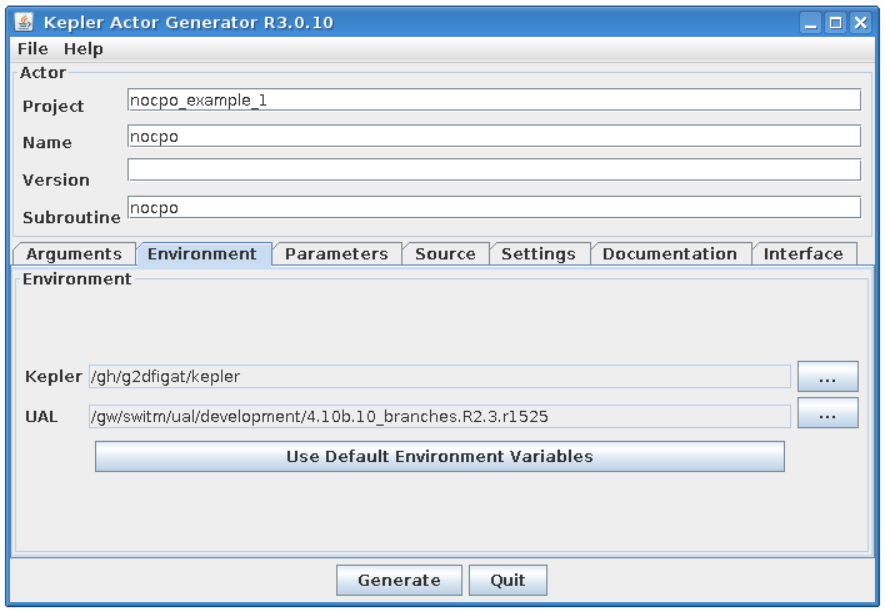
   
Project settings
----------------

Please take a look at the project settings.

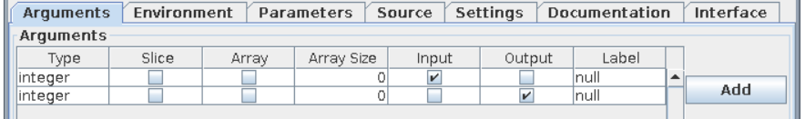

Subroutine arguments:

- one input argument of type integer
- one output argument of type integer

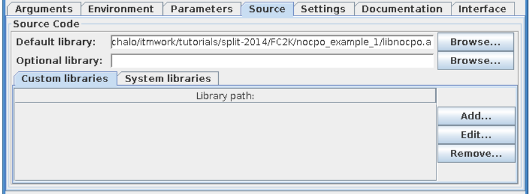
 

After all the settings are correct, you can generate actor
----------------------------------------------------------   

Simply press "Generate" button and wait till FC2K finishes the generation.

 
Confirm Kepler compilation
--------------------------

After actor is generated, FC2K offers to compile Kepler application. Make sure to compile it by pressing "Yes".

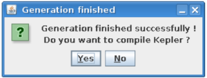

You can now start Kepler and use generated actor
------------------------------------------------

Open new terminal window and make sure that all environment settings are correctly set and execute Kepler.

.. code-block:: console

        shell> source $ITMSCRIPTDIR/ITMv1 kepler test 4.10b > /dev/null
        shell> kepler.sh

After Kepler is started, open example workflow from the following location

.. code-block:: console
                
        $TUTORIAL_DIR/FC2K/nocpo_example_1/nocpo.xml

        
You should see similar workflow on screen.

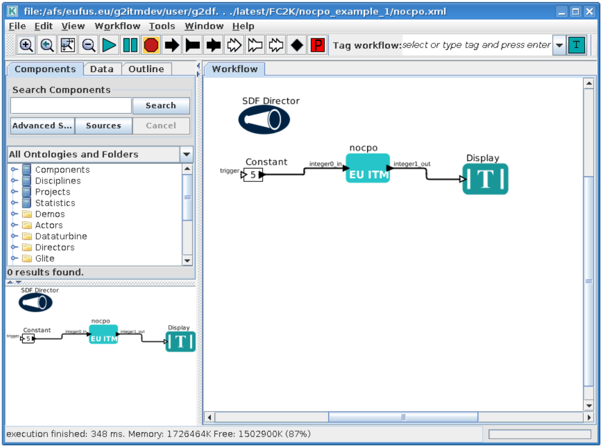

Launch the workflow
-------------------

You can start the workflow execution, by pressing "Play" button

After workflow finishes it's execution, you should see result similar to one below:

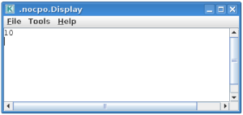

Exercise no. 1 finishes here. 

FC2K - Example 2 - Embedding Fortran code into Kepler (CPOs)
============================================================

**Exercise no. 2.**

*Fortran example (CPO handling)*

(approx. 30 min)

**The knowledge gained**

**After this exercise you will:**

  - know how to prepare Fortran codes that use UAL
  - know how to prepare Fortran based library that uses UAL
  - know how set up Makefile
  - know how start and configure FC2K tool

In this exercise you will execute simple Fortran code that uses UAL. Code will be incorporated into Kepler. In order to do this follow the instructions:

Get familiar with codes that will be incorporated into Kepler
-------------------------------------------------------------

Go to Code Camp related materials within your home directory

.. code-block:: console

         shell> cd $TUTORIAL_DIR/FC2K/equilibrium2distsource/

You can find there various files. Pay particular attention to following ones:

   - equilibrium2distsource.f90 - Fortran source code that will be executed fromKepler - this code uses UAL
   - Makefile - makefile that allows to build library file
   - cposlice2cposlicef_fc2k.xml - parameters for FC2K application (NOTE! this file contains my own settings, we will modify them during tutorial)
   - cposlice2cposlicef_kepler.xml - example workflow
     
Build the code
--------------
   
A Fortran example could be built by issuing

.. code-block:: console
                
        shell> make clean -f make_ifort
        shell> make -f make_ifort

Codes are ready to be used within FC2K

Prepare environment for FC2K
----------------------------

Make sure that all required system settings are correctly set

.. code-block:: console

        shell> source $ITMSCRIPTDIR/ITMv1 kepler test 4.10b > /dev/null

Start FC2K application
----------------------

This is as simple as typing fc2k from terminal

.. code-block:: console

        shell> fc2k

After a while, you should see FC2K's main window

 
Open project cposlice2cposlicef_fc2k
------------------------------------

1. Choose **File -> Open**
2. Navigate to $TUTORIAL_DIR/FC2K/equilibrium2distsource/.
3. Open file cposlice2cposlicef_fc2k.xml.
4. You should see new project loaded into FC2K.

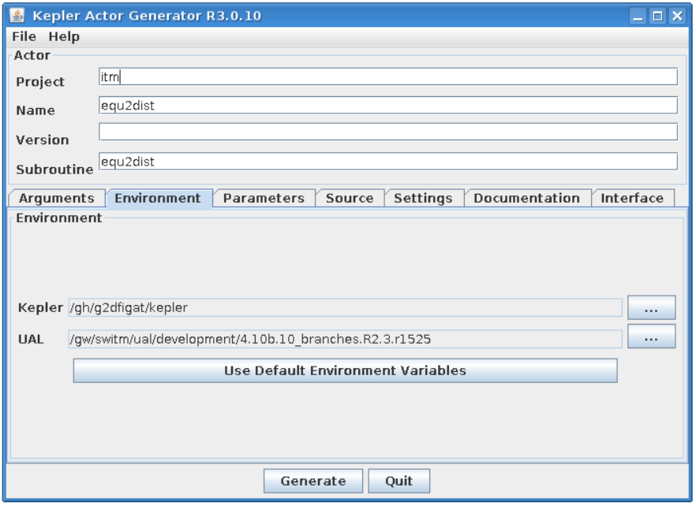

   
Project settings
----------------

Please take a look at the project settings.

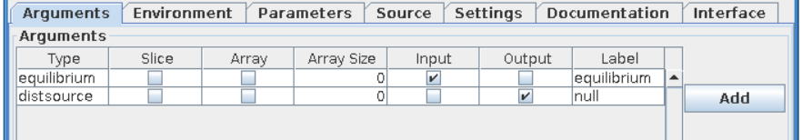
           
Subroutine arguments:

- one input argument - CPO array
- one output argument - CPO array

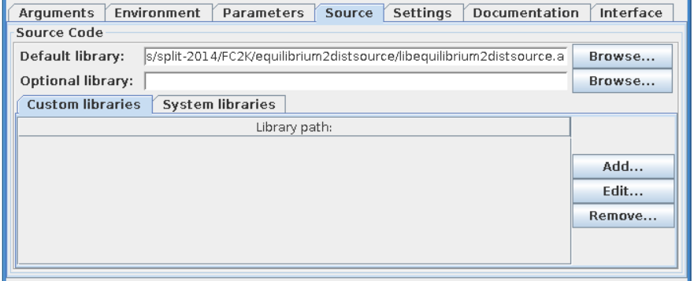

  
After loading parameters you can notice that library location points to location within your itmwork directory **($ITMWORK)**.

After all the settings are correct, you can generate actor
----------------------------------------------------------

Simply press "Generate" button and wait till FC2K finishes the generation.
 
Confirm Kepler compilation
--------------------------

After actor is generated, FC2K offers to compile Kepler application. Make sure to compile it by pressing "Yes".

.. image:: images/kepler_25.png
   :align: center

You can now start Kepler and use generated actor
------------------------------------------------

Open new terminal window and make sure that all environment settings are correctly set and execute Kepler.

.. code-block:: console

        shell> source $ITMSCRIPTDIR/ITMv1 kepler test 4.10b > /dev/null
        shell> kepler.sh

After Kepler is started, open example workflow from the following location

.. code-block:: console

        shell> $TUTORIAL_DIR/FC2K/equilibrium2distsource/cposlice2cposlicef_kepler.xml

You should see similar workflow on screen.

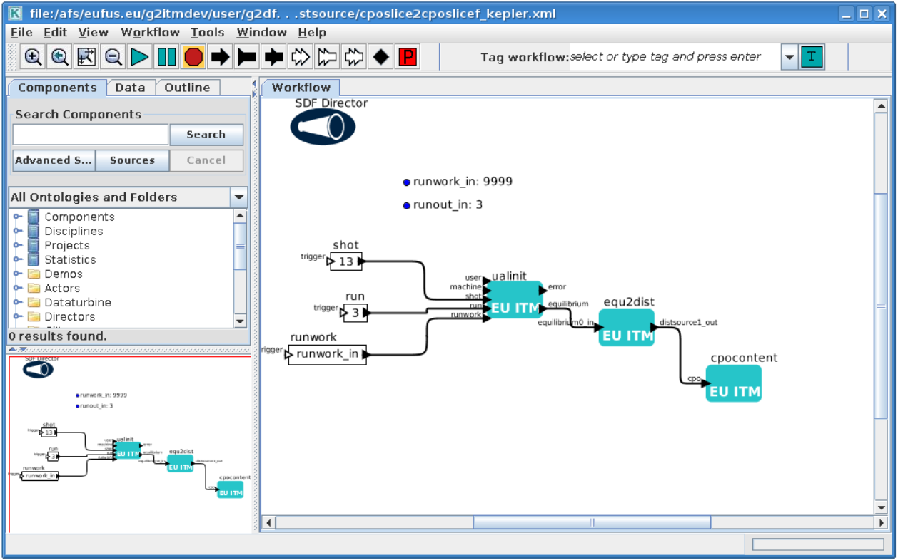

Launch the workflow
-------------------

You can start the workflow execution, by pressing "Play" button

.. image:: images/kepler_27.png
   :align: center

After workflow finishes it's execution, you should see result similar to one below:

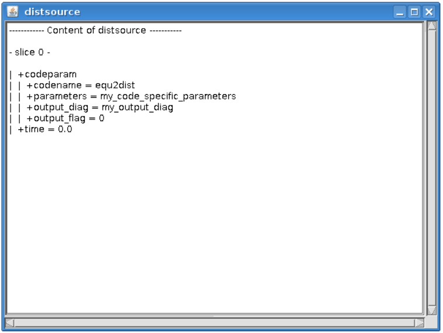

Exercise no. 2 finishes here.

FC2K - Example 3 - Embedding C++ code within Kepler (no CPOs)
==============================================================

**Exercise no. 3**

*Embedding simple C++ code within Kepler (no CPOs)*

(approx. 30 min)

**The knowledge gained**
**After this exercise you will:**

- know how to prepare C++ codes for FC2K
- know how to prepare C++ library
- know how set up Makefile
- know how start and configure FC2K tool
 

In this exercise you will execute simple C++ code within Kepler. In order to do this follow the instructions:

Get familiar with codes that will be incorporated into Kepler
-------------------------------------------------------------

Go to Code Camp related materials within your home directory

.. code-block:: console

        cd $TUTORIAL_DIR/FC2K/simplecppactor_nocpo

You can find there various files. Pay particular attention to following ones:

- simplecppactornocpo.cpp - C++ source code that will be executed from Kepler
- Makefile - makefile that allows to build library file
- simplecppactor_nocpo_fc2k.xml - parameters for FC2K application (NOTE! this file contains my own settings, we will modify them during tutorial)
- simplecppactor_nocpo_workflow.xml - example workflow
  
Build the code by issuing
-------------------------

.. code-block:: console
                
        shell> make clean
        shell> make

Codes are ready to be used within FC2K

Prepare environment for FC2K
----------------------------

Make sure that all required system settings are correctly set

.. code-block:: console

        shell> source $ITMSCRIPTDIR/ITMv1 kepler test 4.10b > /dev/null

Start FC2K application
----------------------

This is as simple as typing fc2k from terminal

.. code-block:: console
                
        shell> fc2k

        
After a while, you should see FC2K's main window

Open project simplecppactor_nocpo
---------------------------------

1. Choose **File -> Open**
2. Navigate to $TUTORIAL_DIR/FC2K/simplecppactor_nocpo
3. Open file simplecppactor_nocpo_fc2k.xml.
4. You should see new project loaded into FC2K.

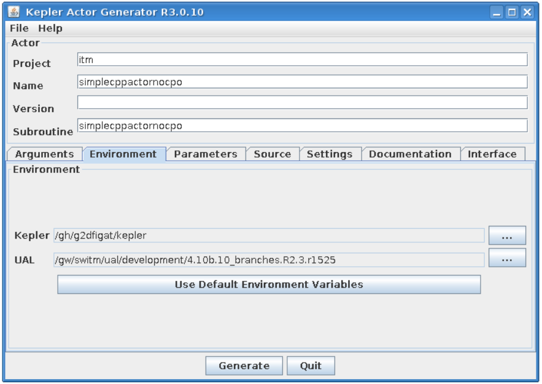
   

Project settings
----------------

Please take a look at the project settings.

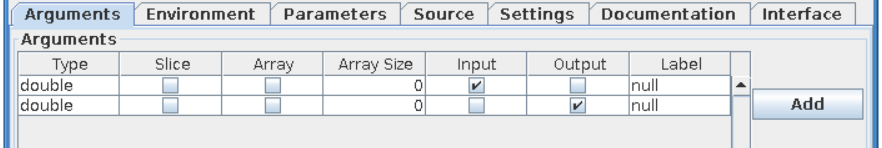

Function arguments:

- one input argument - double
- one output argument - double

.. image:: images/kepler_31.png
   :align: center

After loading parameters you can notice that library location points to location within your $TUTORIAL_DIR directory.

Actor generation
----------------

After all the settings are correct, you can generate actor

Simply press "Generate" button and wait till FC2K finishes the generation.

Confirm Kepler compilation
--------------------------

After actor is generated, FC2K offers to compile Kepler application. Make sure to compile it by pressing "Yes".

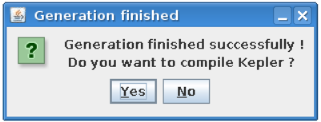

You can now start Kepler and use generated actor
------------------------------------------------

Open new terminal window and make sure that all environment settings are correctly set and execute Kepler.

.. code-block:: console

        shell> source $ITMSCRIPTDIR/ITMv1 kepler test 4.10b > /dev/null
        shell> kepler

After Kepler is started, open example workflow from the following location

.. code-block:: console

        $TUTORIAL_DIR/FC2K/simplecppactor_nocpo/simplecppactor_nocpo_workflow.xml

You should see similar workflow on screen.

.. image:: images/kepler_33.png
   :align: center

Launch the workflow
-------------------

You can start the workflow, by pressing "Play" button

           
After workflow finishes it's execution, you should see result similar to one below:

.. image:: images/kepler_35.png
   :align: center

Exercise no. 3 finishes here.
 
FC2K - Example 4 - Embedding C++ code within Kepler (CPOs)
==========================================================

**Exercise no. 4**

*C++ code within Kepler (CPO handling)*

(approx. 30 min)

**The knowledge gained:**
**After this exercise you will:**
- know how to prepare C++ codes for FC2K
- know how to prepare C++ library
- know how set up Makefile
- know how start and configure FC2K tool
In this exercise you will execute simple C++ code within Kepler. In order to do this follow the instructions:

Get familiar with codes that will be incorporated into Kepler
-------------------------------------------------------------

Go to Code Camp related materials within your home directory

.. code-block:: console

        shell> cd $TUTORIAL_DIR/FC2K/simplecppactor

You can find there various files. Pay particular attention to following ones:

- simplecppactor.cpp - C++ source code that will be executed from Kepler
- Makefile - makefile that allows to build library file
- simplecppactor_fc2k.xml - parameters for FC2K application (NOTE! this file contains my own settings, we will modify them during tutorial)
- simplecppactor_workflow.xml - example workflow
  
Build the code by issuing
-------------------------

.. code-block:: console

        shell> make clean
        shell> make
        
Codes are ready to be used within FC2K

Prepare environment for FC2K
----------------------------

Make sure that all required system settings are correctly set

.. code-block:: console

        shell> source $ITMSCRIPTDIR/ITMv1 kepler test 4.10b > /dev/null

        
Start FC2K application
----------------------

This is as simple as typing fc2k from terminal

.. code-block:: console

        shell> fc2k
        
After a while, you should see FC2K's main window.

Open project simplecppactor
---------------------------

1. Choose **File -> Open**
2. Navigate to $TUTORIAL_DIR/FC2K/simplecppactor.
3. Open file simplecppactor_fc2k.xml.
4. You should see new parameter settings loaded into FC2K.

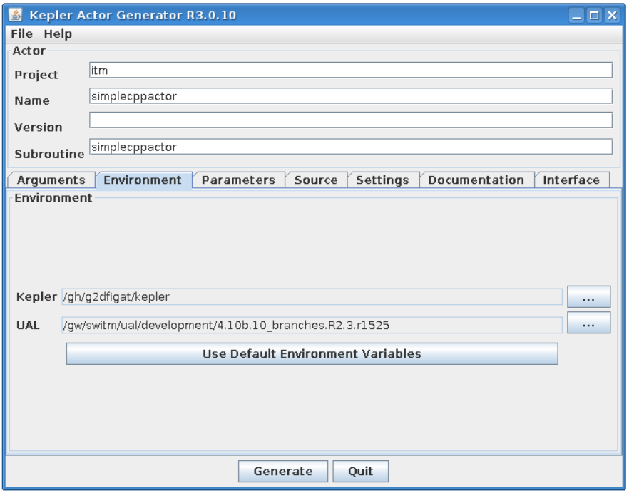
   

Project settings
----------------

Please take a look at the project settings.

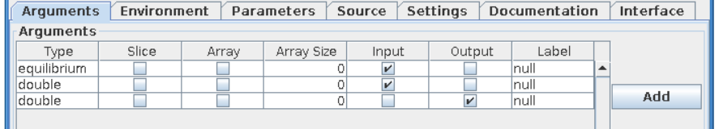

Function arguments:

- input argument - equilibrium
- input argument - double
- output argument - double

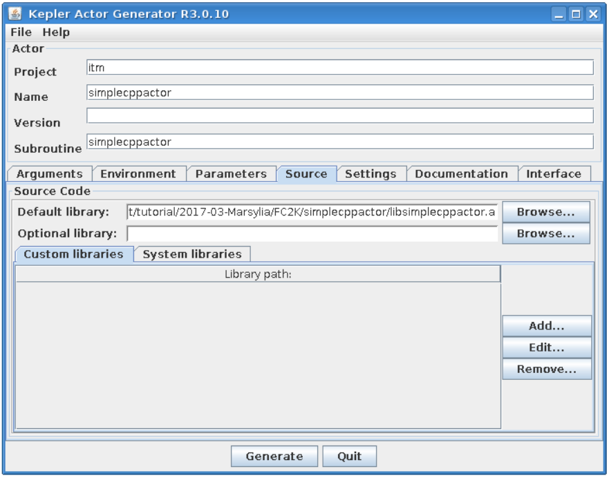

You should modify these setting, so they point to locations within you home directory. They will typically be as follows:

Actor generation
----------------

After all the settings are correct, you can generate actor
Simply press "Generate" button and wait till FC2K finishes the generation.

Confirm Kepler compilation
--------------------------

After actor is generated, FC2K offers to compile Kepler application. Make sure to compile it by pressing "Yes".

.. image:: images/kepler_39.png
   :align: center

You can now start Kepler and use generated actor
------------------------------------------------

Open new terminal window and make sure that all environment settings are correctly set and execute Kepler.

.. code-block:: console

        shell> source $ITMSCRIPTDIR/ITMv1 kepler test 4.10b > /dev/null
        kepler.sh

After Kepler is started, open example workflow from the following location

.. code-block:: console

        shell> $TUTORIAL_DIR/FC2K/simplecppactor/simplecppactor_workflow.xml

You should see similar workflow on screen.

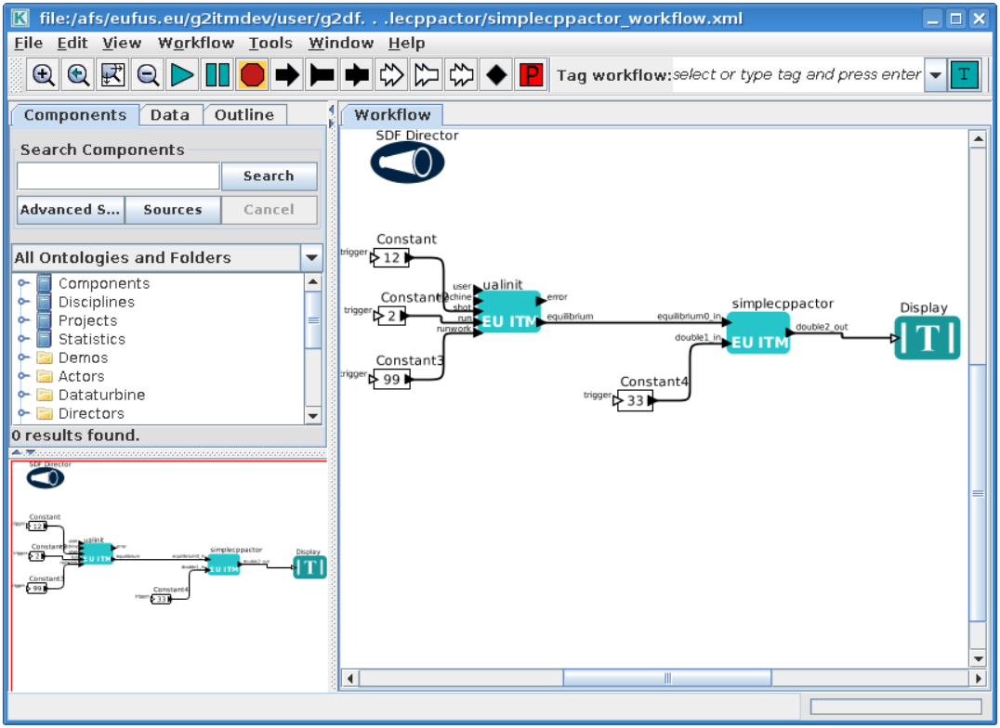

Launch the workflow

You can start the workflow, by pressing "Play" button

.. image:: images/kepler_41.png
   :align: center

After workflow finishes it's execution, you should see result similar to one below:

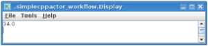

Exercise no. 4 finishes here.

IMAS Kepler 2.1.3 (default release)
===================================

Installation of default version of Kepler (without actors)
----------------------------------------------------------

In order to use most recent version of Kepler do following. First of all make sure you have directory imas-kepler inside your $HOME

.. code-block:: console

         in case you already have imas-kepler inside $HOME
         you can move it to $ITMWORK/imas-kepler
        > mv $HOME/imas-kepler $ITMWORK/imas-kepler
 
         If you don't have $HOME/imas-kepler directory, create
         it inside $ITMWORK
        > mkdir $ITMWORK/imas-kepler
 
         create symbolic link inside $HOME
        > cd $HOME
        > ln -s $ITMWORK/imas-kepler
        
Then, you can load imasenv module by calling

.. code-block:: console
                
        > module load imasenv

If there is no Kepler version installed, you will be informed by message

.. code-block:: console
                
        WARNING: Cannot find /afs/eufus.eu/user/..../imas-kepler/2.5p2-2.1.3... Run kepler_install_light before running kepler;
        INFO: setting KEPLER=/gw/swimas/extra/kepler/2.5p2-2.1.3;
        IMAS environment loaded.
        Please do not forget to set database by calling 'imasdb <machine_name>' !

In that case, call kepler_install_light - you will see installation process running in your terminal.

.. code-block:: console

        > kepler_install_light
        Warning: $KEPLER_INSTALL_PATH override by environment: /afs/eufus.eu/user/g/g2michal/imas-kepler/2.5p2-2.1.3
        mkdir: created directory ?/afs/eufus.eu/g2itmdev/user/g2michal/imas-kepler/2.5p2-2.1.3?
        sending incremental file list
        .ptolemy-compiled
        build-area/
        build-area/README.txt
        build-area/build.xml
        build-area/current-suite.txt
        ...
        ...
        ...
        ?gui? -> ?gui-2.5?
        ?common? -> ?common-2.5?
        Done installing /afs/eufus.eu/g2itmdev/user/g2michal/imas-kepler/2.5p2-2.1.3.
        Run `module switch kepler/2.5p2-2.1.3` to update $KEPLER to match.
        Then run `kepler` to try your lightweight installation.

You have to switch module, to make sure that KEPLER variable points to proper location.

.. code-block:: console
                
        > module switch kepler/2.5p2-2.1.3

Once you have set version of Kepler, you can run it by typing kepler

.. code-block:: console

        > kepler
        The base dir is /afs/eufus.eu/g2itmdev/user/g2michal/imas-kepler/2.5p2-2.1.3
        Kepler.run going to run.setMain(org.kepler.Kepler)
        JVM Memory: min = 1G,  max = 8G, stack = 20m, maxPermGen = default
        adding $CLASSPATH to RunClassPath: /gw/switm/jaxfront/R1.0/XMLParamForm.jar:/gw/switm/jaxfront/R1.0/jaxfront-core.jar:/gw/switm/jaxfront/R1.0/jaxfront-swing.jar:/gw/switm/jaxfront/R1.0/xercesImpl.jar:/gw/swimas/core/imas/3.20.0/ual/3.8.3/jar/imas.jar
        ...
        ...

Installation of "dressed" version of Kepler (with actors)
---------------------------------------------------------

In order to use most recent version of Kepler (with actors) do following. First of all make sure you have directory imas-kepler inside your $HOME

.. code-block:: console

        > mkdir $HOME/imas-kepler

Then, you can load imasenv module by calling

.. code-block:: console

        > module load imasenv

If there is no Kepler version installed, you will be informed by message

.. code-block:: console
                
        WARNING: Cannot find /afs/eufus.eu/user/..../imas-kepler/2.5p2-2.1.3... Run kepler_install_light before running kepler;
        INFO: setting KEPLER=/gw/swimas/extra/kepler/2.5p2-2.1.3;
        IMAS environment loaded.
        Please do not forget to set database by calling 'imasdb <machine_name>' !

You have to switch to "dressed" version of Kepler by calling

.. code-block:: console

        > module switch kepler/2.5p2-2.1.3_IMAS_3.20.0

.. code-block:: console

        > kepler_install_light
        Warning: $KEPLER_INSTALL_PATH override by environment: /afs/eufus.eu/user/g/g2michal/imas-kepler/2.5p2-2.1.3_IMAS_3.20.0
        mkdir: created directory ?/afs/eufus.eu/g2itmdev/user/g2michal/imas-kepler?
        mkdir: created directory ?/afs/eufus.eu/g2itmdev/user/g2michal/imas-kepler/2.5p2-2.1.3_IMAS_3.20.0?
        ...
        ...
        Done installing /afs/eufus.eu/g2itmdev/user/g2michal/imas-kepler/2.5p2-2.1.3_IMAS_3.20.0.
        Run `module switch kepler/2.5p2-2.1.3_IMAS_3.20.0` to update $KEPLER to match.
        Then run `kepler` to try your lightweight installation.

You have to switch module, to make sure that KEPLER variable points to proper location.

.. code-block:: console

        > module switch kepler/2.5p2-2.1.3_IMAS_3.20.0

Once you have set version of Kepler, you can run it by typing kepler

.. code-block:: console

        > kepler
        The base dir is /afs/eufus.eu/g2itmdev/user/g2michal/imas-kepler/2.5p2-2.1.3_IMAS_3.20.0
        Kepler.run going to run.setMain(org.kepler.Kepler)
        JVM Memory: min = 1G,  max = 8G, stack = 20m, maxPermGen = default
        ...
        ...

        
IMAS Kepler 2.1.5 (release candidate)
=====================================

**Most recent steps for Gateway users**

In order to use most recent version of Kepler do following. First of all make sure you have directory imas-kepler inside your $HOME

.. code-block:: console

        > mkdir -p $HOME/imas-kepler/modulefiles

Make sure to set IMAS_KEPLER_DIR variable inside .cshrc file

.. code-block:: console

        > echo "setenv IMAS_KEPLER_DIR $HOME/imas-kepler" >> ~/.cshrc
        
Now, you can load imasenv/3.21.0 module by calling

.. code-block:: console

        > module load imasenv/3.21.0

Note that this module uses kepler/2.5p2-2.1.5 instead of kepler/2.5p2-2.1.3

.. code-block:: console

        > module load imasenv/3.21.0
        IMAS environment loaded.
        Please do not forget to set database by calling 'imasdb <machine_name>' !

Now, you can install your personal Kepler installation (please note that since release 2.5p-2.1.5 and keplertools-1.7.0 it is possible to switch between different installations of Kepler (they will not collide).

.. code-block:: console

        > kepler_install my_own_kepler
        Using IMAS_KEPLER_DIR at: /pfs/work/g2michal/imas-keplers.
        Using KEPLER_SRC from KEPLER: /gw/swimas/extra/kepler/2.5p2-2.1.5.
        mkdir: created directory ?/pfs/work/g2michal/imas-keplers/my_own_kepler
        mkdir: created directory ?/pfs/work/g2michal/imas-keplers/my_own_kepler/.kepler?
        mkdir: created directory ?/pfs/work/g2michal/imas-keplers/my_own_kepler/.ptolemyII?
        mkdir: created directory ?/pfs/work/g2michal/imas-keplers/my_own_kepler/KeplerData?
        Done installing /pfs/work/g2michal/imas-keplers/my_own_kepler/kepler.
        ?/gw/swimas/extra/keplertools/1.7.0/share/modulefiles/kepler? -> ?/pfs/work/g2michal/imas-keplers/modulefiles/kepler/my_own_kepler?

        Kepler was installed inside /pfs/work/g2michal/imas-keplers/my_own_kepler
        Its module file is: /pfs/work/g2michal/imas-keplers/modulefiles/kepler/my_own_kepler
        To load this environment, run: module switch kepler/my_own_kepler
        To see available installations: module avail kepler

As you can see, your personal Kepler installations are available via modules. In order to switch to given version of Kepler you need to switch the module

.. code-block:: console

        > module switch kepler/my_own_kepler

Once you have set version of Kepler, you can run it by typing kepler

.. code-block:: console

        > kepler
        kepler
        The base dir is /marconi_work/eufus_gw/work/g2michal/imas-keplers/my_own_kepler/kepler
        Kepler.run going to run.setMain(org.kepler.Kepler)
        JVM Memory: min = 1G,  max = 8G, stack = 20m, maxPermGen = default
        ...
        ...
        
Installation based on README file
=================================

Installation instructions based on most recent version of IMAS Kepler

Detailed, up to date, instructions on how to install and switch between different installations of Kepler, can be found here

.. code-block:: console
                
        > git clone ssh://git@git.iter.org/imex/kepler-installer.git
        
        > cat kepler-installer/README
   
You can also find latest documentation at following location (Gateway)

.. code-block:: console

        > cat $SWIMASDIR/extra/kepler-installer/README
